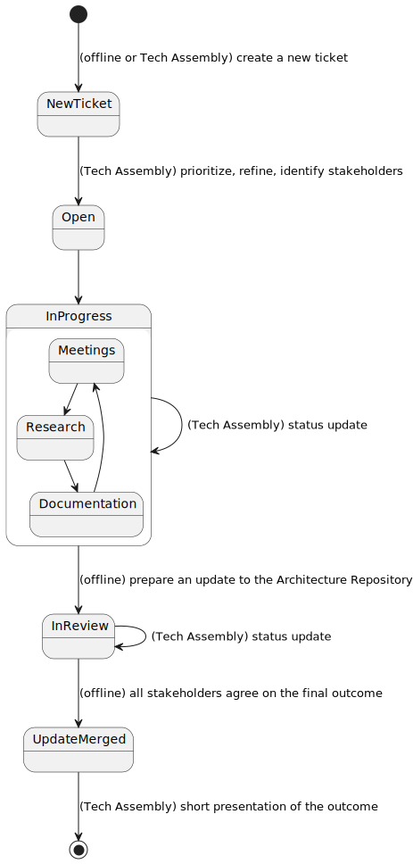

# Midnight Architecture

This is a repository of the Midnight software architecture documents. While each component
repository may have its own local documentation, this repo includes the specification of
each component in standard terms and documents the flows, features, and deployments
supported by the system.

What are *flows*, *features*, *components* and so forth? The essential terminology of our
architectural elements are defined in [definitions](definitions.md).

## TOC

* [Definitions of Architectural Elements](./definitions.md)
* [Decision Record](./adrs)
* [Proposals](./proposals/)
* [Midnight Architecture Overview](./overview)
* [User Flows](./user-flows/README.md)
    - [dAPP-User Flows](./user-flows/dapp-user/README.md)
        - [Flow: dApp User Generating a Transaction](./user-flows/dapp-user/dApp%20User%20Generating%20a%20Transaction.md)
* [Components](./components/README.md)
    - [Wallet Engine](./components/WalletEngine/README.md)
    - [Client SDK](./components/ClientSDK)
    - [Wallet Browser Extension](./components/WalletBrowserExtension/README.md)
    - [Wallet Backend](./components/WalletBackend/README.md)
    - [Transaction Kernel](./components/kernel/README.md)
    - Lares Runtime
        - [Private State Management](./components/lares/private-state-management/README.md)
* [API’s and Common Types](./apis-and-common-types/README.org)
* Example dApps
    - [Lares Private e-Voting Example](./example-dapps/evoting/README.org)
* [Languages Architecture](./languages/README.org)
    - [Abcird](./languages/abcird.org)
    - [Reach](/languages/reach.org)
* [Flowlets](./flowlets/README.md)
* [Architectural Issue Tracking](./risks-and-issues.md)

## How to update contents of this repository

There is a process in place, which ties this repository, [Jira Midnight Architecture Board](https://input-output.atlassian.net/jira/software/c/projects/PM/boards/799) and Midnight Tech Assembly meetings. Parts of it are already mentioned in ADRs:
  - [0, about using ADRs in the first place](./adrs/0000-use-adrs-and-adrgen.md)
  - [1, about PR template](./adrs/0001-extended-pr-template.md) 

The goal of it is to bring transparency, involvement of whole team at decision making and  a team-wide habit of documenting important decisions. Because of that - essentially every team member is allowed (and encouraged) to update contents of this repository and add tickets to the Jira board.

### The process

1. Create a new ticket. Essentially any kind of issue is allowed - be it raising a concern, documenting a gap, research related to new feature or asking for decision/consultancy.
2. On following Tech Assembly call the scope of the ticket is discussed, its priority and stakeholders are being identified, including the ticket owner. In that way it becomes clear how and with who to proceed offline
3. After work on ticket starts, all of following is meant to happen:
   -  stakeholders meet to discuss
   -  necessary research is done
   - documentation is created, in form of proposals, which are the "fast path" to adding non-obligating contents to this repository, the final decision in form of ADR or update to the official architecture
   - on Tech Assembly calls the ticket owner provides a status update to the whole Midnight team
4. Once a pull request with an update to the official architecture or an ADR is ready (at this stage all stakeholders should be already on the same page) - the ticket is moved to review stage, where the whole team can learn and comment the outcome. 
5. When all the feedback is addressed and the pull request merged - on following Tech Assembly the owner gives a short presentation of the contents of the update so that whole team knows where to find necessary documentation and what is the decision made.

## Tools

Documents use text-based diagrams to enable version control of key illustrations. The
tools used include:

- [Nix](https://nixos.org) as build tool and dependency resolution mechanism
- [plantUML](https://plantuml.com/)
- [graphviz](https://www.graphviz.org/) (used by plantUML)

**Please use local installations of these tools rather than pasting IOHK confidential data
into web-hosted versions.**

Additionally, to help with maintaining Decision Record documents -
an [adrgen](https://github.com/asiermarques/adrgen)
is used.

You can access all the tools needed with nix and (optional) direnv. Having a working nix
installation, and enabled flakes and nix command features (e.g. by adding
line `experimental-features = nix-command flakes` to `~/.config/nix/nix.conf` file), you
can run `nix develop` or `direnv allow` to enter a shell environment, where they all are
available on `$PATH`.

To use PlantUML easily there are couple of derivactions/commands available:

1. Compiling PlantUML files in-place

        $ nix run .#render-pumls [dir]

    This may be useful for just ensuring files are properly rendered before commiting

2. Watching PlantUML files

        $ nix run .#watch [dir]

    It runs a watchman process in foreground and calls the `render-pumls` script in order to update them in-place. It seems to be good enough for now, but no doubt it may be more involved in future to achieve better latency.

3. Renders derivation

        $ nix build

    It contains `.svg` files in a directory structure matching the one of this repository. It could possibly be an input to the `render-pumls` script, though there may be concerns regarding amount of file operations needed first to do that (especially in watch mode), so it is a separate thing for now.
