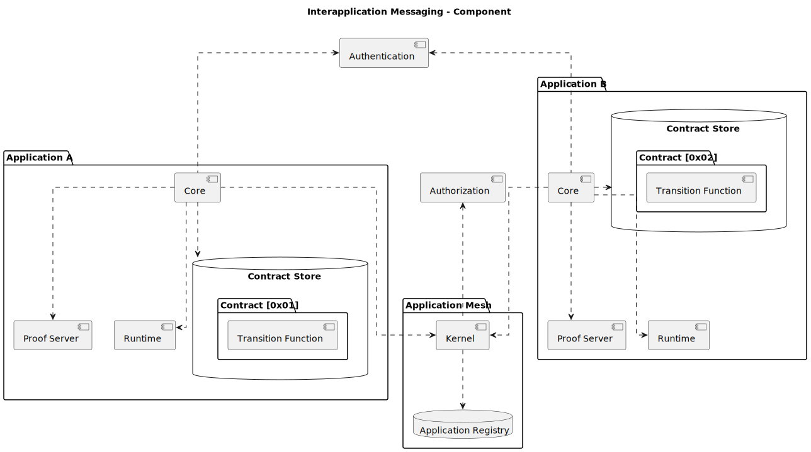
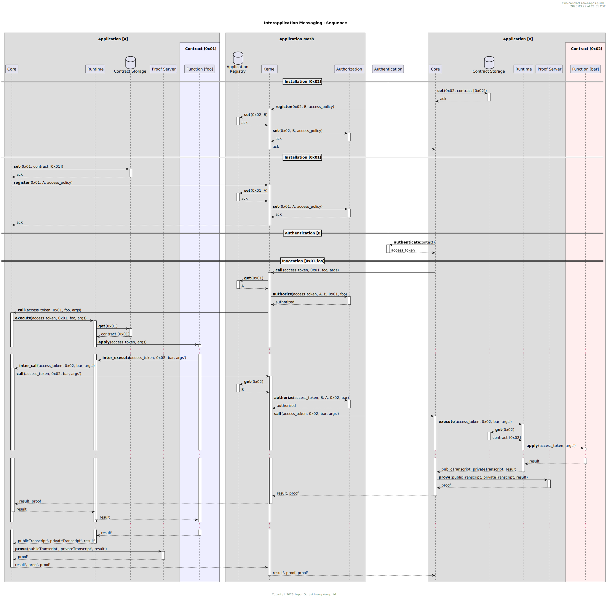
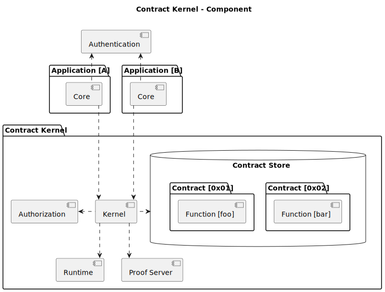
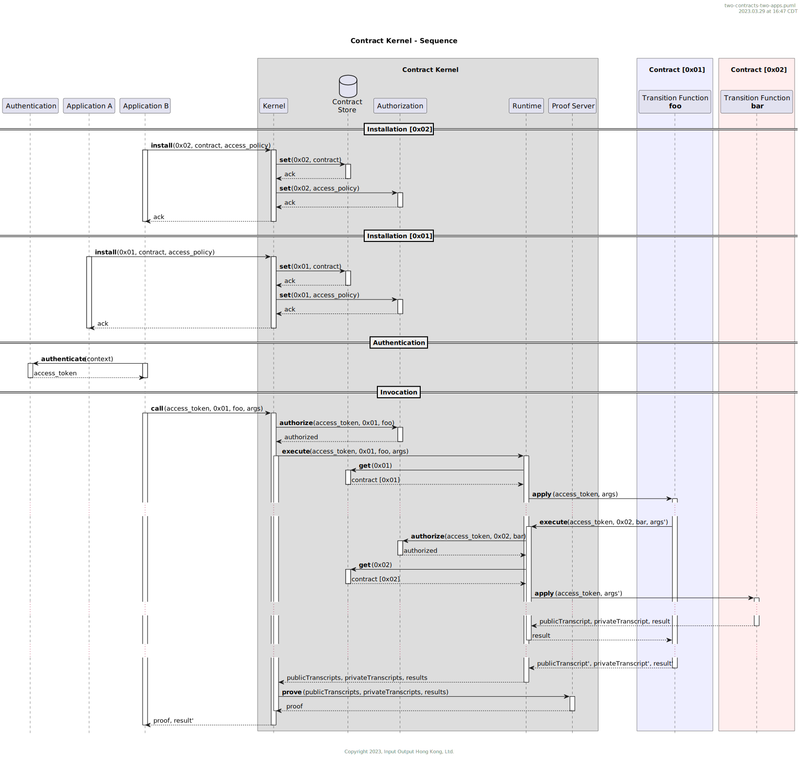

# 10. Contract Kernel

## Status

Proposed

|           |                                          |
|-----------|------------------------------------------|
| date      | March 17th, 2023                         |
| deciders  | Jon Rossie, Andrzej Kopeć, Thomas Kerber, Joseph Denman |
|           |                                          |

## Context and Problem Statement

This ADR is a counter-proposal to [ADR-9](./0009-dapp-to-dapp-communication.md).

### Terminology
 Throughout this document *application* means *decentralized application*. Assume that the user accesses applications by navigating to a URL using a web browser. To *call a contract* means to invoke a transition function defined in the contract. An application must *install* a contract in the browser computing environment before the contract can be called. A *local program* is either a transition function or a private oracle.

### Problem Statement
Contract functionality should be reusable across other contracts and applications running in the user browser. The mechanism of reuse should not compromise the private data of the contract. There are at least two reuse scenarios we must support.

1. An installed contract may call another installed contract.
2. An application may call a contract another application installed.

In both cases, the calls should be evaluated using the current private state of the installed contract.

<!-- This is an optional element. Feel free to remove. -->
## Decision Drivers

The solution should have the following properties.
* Security
* Privacy
* Reliability
* Usability
* Testability
* Performance
* Auditability
* Debuggability
* Upgradeability


## Considered Options

There are two main contenders for the reuse scheme.

* Inter-application Messaging (IAM)
* Contract Kernel (CK)

### Inter-application Messaging (IAM)

In this scheme, local programs are embedded within the web page containing the application and are treated similarly to the application code. To enable inter-application contract calls, the scheme employs an *application mesh* that handles application discovery, messaging, and authorization services. Upon loading, applications register with the mesh and make the contracts they host available to other applications. To control access to these contracts, applications provide an *access policy* to the mesh during registration. Both reuse scenarios require interaction with the host application for contracts and private oracles.

**Pros**:

1. No single point of failure
2. Independent contract executions are automatically concurrent

**Cons**:

1. Difficult to test
2. Difficult to debug
3. Difficult to use
4. Unreliable
5. Poor performance for inter-contract calls
6. Could be difficult to trace inter-contract calls
7. Not as easy to upgrade

### Contract Kernel (CK)

In this scheme, local programs are stored in a single datastore protected by a contract kernel. The contract kernel is responsible for receiving, authorizing, and processing requests to use them. Inter-contract calls do not leave the kernel. Applications install contracts in the kernel and specify an *access policy*, which controls the access of other applications to the installed contract. This scheme assumes local programs have a serializable executable representation and are not treated as application code.

**Pros**:

1. Inter-contract calls are reliable
2. Inter-contract calls have a clear semantics
3. Inter-contract calls are fast
4. Inter-contract calls are traceable
5. All private data resides in one location, making it easy to export and inspect, create GUI for inspecting
6. Contract kernel maps cleanly to a single TEE
7. Reduced trusted computing base, all data is guaranteed to be encrypted
8. Structures the system such it can be extended to use remote private computing servers

**Cons**:

1. Not automatically concurrent, serializes contract calls across applications
2. `Abcirdc` must target a different language
3. A secure contract kernel requires some research and could be complex to implement

**Neutral**:
1. The trusted computing base is identified and minimized, but it is a single point of failure.
2. Requires a serializable executable representation for local programs, but users are allowed more flexibility in their implementation languages
3. A standalone runtime requires research and could be complex to implement, but this was something we were already considering building to facilitate independent testing

## Decision Outcome

Chosen option: Pending

## Validation

* TODO - Unsure of how to validate

<!-- This is an optional element. Feel free to remove. -->
## Pros and Cons of the Options

### Inter-application Messaging

**Security**

The application mesh preserves security by authorizing inter-contract calls. Like the contract kernel scheme, a central entity manages authorization.

**Privacy**

Isolated storage in each application ensures privacy, and private transcripts are not shared with the calling application.

**Reliability**

The reliability of a contract now depends on both the reliability of the application that hosts it and the correctness of the callee contract, which increases the error surface area. In this scenario, the availability of the caller contract and its associated functionality is contingent on the availability of the callee contract, and achieving fault-tolerance is challenging as the developer must anticipate and recover from errors resulting from inter-application calls. This is in contrast to a direct contract call, where the error surface area is much smaller.

**Usability**

Embedding local programs directly in the web page requires less setup than the contract kernel scheme. However, the scheme's lack of reliability and performance will require significant developer efforts to mitigate, thereby decreasing usability.

**Testability**

In the inter-application messaging scheme, application and contract code are coupled; to some extent, testing one requires testing the other. To test contract logic, the user would need test libraries that include a application mesh. Furthermore, the user would need to simulate the behavior of other applications. Contrast this to the contract kernel scheme, wherein contracts can be tested independently of applications.

**Performance**

Proof construction occurs during the execution of the caller contract, which can result in wasted time if the contract execution fails after the inter-application call. To address this issue, a protocol could be implemented to queue the proof inputs and initiate proving only after the outer call has successfully returned. However, this would add complexity to the inter-application call protocol and introduce additional messaging overhead.

Frequent and desirable contract calls may result in high message volume and subsequent high latency for inter-application calls in the application mesh.

A naive approach to inter-application calls blocks the main thread of both applications, preventing them from performing other important operations, such as UI updates based on external events. While there are various ways to circumvent this, they increase implementation complexity and decrease usability. Providing utilities for this purpose may alleviate the burden, but it also increases the delivery effort.

**Auditability**

Auditing inter-contract calls requires careful consideration. Each application, alongside the application mesh, requires intelligent monitoring and logging. As different applications may not have access to logs from other applications, assembling a coherent record of end-to-end interactions could be challenging.

**Debuggability**

Debugging contracts is challenging for similar reasons as testing. A dedicated debugger for Abcird seems unfeasible in this scenario. As with traditional web applications, debugging is accomplished through intelligent logging.

**Upgradeability**

Updating the behavior of local programs necessitates recompiling and redeploying the webpage, as they are integrated into the webpage. Conversely, the contract kernel scheme enables dynamic upgrades.

### Contract Kernel

**Security**

Similarly to IAM, authorization is managed by a single entity that resides in the kernel, and each contract is guarded by an access policy specified by the installing application.

Recall the contract kernel scheme requires a serializable executable representation of local programs. In the case this representation is WASM, the `WebAssembly` Javascript API allows us fine-grained control over the system functions / external interactions available to local programs. For example, consider the following WASM module,

```wasm
(module
  (func $i (import "imports" "imported_func") (param i32))
  (func (export "exported_func")
    i32.const 42
    call $i))
```
which imports `imported_func` and exports `exported_func`. The only external call available to the module is `imported_func`. Hence, if the module above is analogous to the executable representing a private oracle, the only external interaction the private oracle is capable of would be `imported_func`, which is specified as follows:

```javascript
const importObject = {
  imports: { imported_func: (arg) => console.log(arg) },
};
```

```javascript
const privateOracle = WebAssembly.instantiateStreaming(fetch("private_oracle.wasm"), importObject).then(
  (obj) => obj.instance.exports.exported_func()
);
```

The result is a Javascript object exposing functions that execute WASM functions that are sandboxed. This is a much more controlled approach to third-party script execution, which is essentially what private oracles are, and one of the problems WASM is intended to solve.

**Privacy**

Appropriate encryption of all private data can be ensured in a central store. In contrast, IAM necessitates developers to handle their private data storage and encryption."

**Reliability**

Inter-contract calls are confined to the contract kernel, a single application. To successfully execute a well-defined contract call, only the contract kernel must be available. Contrast this to the inter-application messaging scheme, where each additional inter-contract call introduces a dependency on a separate application. This also means that no application can execute a contract call without the contract kernel, making it critical to be highly fault-tolerant. It will become the target for attacks against the user.

**Usability**

Executing a contract call only requires a single call to the contract kernel, without the need for additional application logic beyond contract installation. This is in contrast to the inter-application messaging scheme, which requires additional application logic to respond to inter-application call requests.

**Andy:** In the contract kernel scheme, the application end-user must install the contract kernel before they can begin using any application. This is an additional obstacle compared to the inter-application messaging scheme.

**Testability**

Assume the existence of an independent contract runtime, which receives the necessary executables and arguments and produces an execution result. Hence, if all executables and state are available, contract logic can be tested in isolation via the runtime. 

Additional machinery is required to test application logic. Developers would need a test kernel to simulate the behavior of the production kernel. Unlike the inter-application messaging approach, developers wouldn't need to simulate the behavior of an entire application, just the behavior of the application from the perspective of the kernel. For example, the user would perform some number of contract installations and removals at various points in a test case and verify that inter-contract calls are still successful.

**Performance**

The contract kernel scheme eliminates costly inter-application messaging infrastructure and protocols. However, parallelizing independent contract calls will require effort, as a simplistic implementation would sequentially process all call requests from all applications.

**Auditability**

All events happening during a call can be logged in a single event log and accessed according to the kernel's security policies.

**Debuggability**

Given a standalone contract runtime that receives proper executables and arguments and generates an execution result, it is possible to incorporate a debugger that integrates with the runtime.

**Upgradeability**

Theoretically, end-points for updating the local program executables can be exposed by the kernel to enable dynamic updates.

One additional concern is versioning. The contract kernel introduces more standalone pieces of software than the inter-application messaging scheme, and versioning issues along with them. In particular, the following components would use versioning:

1. Runtime
2. Contract Kernel
3. Compiler
4. Target Language (e.g. WASM)

Furthermore, for inter-contract calls to work, the target language versions of the two involved contracts must be compatible.

One way to look at the contract kernel is as a private local node that runs concurrently with the Midnight consensus nodes. One could examine the versioning schemes used on consensus nodes in other blockchain systems and adapt it to the contract kernel.

## More Information


### Inter-application Messaging

The following diagram is a sketch of the component structure of the inter-application messaging scheme.



The following scenario is the most general reuse scenario the platform should be able to support. It incorporates both reuse cases described in the [problem statement](./0010-contract-kernel#problem-statement.md) section.

**Scenario 1.0**:
1. Application `B` installs contract `0x02` which defines a transition function `bar`.
2. Application `A` installs contract `0x01` which defines a transition function `foo` that calls `bar`.
3. Application `B` calls `foo`.

The next diagram is a sketch of the behavior of the inter-application messaging scheme for scenario (1.0).



### Contract Kernel

The following diagram is a sketch of the component structure of the contract kernel scheme.



Likewise, the next diagram is a sketch of the behavior of the contract kernel scheme in scenario (1.0).

