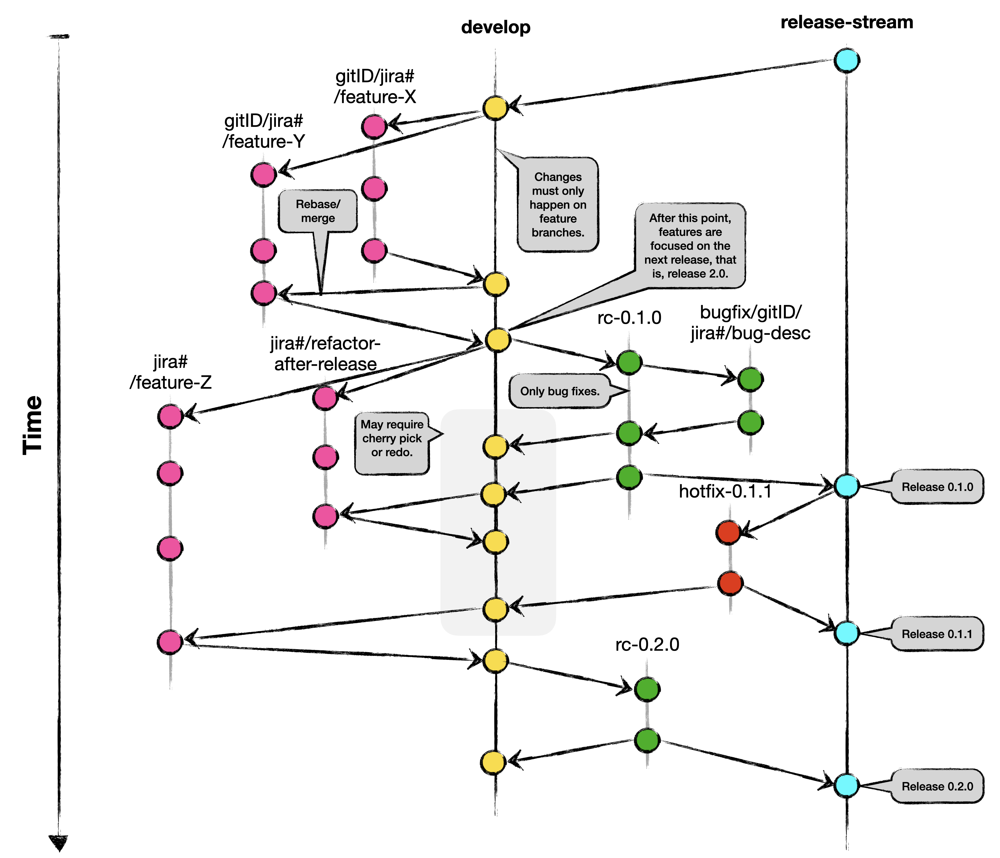

# 14. Git Workflow

## Status

proposed.

---
| -         | -                                                                                                                            |
|-----------|------------------------------------------------------------------------------------------------------------------------------|
| date      | Jan 23, 2024
| deciders  | Thomas Kerber, Andrzej Kopec, Kent Dybvig, Jonathan Sobel, Thomas Ubermeier, Jon Rossie, <all git repo maintainers, please add anyone that I'm missing here.>                                                                                      |
| consulted | Jonathan Sobel, Andrzej Kopec |
---

## Context and Problem Statement

Currently, different teams have their own standards, if any, as a Git workflow. This causes a problem when engineers work on another team's Git repo. Additionally, when we approach a release date one has to watch various Slack channels to keep up-to-date where to merge or not to merge. To avoid these problems, the engineering teams need to follow a Git workflow across Midnight. The following proposes three options.

## Decision Drivers

* A workflow that allows managing multiple publicly and internally available versions of software with ease and clarity.
* A workflow that supports seameless releases and concurrent development.
* A wprlflow that supports consistent mechanism for creating PR and merges across Midnight's pipeline.

## Considered Options

* Purposed Git workflow (explained below) accompanied with a checklist for merging PRs. 

## Decision Outcome

TBD.

## Validation

The ADR is validated by the reviewer.

## Purposed Git Workflow

This workflow is based on [a successful Git branching modlel](https://www.atlassian.com/git/tutorials/comparing-workflows/gitflow-workflow)
and [Gitflow](https://www.atlassian.com/git/tutorials/comparing-workflows/gitflow-workflow) with some adjustment. The adjustment are aimed
to facilitate a developer-facing process, that is, the focus of the git workflow is on facilitating the developers interaction with multiple git repos that interact with each other.

### Primary Branches

* The `release-stream` branch. It stores the official release history.
* The `develop` branch. It stores the continous and latest development changes.

### Temparory Branches

There are three main categories of temporary branches that support parallel development between different
teams and team members, easily tracking feature developments, preparing for production releases, and fixing
live production bugs:
* `feature` branches
* `release-candidate` branches
* `hotfix` branches

There should be naming conventions and procedures around creating and merging these branches. Such conventions and procedures are explained for each category separately.

#### Feature Branches

* Naming convention: use `WIP/git-ID/jira-ticket-number/feature-X` for adding a new feature where `git-ID` is the engineer's GitHub ID, `jira-ticket-number` is Jira ticket's number if it exists, `feature-X` is a summary of the feature. For example, `WIP/pataei/PM-7005/relational-ops`. If a branch is more experimental, exchange `EXP` for `WIP`.
* Branch from: `develop`.
* Check before merge: if `develop` needs to be merged or rebased back into your feature branch.
* Merge into: `develop`.

#### Release-Candidate Branches

* Naming convention: use `RC-x.y.z` for a release candidate branch for version `x.y.z`. Once this branch is created, any development on the `develop` branch is aimed for the release after this one. On this branch only bug fixes can occur.  adding a new feature where `git-ID` is the engineer's GitHub ID, `jira-ticket-number` is Jira ticket's number if it exists, `feature-X` is a summary of the feature. For example, `WIP/pataei/PM-7005/relational-ops`. If a branch is more experimental, exchange `EXP` for `WIP`.
* Branch from: `develop`.
* Merge into: `release-stream`.
* Note: if bug fixes occur on this branch they must be merged back into the `develop` branch. Once this happens, one might need to cherry pick or even redo some of the changes in such a merge.

#### Hotfix Branches

* Naming convention: use `hotfix-x.y.w` for fixing a bug in production for the release `x.y.z` where `w` is the increment of `z` everytime a hotfix occurs.
* Branch from: `release-stream`.
* Merge into: `release-stream` and `develop`. Merging this into the `develop` branch might also require some cherry picking or redoing of work.

## Merge Checklist

A merge can only occur if all the items on the checklist have been done. This checklist may vary depending on the repo but it must contain all the items that a review must check before approving the PR. Some of these items are:

- Has the change log been updated?
- Has the version been updated?
- Has new tests been added to test the new feature/bug?
- Has new tests been added to CI for the new feature/bug?

## More Information

I found [Git workflow on Midnight's confluence page](https://input-output.atlassian.net/wiki/spaces/MN/pages/3378086090/Git+Workflow). However, it misses the separation of the `develop` and `release-stream` branches.

Questions to consider when picking a git workflow model:

* Will we support multiple version of Midnight and roll backs to previous versions?
* Once we have mainnet and testnet do we need to keep separate release branches for each?

