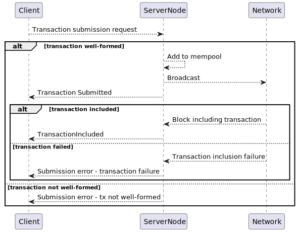

# Transaction submission

[Repo](https://github.com/input-output-hk/midnight-mocked-node)

This protocol allows to submit transactions to the node, so that they eventually can 
be included in the chain. It is heavily inspired by the [Ouroboros Transaction 
Submission protocol](https://github.com/input-output-hk/ouroboros-network/).

## Special Needs

In order to offer good user experience, the protocol offers a reliable error 
information in case of transaction being rejected. This, eventually requires a 
reliable source of information about rejected transactions as in the majority of cases 
node transaction was submitted to is not the same as the one, which mints blocks.

## Server / implementor

This API is primarily meant to be implemented by the node. It is easy to imagine a 
load-balancing facade in front of a group of nodes implementing this API in a 
non-distinguishable way.

## Clients

Most natural client of this API is the Wallet (backend, browser or headless). By 
extension and nature of transactions in Midnight, some DApps are expected to use this 
API too.

### Data Types

It's 4 of them:
  - transaction to be submitted
  - confirmation of submission - the transaction was received by node and it is added 
    to the mempool
  - confirmation of inclusion - the transaction is included in block
  - error

## Sequence diagram

