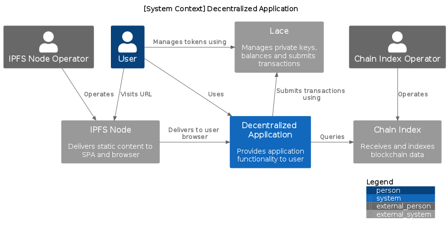

# Background

This directory contains system context diagram from the perspective of a decentralized application (dapp) operating against Midnight. The architecture of the dapp is based on maximimally decentralized architectures for Ethereum dapps, which differ from typical web applications in the following ways:

1. Web pages are delievered to the user browser by an [IPFS](https://ipfs.tech/) node, not a centralized web server
2. Application logic is performed by an [Ethereum](https://ethereum.org/en/developers/docs/nodes-and-clients/) node, not a centralized web server

A high-level overview of a common architecture of an Ethereum dapp can be found [here](https://www.preethikasireddy.com/post/the-architecture-of-a-web-3-0-application).

# Overview

The *primary* system is the decentralized application (dapp). This is the system we will explode. All systems that are not the dapp are *external*. Each alternative below makes use of common external systems.

1. IPFS Node - hosts the single-page application defining the dapp
2. Lace - represents the [Lace](https://www.lace.io/) wallet
3. Chain Index - also known as the *filter service*

The term *Chain Index* is used to emphasize similarities with the [Plutus](https://plutus-apps.readthedocs.io/en/latest/plutus/explanations/pab.html?highlight=Chain%20index) framework. Each diagram also includes common external *roles*

1. IPFS Node Operator
2. Chain Index Operator

which operate the external systems. It is assumed that the Lace wallet is operated by the dapp user.

# Options

The following sections describe possible topologies for a decentralized application built against Midnight. Each topology has implications for the Midnight system design.

## Application Submits Transactions

The following diagram depicts the Midnight analogue of the standard Ethereum dapp architecture.

*Fig. 1. System context diagram in which dapp is responsible for submitting transactions*

The external system *Midnight Provider* supports the Midnight node RPC API, analogous to an Ethereum [provider](https://web3js.readthedocs.io/en/v1.2.11/web3-eth.html#eth) in [web3.js](https://web3js.readthedocs.io/en/v1.2.11/index.html#). The provider abstraction would allow the dapp to use third-party services, analogous to [Infura](https://www.infura.io/) and [Alchemy](https://www.alchemy.com/), that operate Midnight node clusters and provide network connectivity and availability guarantees. In practice, Lace may implement the Midnight Provider API, as MetaMask implements the Ethereum Provider API.

## Wallet Submits Transactions

In the following diagram, the wallet is responsible for submitting transactions to the network.

*Fig. 2. System context diagram in which wallet is responsible for submitting transactions*

In contrast to Figure 1, Figure 2 does not include *Midnight Provider* because the dapp never directly interacts with it. This configuration is less flexible than that depicted in Figure 1 because it does not have a provider abstraction.