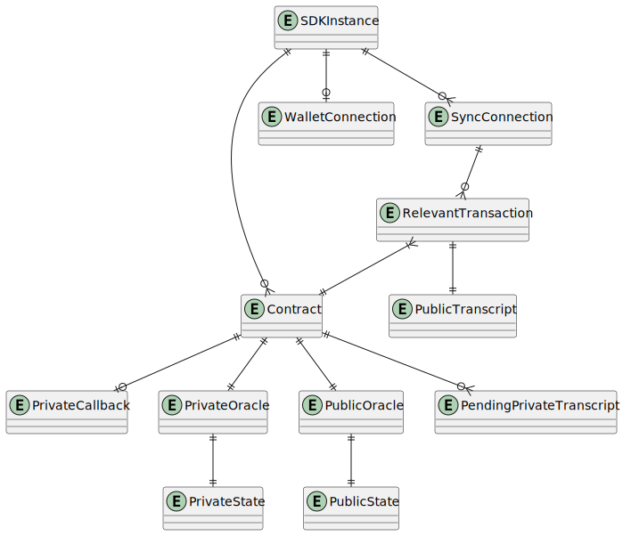

# Component Name

[https://github.com/input-output-hk/midnight-client-sdk](https://github.com/input-output-hk/midnight-client-sdk)

Client SDK is a library, that is used directly by dApp. It has 2 primary responsibilities:
  - orchestrate calls to Lares in order to effectively call dApp's smart contract or update state
  - provide dApps an API for communicating with Wallet

## Special Needs

## Neighbors & API Dependencies

### Client - Wallet dApp connector

Client SDK uses the dApp connector API implemented by Wallet in order to communicate with it.

### Client - Lares

Client SDK uses APIs implemented by Lares in order to:
  - manage oracles state
  - call transition functions
  - generate ZK proof of transition function call

### Server - SDK interface

An API that is meant to be used by dApps to use SDK's functionality. Because of being a library dependency for 
potentially many different dapps developed at different pace this one has to be well-thought to provide good 
developer experience as well as proper balance between safety, easiness of use and maintainability.

## Operating Environment

Client SDK is run in possibly any browser. Specifically, the ones that are most likely to be used are:
- Google Chrome
- Mozilla Firefox
- Apple Safari
- other Chromium-based browsers like Microsoft Edge, Brave, Opera, Vivaldi, etc.

Possibly any desktop operating system that allows running some browser listed above may be used, the most popular
ones are:
- Microsoft Windows
- Linux distributions
- macOS
- BSD flavors

Additionally, Client SDK may be run in environments like Node.js in CLI or server-side use-cases

## Key Library Dependencies

## Logical Data Model

Include an [ER diagram](https://plantuml.com/ie-diagram).

### Entities

Document the entities.

#### Entity 1

#### Entity 2

### Invariants

This MUST include state invariants expressed in terms of the ER model that describe the valid states of the system.

## Responsibilities

### Interface Data Types

What kinds of data are used in the API's, either as inputs or outputs?  Are they versioned?  Does the component have to support multiple versions at once?

### API's
What API's does the component support?  It's not necessary to include the actual code.  Rather, document the nature of the responsibility and any special constraints.

#### API 1

##### Event 1

- Name, input args, return type, kinds of failures
- Computational complexity
- Net effect on memory size or disk usage
- What ER-model structures are used to handle the event?

##### Event 2

## Non-Functional Requirements

### Scalability

- What is the expected complexity bound of each API function?
- For each API function, what is its net effect on memory growth and what mechanisms are included to prevent memory leaks?

### Availability

Is it ok for the component to "just let it fail" when things go wrong, or must this component fight to survive all errors?

### Security

How are the API's protected against unauthorized use?  What is the DDoS defense, for example?  Are there operations that require specific authorization using signatures or authenticated identities?

### Debugability, Serviceability

- What logging levels are supported and can they be dynamically configured?
- How does the component provide debug context on a crash?

## Life Cycle (State Machine)

The component MUST declare whether it has a lifecycle that can be described as a state machine.  This should include any state changes that affect things like the availability of the component or its resources.  A component that performs periodic expensive memory-refactoring, for example, should document this period of unavailability and high resource usage as a distinct state. 

How will the component handle unavailability of required services, both at launch and in steady state?
