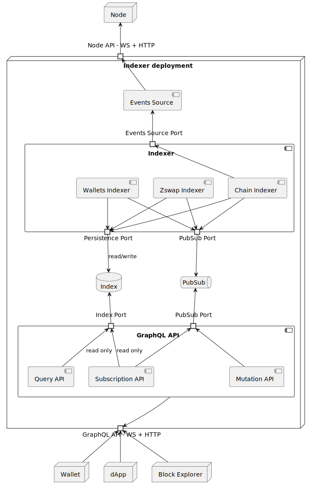
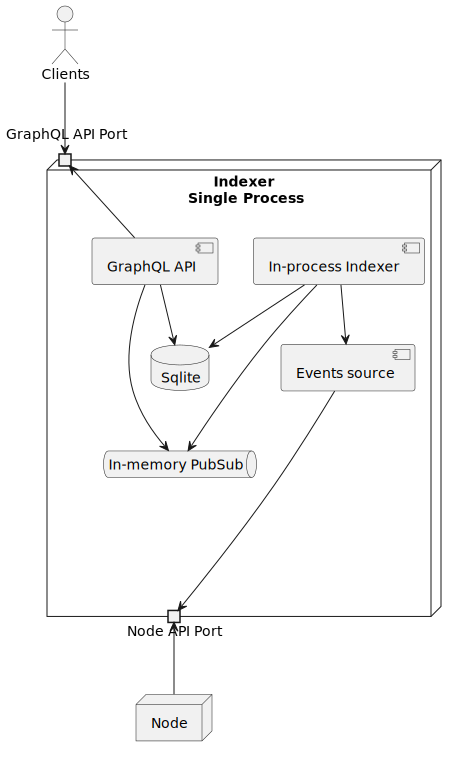
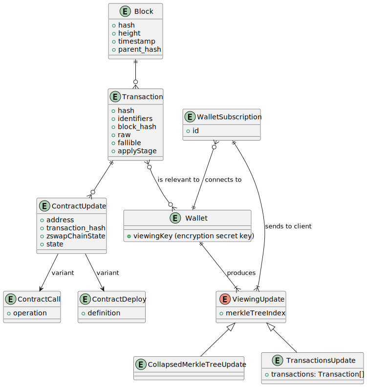
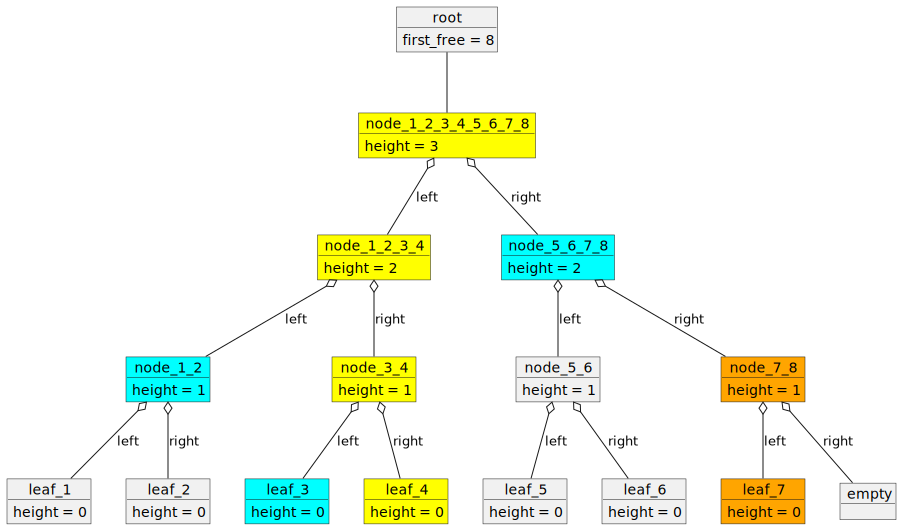
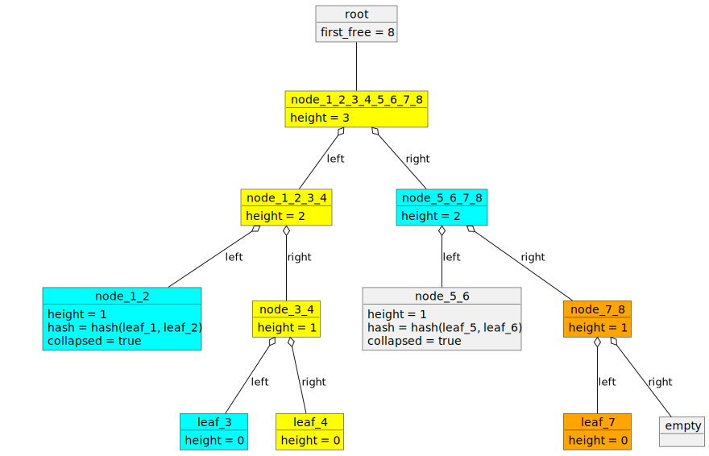
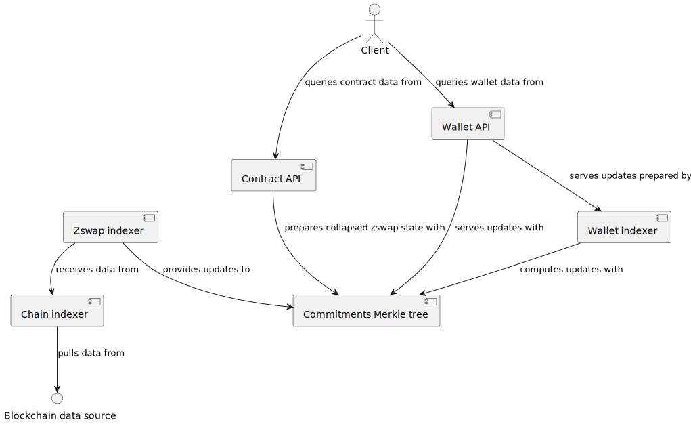

# Indexer

Original, Scala implementation: https://github.com/input-output-hk/midnight-pubsub-indexer
New, Rust implementation: https://github.com/input-output-hk/midnight-indexer

The Indexer is a component meant to optimize the flow of data from the node to the end users'
applications. Because nodes aren't designed to support such clients, they only store the raw blocks
of transactions and the most updated ledger state, so user applications would have to retrieve the
whole history of blocks just to find the ones that are of interest.
To solve this mismatch, Indexer retrieves the history of blocks, processes them, and stores
data with a structure that is optimized (i.e. _indexed_) for the end users' applications. It also
offers a mechanism so that applications can subscribe to be notified whenever some data of their
interest changes, avoiding the necessity to constantly poll to see if there is something new that
they should be aware of.

## Special Needs

## Operating Environment

In principle, Indexer is meant to run in two kinds of environments:
- desktops, which require minimum amount of preparation and configuration in order to run the component at all
- cloud/server deployments, where setup that supports high availability is needed and high load of queries can be handled

Possibly any _desktop_ operating system may be used, with the most popular being:
- Linux distributions
- macOS
- Microsoft Windows

## Neighbors & API Dependencies

There are at least, but not limited to, 3 types of clients of the Indexer:

1. Wallets
2. dApps
3. Block explorers

All depend on Indexer's GraphQL API.

And there is one source from where the Indexer pulls the blocks, which is at least
one [node](missing_documentation).

Apart from these - an important API dependency is ZSwap one - to allow indexing wallet data.

### Wallets

Wallets allow users to build transactions that transfer tokens and/or call or deploy contracts. All transactions will spend some of the user's coins, so wallets need to know the transactions that send coins to the user's addresses, and they also need to know when a transaction they submitted was confirmed, in order to mark the input coins as spent and remove them from their available coins.

### dApps

DApps are all about contracts, and so they need to know when a contract's state was updated. This means knowing when and how a contract was called, in order to update the state.

### Block explorers

A block explorer will typically allow users to find blocks by their hash or height, find transactions by hash, or get a contract state by address. 
Indexer allows for simply doing these kind of queries and getting an immediate response.

### Midnight Node

Runs consensus and ledger. Processes transactions to determine which follow the rules and can be added to the blockchain

### ZSwap API

It is the part of ledger, which is responsible for coin management - it dictates the transaction shape related to coins and valid rules of moving coins.

## Key Library Dependencies

- Typelevel stack as a "standard functional library" for types, operations, effects and streaming
  - cats-core
  - cats-effect
  - fs2
- doobie - for DB Access
- Caliban - for exposing GraphQL API
- Sttp - for Http layer
- Circe - for JSON serialization

## Internal component structure



### Events Source

Fetches data from a node and subscribes to events about new blocks and transactions. 

### Indexer

Runs indexers of specific types, most importantly - the ones for blockchain and wallets.

#### Chain Indexer

Processes blocks, transactions and derived data like contract states or zswap chain state.

#### Wallets Indexer

Processes transactions on a per-wallet basis to be able to provide data needed to let wallet prepare valid transactions. Index database is the source of truth for this indexer, which has the following consequences:
- unified processing for wallets regardless of their status
- usage of already processed data as input
- for chain-related events PubSub is primarily a notifier of a fact, contents of the messages can be used for processing to limit latency impact of a round-trip to the Index database, but one needs to consider possibility of a gap between delivered data at arbitrary points in time (e.g. when the PubSub is restarted)     

### PubSub

This component allows various parts of the system to publish and subscribe to specific topics, facilitating real-time data updates. Crucially, it is the synchronization mechanism between various indexers, so that it becomes possible to run and scale specific indexers separately. It also plays an important role in handling requests from GraphQL mutations to avoid writing to the Index database from the API part of the system. PubSub is a stateless component, whose failure and restart are not causing loss of data, but just delays or recoverable errors. For example:
- if Chain Indexer publishes information about new blocks, but PubSub is not currently working, it should not mean missed blocks data for Wallets Indexer, just a delay and more blocks to process; accordingly - it should not cause a failure on chain indexer's side
- if there is a command issued from Mutation API, but it was not handled in a timely manner - Mutation API is free to raise an error to the client, who can make decision about further interactions - e.g. to retry

### Index database

This component stores indexed data in a way, that is easy to query. As the data is in a very big part immutable, it is safe to denormalize the data. As Index database is the source of truth for the API layer and other indexers than the Chain one - one needs to be very careful about read and write patterns to maximise throughput during catch-ups and reduce latency when close to the tip of the chain. 

### GraphQL API

Completely stateless implementation of the API - facilitating horizontal scaling and timely restarts in case of issues. 

#### Subscription API

The subscription API provides WebSocket-based subscriptions. Clients can use it to receive real-time updates and notifications about events and data changes.

#### Query API
This component offers an HTTP API that allows clients to query and retrieve data from the index, providing a structured and user-friendly way to access information through a GraphQL interface.

#### Mutation API

This component offers clients to issue commands (called _mutations_ in GraphQL jargon). An example of such command would be registering a wallet to track. 

## Deployments

As mentioned in the [Operating Environment](#operating-environment) section, Indexer is meant to be used in 2 environments, which have different needs in terms of amount of configuration needed, failure modes or recovery.

### Local



### Cloud


## Logical Data Model



### Entities

_TODO: Move these to apis and common types with proper descriptions_

#### Block

#### Transaction

#### Contract Call

#### Contract Deploy

### Invariants

1. Once data is persisted, it should remain available and consistent over time. 
2. Any data retrieval or query operation for information from the genesis block or any subsequent block should consistently return the same results as initially.
3. For each block, every transaction associated must be indexed.
4. For each indexed transaction, its associated block must include it in its list of transactions.
5. For each block, its parent field should refer to a valid parent block.
6. A parent block should have a height that is one less than the height of the following block.
7. The hash of the parent block should match the parent field in the following block.
8. If a transaction is listed in the transactions of a block, then the block field of said transaction should refer to that block.
9. For each contract call or deploy listed in a transaction's contractCalls, the transaction field of the contract call or deploy should refer to the same transaction that contains it in its contractCalls list.
10. For each contract call there must be a single corresponding contract deploy with the same address.
11. Each wallet session is uniquely identified by a session ID, which is randomly generated and associated to a viewing key.
12. If a session ID is removed, a new session ID will be generated for the same viewing key when requested.
13. Hosted ViewingWallet needs to serve enough data to let client wallets derive
    the same state as if they were querying node transaction by transaction, that is at least:
    1. Updates to coin commitments Merkle tree
    2. Relevant transactions
    3. Data to perform consistency checks


## Responsibilities

### API's

#### GraphQL

Defined in https://github.com/input-output-hk/midnight-pubsub-indexer/blob/main/api/src/main/resources/pubsub_indexer_v1.graphql

It includes 3 major parts:
  - blockchain and state queries &mdash; stateless request&mdash;response API
  - blockchain and state subscriptions &mdash; ephemerally stateful push-based subscriptions
  - wallet update subscriptions - ephemerally stateful push-based subscriptions

Those combined cover needed functionality to meet needs of:
1. Wallets - by providing them data to update state
2. dApps - first and foremost - by providing them information about contract state
3. Block explorers - by providing at least the basic data about entities stored in the blockchain

#### Blockchain queries

This is a set of stateless request-response APIs that can be exposed on top of HTTP.
It is implicitly meant to be used by a public blockchain explorer.

```graphql
# No block offset argument means that client wants to get the latest
type Query {
    block(offset: BlockOffsetInput): Block
    transaction(offset: TransactionOffsetInput): Transaction
    contract(address: String!, offset: BlockOffsetInput): ContractCallOrDeploy
}
```

#### Contract state subscriber

This is a subscription API, where the client sends a request first, and from that moment the server
starts pushing an indefinite number of responses back to the client.

The most prominent use case for this API are dApps, which need to be constantly updated whenever
there is an event that affects the contract state.

```graphql
type Subscription {
    contract(address: ContractAddress!, offset: BlockOffset): ContractCallOrDeploy
}
```

#### Blocks Subscriber 

This subscription API provides clients with all the blocks

```graphql
type Subscription {
    blocks(offset: BlockOffsetInput): Block
}
```

#### Transactions subscriber

This subscription API provides clients with all the transactions. If `sessionId` is provided either by argument or in the header of the request, only transaction associated to that ID will be returned with associated `WalletLocalState`.

```graphql
type Subscription {
    transactions(offset: TransactionOffsetInput, sessionId: SessionId): WalletSyncEvent
}
```

To obtain the ID, the clients must first connect with a viewing key to get the session identifier and then use the identifier to subscribe
and start receiving all the relevant transactions.

This API design is meant for wallets. Only wallets should have access to user's keys and with the inputs and outputs information can build a view of the available coins.

```graphql
type Mutation {
    connect(key: ViewingKey): SessionId!
    disconnect(sessionId: SessionId!): Void!
}
```
Disconnect mutation will permanently remove the session associated to the viewing key. To subscribe again to a wallet's transactions, a new session must be created.

### Zswap

#### Use cases and context

One of very reasons to create a dedicated component for indexing and serving data is Zswap and the need for data processing it forces upon clients. Specifically:
- DApps need to obtain not only state of contracts they are using, but also a partial state of Zswap to be able to move tokens
- Wallets, in order to be able to calculate their balances, spend and receive tokens, need to scan whole chain looking for their transactions as well as obtain or reconstruct partial state of Zswap
- additionally, usage of a Merkle tree in Zswap allows performing cheap (though limited in scope) consistency checks

Whole Zswap ledger state includes:
- nullifier set - a set of hashes, that allow preventing double spends
- coin commitments Merkle tree - append-only Merkle tree of hashes of all coins ever created, to prevent uncontrolled creation of new tokens
- set of past known roots of the commitments Merkle tree - together with the current Merkle tree it allows to ensure no tokens are created out of thin air 
- first free index in the commitments Merkle tree - to speed up insertion process 

<!-- TODO: Update reference to point to the file on the same branch -->
A recap of how this state is relevant to private token transfers can be found in the [Wallet Specification](https://github.com/input-output-hk/midnight-architecture/blob/43ab2435aaab845929230bda8d0328bdb26ab0e6/components/WalletEngine/Specification.md#coin-nullifiers-and-commitments). For Indexer though, only one piece of this data is important - the coin commitments Merkle tree. Its contents are needed when spending tokens, because a Merkle proof of spent coin's commitment is needed in order to spend the coin (with the resulting tree root being one of past tree roots), this signals to the ledger that an existing coin is being spent, which is a step towards making sure that no tokens are created without ledger's permission.

Requirements above lead to an observation, that clients (both wallets and DApps) only need to receive Merkle tree root and the contents compacted to provide data only for coins related to them. For DApps, it is public information, which coins are needed. For wallets, this information is learned with usage of the encryption secret key and detection, which transaction outputs are relevant for a particular wallet. Importantly - the data served does not necessarily need to lead to specific coins exclusively, a bigger granularity is allowed and should work just fine for clients, for example serving data enough to calculate Merkle proofs for all coins from a transaction, block or range of blocks.

Compaction itself can easily be performed by replacing Merkle tree nodes with "collapsed" nodes - ones, which do not have children in order to compute their hash, instead they contain only the computed hash value. This allows to replace whole subtrees with single values, which dramatically improves memory efficiency, as neighbour branches to the paths leading to the values of interest can all be collapsed. This process is presented on the diagrams below.

Before compaction, `leaf_4` is the element, whose membership needs to be proven, nodes in yellow are ones to be computed when verifying the proof, nodes in light blue are ones needed in the proof data:


After compaction, unnecessary data is removed from the tree:

One can see that nodes in orange are kept. This is because they are still needed to enable insertion of 8th element into the tree. 

#### API to support

<!-- TODO: Consider uploading the Graphql schema into arch repository -->
There are 2 areas in the API, which involve the Zswap state:
1. A query for Zswap state collapsed to include only data relevant to that contract, that is:
   1. nullifier set can be empty
   2. commitments tree collapsed to allow proving membership of contract coins only
   3. first free index present
   4. past tree roots set can be empty
2. A stream of wallet state updates including: 
   1. transactions relevant to wallet
   2. Updates to the commitments Merkle tree, so that wallet can reconstruct the tree in a state collapsed to only its coins
   3. Expected root of the commitments Merkle tree after particular update/set of updates, so that wallet can be ensured the reconstructed tree is consistent with the chain
   4. Progress updates

#### Design

Conceptually, the support for Zswap renders following dependencies between components (in an abstract way, an arrow means a dependency exists, but its nature can vary - it can be just data format, or expectancy to have direct memory access to data and API to operate on it):


Major approaches one can take to implement the support depend mostly on 2 dimensions, resulting in 6 possibilities in total:
- whether Merkle tree implementation is backed by [Hoarfrost-like](../../apis-and-common-types/hoarfrost/README.md) storage (allowing to load the tree only partially into the memory, based on what is needed at the time) or kept entirely in memory (so persistence and serialization of tree always works with whole tree)
- whether producing updates/collapsed trees should be eager (so that commitment tree data is calculated by indexers and saved into the DB), lazy (so that the API layer loads and queries the tree to prepare necessary data) or lazy with cache (so that results of previous calculations are stored and can be re-used)

##### In memory Merkle tree + eager update calculation

Pros:
- This approach greatly simplifies API side, because all data are stored in DB
- This approach results in a good expected performance on API side
Cons:
- Increased complexity on indexers (because zswap and contract indexing need to be orchestrated, access to the Merkle tree needs to be properly synchronized to avoid concurrency issues, which may be hard to do in an efficient manner)
- Increased computational cost on indexers (because each contract call results in access to the commitments tree and calculation of its collapsed version)
- Increased memory consumption on indexers (because they need to store the Merkle tree in memory)
- Lot of storage needed to store all the updates/collapsed trees

##### In memory Merkle tree + lazy update calculation

Pros:
- Simplified and streamlined indexers
- Only pointers allowing to produce updates/collapsed trees are needed to be stored
- Relatively lightweight synchronization is needed, related to ensuring that right version of the tree is being loaded to produce the update
Cons:
- More work on the API side
- API side may experience churn of Merkle tree updates, leading to lot of CPU, memory and networking bandwidth spent on constant reloading Merkle tree
- Increased CPU and memory usage on API side as the commitment tree grows
- While impact on storage is smaller than in the case of eager update calculation, storing whole tree as a separate entry for each block is still a lot of data

##### Merkle tree backed by storage + eager update calculation

Pros:
- Efficient usage of storage (because of ability to share of tree nodes and contracts, wallets, etc. being pointed to root nodes of trees prepared for them)
- This approach greatly simplifies API side, because all data are stored in DB
- This approach results in a good expected performance on API side 
Cons:
- Increased complexity on indexers (because of orchestration needed between contract and zswap ones)
- Increased computational cost on indexers (because each contract call results in access to the commitments tree and calculation of its collapsed version)

##### Merkle tree backed by storage + lazy update calculation

Pros:
- Efficient usage of storage
- Simplified and streamlined indexers
Cons:
- More work on the API side
- Increased CPU (to calculate updates) and memory (portions of the Merkle tree still need to be loaded) usage on API side
- Less churn on DB

##### Lazy update calculation with cache (both with or without storage-backed Merkle tree)

Pros:
- Simplified and streamlined indexers
- work to produce updates is minimized and delayed to the last possible moment
Cons:
- Even more complexity on the API side
- need to accommodate for caching in the architecture
- Hard to apply to wallets
- Unclear performance gains for often changing contracts

## Architecture Characteristics

_NOTE:  There is also a
quick [reference list of architecture characteristics](../definitions.md#architecture-characteristics)
available._

_NOTE:  Choose wisely, the more architecture characteristics are identified for a component, the more
complicated it will be. Also, bear in mind that some architecture characteristics can be delegated
to software design or UX._

_Here is a list of sample architecture characteristics, please remember to update them to match the
needs of the particular component._

### Configurability

The component accepts the following configurations
- Storage:
  - `driver-name`
  - `jdbc-url`
  - `user`
  - `pass`
  - `thread-pool-size`
- Transaction Steam
  - `progress-update-delay`
- Server
  - `host`
  - `port`
- Events-source
  - `node-host`
- API
  - `max-cost`
  - `max-depth`
  - `max-fields`
  - `timeout`

### Performance

- _What is the expected complexity bound of each API function?_
- _For each API function, what is its net effect on memory growth and what mechanisms are included to
  prevent memory leaks?_

### Availability

_Is it ok for the component to "just let it fail" when things go wrong, or must this component fight
to survive all errors?_

### Security, Authentication, Authorization

_How are the API's protected against unauthorized use? What is the DDoS defense, for example? Are
there operations that require specific authorization using signatures or authenticated identities?_

### Debugability, Serviceability

- _What logging levels are supported and can they be dynamically configured?_
- _How does the component provide debug context on a crash?_

## Life Cycle (State Machine)

_The component MUST declare whether it has a lifecycle that can be described as a state machine. This
should include any state changes that affect things like the availability of the component or its
resources. A component that performs periodic expensive memory-refactoring, for example, should
document this period of unavailability and high resource usage as a distinct state._

_How will the component handle unavailability of required services, both at launch and in steady
state?_
