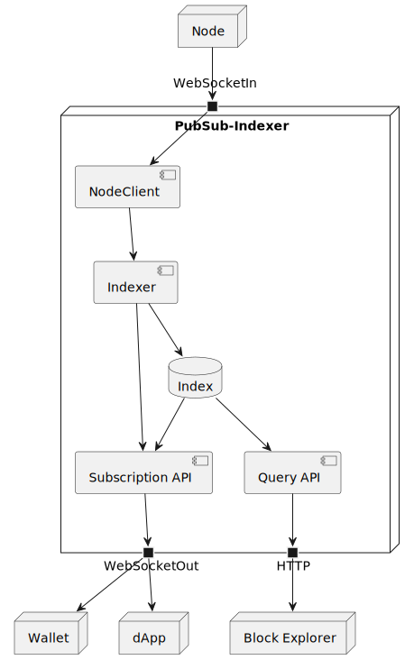
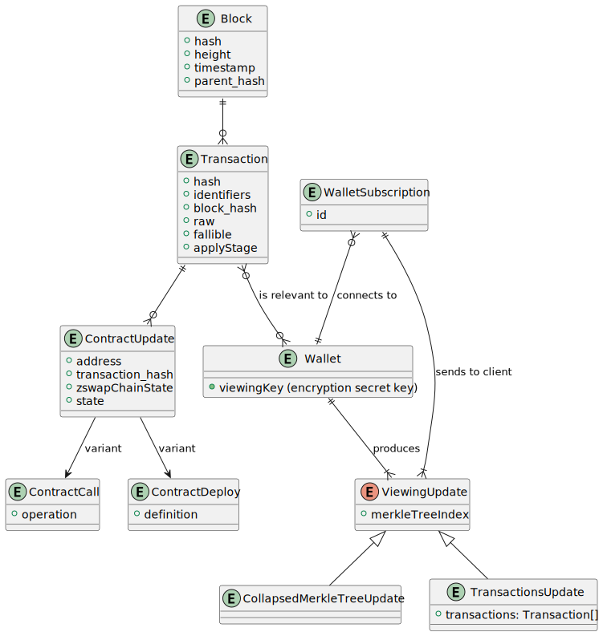

# PubSub-Indexer

https://github.com/input-output-hk/midnight-pubsub-indexer

The PubSub-Indexer is a component meant to optimize the flow of data from the node to the end users'
applications. Because nodes aren't designed to support such clients, they only store the raw blocks
of transactions and the most updated ledger state, so user applications would have to retrieve the
whole history of blocks just to find the ones that are of interest.
To solve this mismatch, PubSub-Indexer retrieves the history of blocks, processes them, and stores
data with a structure that is optimized (i.e. _indexed_) for the end users' applications. It also
offers a mechanism so that applications can subscribe to be notified whenever some data of their
interest changes, avoiding the necessity to constantly poll to see if there is something new that
they should be aware.

## Special Needs

## Neighbors & API Dependencies

There are at least, but not limited to, 3 types of clients of the PubSub-Indexer:

1. Wallets
2. dApps
3. Block explorers

And there is one source from where the PubSub-Indexer pulls the blocks, which is at least
one [node](missing_documentation).



### Wallets

Wallets allow users to build transactions that transfer tokens and/or call or deploy contracts. All
transactions will spend some of the user's coins, so wallets need to know the transactions that send
coins to the user's addresses, and they also need to know when a transaction they submitted was
confirmed, in order to mark the input coins as spent and remove them from their available coins.

### dApps

dApps are all about contracts, and so they need to know when a contract's state was updated. This
means knowing when and how a contract was called, in order to update the state.

### Block explorers

A block explorer will typically allow users to find blocks by their hash or height, find
transactions by hash, or get a contract state by address. PubSub-Indexer allows for simply doing
these kind of queries and getting an immediate response.

## Operating Environment

Possibly any _desktop_ operating system may be used, the most popular ones are:
- Microsoft Windows
- Linux distributions
- macOS
- BSD flavors

## Key Library Dependencies

- Scala standard library
- Typelevel stack
  - cats-core
  - cats-effect
  - doobie
  - fs2
- Caliban
- Sttp
- Circe

## Logical Data Model



### Entities

#### Block

#### Transaction

#### Transaction Input

#### Transaction Output

#### Contract Call

#### Contract Deploy

### Invariants

_This MUST include state invariants expressed in terms of the ER model that describe the valid states
of the system._

## Responsibilities

### Interface Data Types

These are the data types used in the previous interfaces. The ones defined as just `scalar` are yet
to be defined in more detail.

```graphql

# It's not possible to use a union as input type, so using 2 optional fields
input BlockOffset {
  hash: BlockHash
  height: BlockHeight
}

type Block {
  parent: Block!
  hash: BlockHash!
  height: BlockHeight!
  timestamp: DateTime!
  transactions: [Transaction!]!
}

type Transaction {
  block: Block!
  hash: TransactionHash!
  identifiers: [TransactionIdentifier!]!
  inputs: [TransactionInput!]!
  outputs: [TransactionOutput!]!
  contractCalls: [ContractCallOrDeploy!]!
}

type TransactionInput {
  transaction: Transaction!
  nullifier: Nullifier!
  valueCommitment: ValueCommitment!
  merkleTreeRoot: MerkleTreeHash!
}

type TransactionOutput {
  transaction: Transaction!
  coinCommitment: CoinCommitment!
  valueCommitment: ValueCommitment!
}

type Contract {
  address: ContractAddress!
  state: ContractState!
  deploy: ContractDeploy
  calls: [ContractCall!]!
}

interface ContractCallOrDeploy {
  transaction: Transaction!
  state: ContractState!
}

type ContractCall implements ContractCallOrDeploy {
  transaction: Transaction!
  deploy: ContractDeploy!
  state: ContractState! # Means new state after this contract call
  operation: ContractOperation!
}

type ContractDeploy implements ContractCallOrDeploy {
  transaction: Transaction!
  address: ContractAddress!
  state: ContractState! # Means initial contract state
  definition: ContractDefinition!
}

union TransactionSyncEvent = ProgressUpdate | Transaction

type ProgressUpdate {
  synced: BlockHeight
  total: BlockHeight
}

scalar BlockHash

scalar BlockHeight

scalar TransactionHash

scalar TransactionIdentifier

scalar Nullifier

scalar CoinCommitment

scalar ValueCommitment

scalar ContractAddress

scalar ContractState

scalar ContractDefinition

scalar ContractOperation

scalar ViewingKey

scalar SessionId

scalar DateTime

scalar Void
```

### API's

#### Blockchain queries

This is a set of stateless request-response APIs that can be exposed on top of HTTP.
It is implicitly meant to be used by a public blockchain explorer.

```graphql
# No offset argument means that client wants to get the latest
type Query {
    block(offset: BlockOffset): Block
    transaction(hash: TransactionHash, identifier: TransactionIdentifier): Transaction
    contract(address: ContractAddress!): Contract
}
```

#### Contract state subscriber

This is a subscription API, where the client sends a request first, and from that moment the server
starts pushing an indefinite number of responses back to the client.

The most prominent use case for this API are dApps, which need to be constantly updated whenever
there is an event that affects the contract state.

```graphql
type Subscription {
    contract(address: ContractAddress!, offset: BlockOffset): ContractCallOrDeploy
}
```

#### Viewing key subscriber

Also a subscription API, it provides clients with all the events (i.e. transactions)
related to a particular viewing key if one is passed, all transactions are streamed if no viewing
key is given.

The clients must first connect to get a session identifier and then use the identifier to subscribe
and start receiving all the relevant transactions.

This API design is meant for wallets. Only wallets should have access to user's keys and with the
inputs and outputs information can build a view of the available coins.

```graphql
type Mutation {
    connect(key: ViewingKey): SessionId!
    disconnect(sessionId: SessionId!): Void!
}
type Subscription {
    transactions(id: SessionId!, hash: TransactionHash): TransactionSyncEvent
}
```

## Architecture Characteristics

_NOTE:  There is also a
quick [reference list of architecture characteristics](../definitions.md#architecture-characteristics)
available._

_NOTE:  Choose wisely, the more architecture characteristics are identified for a component, the more
complicated it will be. Also, bear in mind that some architecture characteristics can be delegated
to software design or UX._

_Here is a list of sample architecture characteristics, please remember to update them to match the
needs of the particular component._

### Configurability

_Configurability is a cross-cutting responsibility that affects many API's. The antidote to a
regrettable constant in your code is proper configurability. What are the configuration parameters (
policy) supported by the component?_

### Performance

- _What is the expected complexity bound of each API function?_
- _For each API function, what is its net effect on memory growth and what mechanisms are included to
  prevent memory leaks?_

### Availability

_Is it ok for the component to "just let it fail" when things go wrong, or must this component fight
to survive all errors?_

### Security, Authentication, Authorization

_How are the API's protected against unauthorized use? What is the DDoS defense, for example? Are
there operations that require specific authorization using signatures or authenticated identities?_

### Debugability, Serviceability

- _What logging levels are supported and can they be dynamically configured?_
- _How does the component provide debug context on a crash?_

## Life Cycle (State Machine)

_The component MUST declare whether it has a lifecycle that can be described as a state machine. This
should include any state changes that affect things like the availability of the component or its
resources. A component that performs periodic expensive memory-refactoring, for example, should
document this period of unavailability and high resource usage as a distinct state._

_How will the component handle unavailability of required services, both at launch and in steady
state?_
