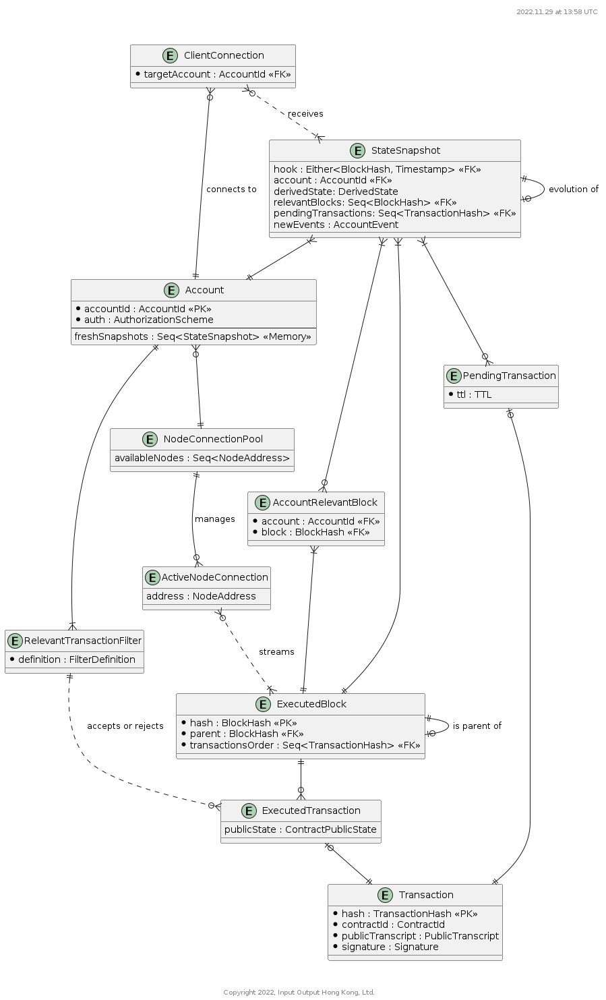

# Wallet Backend

Link to code repo

Component description

## Special Considerations

### Trust

This service implicitly trusts its Node for all block data.  

Clients implicitly trust their `WalletBackend` to serve them correct state and transaction sequences.  There is a risk, however, that a malicious `WalletBackend` might intentionally mislead a client about these facts; is there some easy way for the client to verify anything it learns from the backend?

The service does not trust clients, individually or in aggregate.  In particular, DDoS attacks of all kinds require mitigations.

### Incentives

Is this service monetized?  Does it work for fees?  If so, how are those fees computed and levied?

### Abandoned Session

There is no way to firmly distinguish between a client that has been offline for a while and a client that has forever gone away.  This service maintains data -- sometimes significant amounts of data -- on behalf of its clients.  There must be some policy (configurable) that prunes clients assumed to have abanonded their sessions.  Policy factors may include the time since last contact and the amount of data and/or filter processing consumed by the client in its absence.

## Neighbors & API Dependencies

This service requires a tethered `Node` component that is the source of truth for blocks and that serves contract state so that the `WalletBackend` does not need to compute contract state updates.

Each `WalletBackend` may service any number of clients.  Each client will use only one `WalletBackend` at a time, but may change backends over time.

## Operating Environment

## Key Library Dependencies

## Logical Data Model

Included [ER diagram](https://plantuml.com/ie-diagram).

### Entities

Document the entities.

#### `DEPLOYED_CONTRACT`

All contracts of interest to any client.

#### `CLIENT_CONTRACT`

The recorded fact that a given client is interested in a given contract.  The contract may or may not be deployed when we learn of this interest, so the `contract` column, while not nullable, is only sometimes a valid FK.  Deleted when `CLIENT` is deleted or when the client expresses loss of interest.

### Invariants

This MUST include state invariants expressed in terms of the ER model that describe the valid states of the system.

## Responsibilities

### Interface Data Types

What kinds of data are used in the API's, either as inputs or outputs?  Are they versioned?  Does the component have to support multiple versions at once?

### API's
What API's does the component support?  It's not necessary to include the actual code.  Rather, document the nature of the responsibility and any special constraints.

#### API 1

##### Event 1

- Name, input args, return type, kinds of failures
- Computational complexity
- Net effect on memory size or disk usage
- What ER-model structures are used to handle the event?

##### Event 2

## Non-Functional Requirements

### Scalability

- What is the expected complexity bound of each API function?
- For each API function, what is its net effect on memory growth and what mechanisms are included to prevent memory leaks?

### Availability

Is it ok for the component to "just let it fail" when things go wrong, or must this component fight to survive all errors?

### Security

How are the API's protected against unauthorized use?  What is the DDoS defense, for example?  Are there operations that require specific authorization using signatures or authenticated identities?

### Debugability, Serviceability

- What logging levels are supported and can they be dynamically configured?
- How does the component provide debug context on a crash?

## Life Cycle (State Machine)

The component MUST declare whether it has a lifecycle that can be described as a state machine.  This should include any state changes that affect things like the availability of the component or its resources.  A component that performs periodic expensive memory-refactoring, for example, should document this period of unavailability and high resource usage as a distinct state. 

How will the component handle unavailability of required services, both at launch and in steady state?
