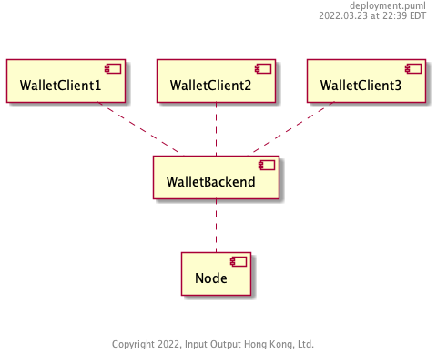
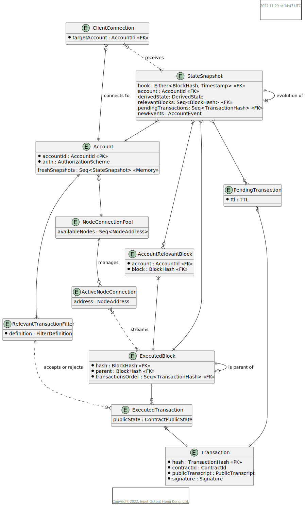

# Wallet Backend

[https://github.com/input-output-hk/midnight-wallet-backend](https://github.com/input-output-hk/midnight-wallet-backend)

Wallet Backend is a cache + preprocessing component of Midnight Wallet. It receives client's viewing key and scans whole blockchain in search for transactions the client may be interested with (directly sending or receiving assets or being involved in a smart contract). Thus, it allows for the client to be implemented for devices with limited network bandwidth, available memory or processing power (browser extensions, mobile apps, all on commodity machines).

Overall, while it is technically possible to implement a fully functioning wallet without backend, it plays an important role:

- allows nodes for not being exposed to the wider web, only p2p connections can be allowed, which removes some scalability and security requirements/constraints from node design and implementation
- handles the process of scanning blockchain in search for wallet-relevant transactions, which is computationally expensive and requires sending whole blockchain over the network
- saves the scanning results for clients, which allows for quick synchronization and state restoration by clients

[Gap analysis to indexer](./Indexer-gap-analysis.md)

## TODO

  - Discuss `Account ||--|| RelevatTxFilter`
  - Reconsider pending transaction handling
  - Revisit naming of `Account`
  - _How likely wallet needs something more than a public state when wanting to interact with already existing contract for the first time?_
  - document that state snapshot should be able to produce a diff between previous
  - extend client connection with known blocks and pending transactions (maybe?)
  - document possible events: applied block, found relevant block, tx submitted, tx failed (ttl)
  - document theoretical possibility of separating derived state from an account

## Special Considerations

### Trust

This service implicitly trusts its Node for all block data, but it can perform consistency checks similar to proposed for client below.

Clients implicitly trust their `WalletBackend` to serve them correct state and transaction sequences. This allows for the easiest and most compact synchronisation protocol between wallet frontend and backend.

There is a risk, however, that a malicious `WalletBackend` might intentionally mislead a client about these facts; is there some easy way for the client to verify anything it learns from the backend? (See https://zcash.readthedocs.io/en/latest/rtd_pages/wallet_threat_model.html for reference)

To mitigate it, we need to ensure a couple of means for the client:

- ability to verify that data received from the backend is consistent on its own
- ability to verify that data received from the backend is indeed part of the chain

For all of the above it is important to keep a couple of properties:

- an honest backend should not experience significant overhead (either computational or memory)
- the client should be able to perform verification easily and quickly
- an adversary backend should require significant resource overhead (disproportional to possible gains) to deceive client

Data consistency can be verified if, for transactions that are learned as a belonging to the wallet, whole blocks are transmitted, potentially with some additional proofs for data that is effect of block processing in node (which also may be part of the header, like data allowing to verify the public state).  
Chain inclusion is another topic though. It seems like consensus would need to be adjusted to accommodate for such a use case, e.g. by introducing some form of checkpoints containing root of a merkle tree containing blocks since previous checkpoint or providing means to verify blocks data with nodes independent of Wallet Backend instance used.

The service does not trust clients, individually or in aggregate. In particular, DDoS attacks of all kinds require mitigations.

### Privacy

What private information does the Wallet Backend learn about its clients? What linkability does it witness that isn't otherwise visible? The need to filter transactions creates challenges here that need to be documented and, of possible, addressed to ensure clients don't sacrifice privacy when working with untrusted Wallet Backends.

Given that Wallet Backend learns the viewing key for particular wallet, and its primary responsibility is to identify transactions related to the wallet, it knows (assuming zerocash-alike scheme for native assets):

- incoming transactions (receiving address, hash, memo, value transferred, public state of involved smart contract and its change, commitments and nullifiers of received notes, nullifiers of spent notes)
- outgoing transactions (receiving and sending address, hash, memo, value transferred, public state of involved smart contract and its change, commitments of new notes, commitments and nullifiers of spent notes)

For that reason it is important to store and process data in a possibly vague/generic way, where wallet backend indeed saves the data that is important for clients, but in a way, that not necessarily say "recipient of transaction X is address Y", but maybe "user of this wallet received a transaction in block Z". This requires a benchmark to be performed if the processing overhead on client side is not too big. Additionally, storage should be encrypted.

### Incentives

Is this service monetized? Does it work for fees? If so, how are those fees computed and levied?

Ideally, it should not be monetized. On the other hand - it is known that the cost of operating a scalable infrastructure for arbitrary number of wallets will be high, due to amount of processing needed. MyMonero, for example, seem to implement a fee scheme, where for transactions sent using their service they collect 50% on top of miner fee.

### Abandoned Session

There is no way to firmly distinguish between a client that has been offline for a while and a client that has forever gone away. This service maintains data -- sometimes significant amounts of data -- on behalf of its clients. There must be some policy (configurable) that prunes clients assumed to have abandoned their sessions. Policy factors may include the time since last contact and the amount of data and/or filter processing consumed by the client in its absence.

## Neighbors & API Dependencies

This service requires a tethered `Node` component that is the source of truth for blocks and that serves contract state so that the `WalletBackend` does not need to compute contract state updates.

Each `WalletBackend` may service any number of clients. Each client will use only one `WalletBackend` at a time, but may change backends over time. Due to significant amount of data processed, number of clients served by single instance may be significantly limited.

## Operating Environment

Wallet backend should be easily runnable on every major platform:

- OS: Linux, macOS, Windows
- architecture: x86_64, ARM

## Key Library Dependencies

1. Platform client for synchronization and transaction submission
2. Ledger client / core wallet library for processing block and transaction data

## Logical Data Model

### Entities

#### `Account`

Aggregate root of an account. It is a unit of processing on wallet backend - both in terms of state (a logical unit of 
state) and execution too (account is essentially identified by its id, filters, authorization data - these all are 
essentially derived from the viewing key passed in case of wallets tracking native tokens). 

It tracks the most recent snapshots of state, in depth allowing to perform synchronization (including not too-deep reorgs) in-memory.  

#### `StateSnapshot`

A unit of account state, hooked in a specified block or a point in time (for pending transactions), that in particular contains:
- previous snapshot
- a new events since the previous snapshot

Based on the above, the snapshot can essentially provide:
- collection of blocks relevant for the account (that is - containing transactions, which installed filter(s) accept)
- collection of pending transactions - that is - transactions wallet backend is waiting for verification
- data derived during the process of synchronization, e.g. witnesses tree, block finality threshold

This organization makes it easy to:
  - handle chain reorganizations (discard block-induced events from snapshots newer than branching point, start applying block 
    again considering timestamps for proper pending transaction handling)
  - differential synchronization with clients
  - persist changes 

#### `AccountRelevantBlock`

A manifestation of many-to-many relationship between blocks and accounts.

#### `ExecutedBlock`

A block as streamed from node, it differs from raw block (as used in p2p communication) by being enhanced with data 
available after its execution.

#### `ExecutedTransaction`

Transaction enhanced with data from block execution, most notably - public state of smart contracts (or at least - data 
allowing to query node for it).

#### `Transaction`

Transaction as created by wallet, contained in blocks and transmitted in p2p protocols. Basic unit of execution, it is defined with:

- data to update ledger state, like contract id + public transcript or inputs and outputs, all with accompanying zk-proofs
- seal - e.g. signature

#### `PendingTransaction`

Transaction that was submitted to the network, but wallet haven't learned yet about its verification. Associated TTL is 
for purpose of submission retries & marking transaction as failed for an unknown reason. Exact semantics and treatment 
of TTL value depend on node's `Transaction Submission` protocol (and consensus, too) - what kind of information the node
is able to provide in case of failure of including transaction in chain.

#### `RelevantTransactionFilter`

A filter, which decides whether particular transaction is relevant for the account or not. Accepting a transaction has to
result with proper event being emitted and [StateSnapshot](#`StateSnapshot`) created
There are a couple of built-in/predefined filters expected to be available and sufficient in most cases:

- native tokens - that is one, which knows how to decrypt and verify native tokens retrieval/spent
- contract - which accepts all transactions belonging to identified contract

#### `NodeConnectionPool`

A pool (either configured or dynamically obtained) of nodes available for synchronizing purposes. The pool's role is to 
allow splitting workload between nodes and maintaining synchronization in case of node failure

#### `ActiveNodeConnection`

Active, established connection to node, that allows proceed with _Synchronization_ or _Transaction Submission_ protocols. 
It is identified by node's address (most probably - IP + port number). Synchronization protocol is expected to be similar 
to the [Local Chain Sync](https://ogmios.dev/mini-protocols/local-chain-sync/) one

#### `ClientConnection`

Active connection initiated by a client, who wants to synchronize its local state. Once connection is initialized, 
first the authorization protocol has to be executed, then the synchronization can take place. Synchronization protocol 
is expected to be similar to the [Local Chain Sync](https://ogmios.dev/mini-protocols/local-chain-sync/) one

### Invariants

This MUST include state invariants expressed in terms of the ER model that describe the valid states of the system.

1. Every single `AccountRelevantBlock` should contain a transaction that is accepted by at least one of the filters owned by an account
2. Except for pending transactions - a `StateSnapshot` data should be derived from a previous snapshot and the new `AccountEvent`s
3. `PendingTransaction`s `TTL` is always a positive value, reaching 0 means TTL failed reaching the chain for an unknown reason.
4. Single account should be connected to at most single node only at a time, exactly one during normal operation, 0 when 
   initializing connection or switching between nodes (for any reason)
5. The only user-provided data is one for: setting up an account, its filter(s) and pending transactions. Everything 
   else is meant to be recoverable from chain. In essence - setting up the same account on different deployment connected 
   to the same network eventually should lead to the same state observed. 

## Responsibilities

### Interface Data Types

What kinds of data are used in the API's, either as inputs or outputs? Are they versioned? Does the component have to support multiple versions at once?

### API's

What API's does the component support? It's not necessary to include the actual code. Rather, document the nature of the responsibility and any special constraints.

#### API 1

##### Event 1

- Name, input args, return type, kinds of failures
- Computational complexity
- Net effect on memory size or disk usage
- What ER-model structures are used to handle the event?

##### Event 2

## Non-Functional Requirements

### Scalability

- What is the expected complexity bound of each API function?
- For each API function, what is its net effect on memory growth and what mechanisms are included to prevent memory leaks?

### Availability

Is it ok for the component to "just let it fail" when things go wrong, or must this component fight to survive all errors?

### Security

How are the API's protected against unauthorized use? What is the DDoS defense, for example? Are there operations that require specific authorization using signatures or authenticated identities?

### Debugability, Serviceability

- What logging levels are supported and can they be dynamically configured?
- How does the component provide debug context on a crash?

## Life Cycle (State Machine)

The component MUST declare whether it has a lifecycle that can be described as a state machine. This should include any state changes that affect things like the availability of the component or its resources. A component that performs periodic expensive memory-refactoring, for example, should document this period of unavailability and high resource usage as a distinct state.

How will the component handle unavailability of required services, both at launch and in steady state?
