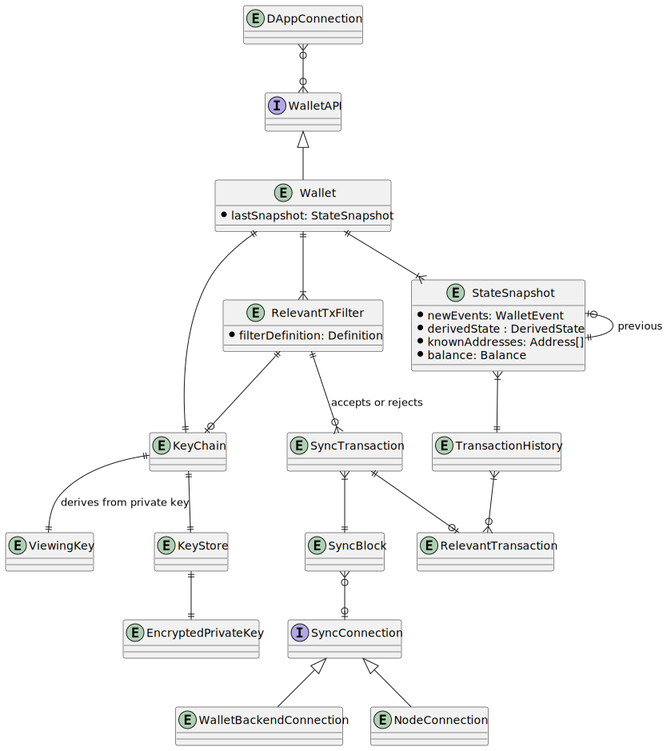

# Wallet Engine

[Wallet Engine Repository](https://github.com/input-output-hk/midnight-wallet)

A library, which defines major building blocks of any Midnight Wallet, providing
implementations, or at least framework-like APIs, for them. As such, it is meant to
provide implementations of the core wallet functionality for:
- browser extension wallet
- headless wallet to be used in testing
- wallet backend

And as an engine for wallet software, the most important responsibilities are:
- protect the private key(s)
- allow creating transactions authenticated using the key
- submitting the created transactions to the network
- keep track of native tokens associated with owned key(s) and data allowing to
  spend them, like Merkle trees

## Special Needs

--

## Neighbors & API Dependencies

## Client - Node Sync

In certain circumstances the wallet has to be connected directly to the node in order to
learn about new transactions.

## Client/server - Wallet Backend Sync

Sometimes wallet is connecting to [Wallet Backend](../WalletBackend) instead of Node. The
library is meant to make it possible and easy to connect to either one, depending on
developer's need.

## Client - Proving

Assuming native tokens' commitment scheme is similar to Sapling or Orchard, wallet has to
calculate zk proofs for spends and outputs.

## Client - Kernel

Kernel is expected to implement core primitives of native tokens' commitment scheme.
Wallet Engine is using these low-level APIs to expose friendlier, higher-level ones.

## Server - Wallet API

Core Wallet primitive is meant to implement unified Midnight Wallet interface, which is
meant to be used by dApp developers in testing and by the [Client SDK](../ClientSDK)
in actual dApps.

## Operating Environment

Applications implemented using Wallet Engine are expected to work in different
environments.

The most obvious ones are: browsers and node.js. Then, some applications, like Wallet
Backend, are meant to be run as backend services, which raises preference for a native
Linux binary (be it ARM or x86_64 architecture).

## Key Library Dependencies

## Logical Data Model

In most of the usages, if only the standard Wallet implementation is used, the data model
is expected to look more or less like on the diagram below.

### Entities

Document the entities.

#### Entity 1

#### Entity 2

### Invariants

This MUST include state invariants expressed in terms of the ER model that describe the
valid states of the system.

## Responsibilities

### Interface Data Types

What kinds of data are used in the API's, either as inputs or outputs? Are they versioned?
Does the component have to support multiple versions at once?

### API's

What API's does the component support? It's not necessary to include the actual code.
Rather, document the nature of the responsibility and any special constraints.

#### API 1

##### Event 1

- Name, input args, return type, kinds of failures
- Computational complexity
- Net effect on memory size or disk usage
- What ER-model structures are used to handle the event?

##### Event 2

## Architecture Characteristics

NOTE:  There is also a
quick [reference list of architecture characteristics](../../definitions.md#architecture-characteristics)
available.

NOTE:  Choose wisely, the more architecture characteristics are identified for a
component, the more complicated it will be. Also, bear in mind that some architecture
characteristics can be delegated to software design or UX.

Here is a list of sample architecture characteristics, please remember to update them to
match the needs of the particular component.

### Configurability

Wallet Engine should be configurable to accommodate for wide range of use cases. Most
notably - what to connect for syncing, what is the target network. This also means, that
support for either feature flags, or ability to compose final implementation out of
smaller pieces is desired.

### Performance

- What is the expected complexity bound of each API function?
- For each API function, what is its net effect on memory growth and what mechanisms are
  included to prevent memory leaks?

Wallet software runs a lot of cryptographic functions, which, compared to others - are
usually the most expensive ones, and in case of collecting hundreds, or thousands of
elements (mostly - UTxOs and transactions) that require calling these functions, this
whole cost starts to add-up pretty quickly. Therefore, _measured_ complexity of most  
calls should be logarithmic in relation to number of UTxOs tracked by wallet, linear only
if it is impossible to perform operation within logarithmic time.

Given current experiences, it seems that an implementation of wallet, which is able to
keep in memory bare minimum of data needed to perform synchronization efficiently is a
good remediation for memory leaks and make memory footprint dependent mostly on number of
UTxOs tracked.

### Availability

Given its nature, in many cases just letting wallet report an error and be restarted by
upstream code should be fine. If implemented as a Engine's sub-component (behaving like a
supervisor in actor frameworks), upstream code might not even notice failure as long as it
is not a critical one.

### Security, Authentication, Authorization

Wallet core responsibility lies in protecting the keys and making use of them in order to
prepare and sign transactions. Thus, the private key has to be loaded to the memory only
when necessary and encrypted when stored.

The APIs that allow for issuing transactions, need to provide a way to implement e.g.
consent from user or way to provide a password (or other credential) needed to decrypt the
private key.

Rest of protections and risks is application-specific and this library may provide
implementations that address them.

### Debugability, Serviceability

A tracing interface is meant to be enabled, which allows to adjust logging and presenting
data by code that collect traces. In most cases, recent trace + stack trace should be
enough of data for debugging. The specific way it's done depends on client code and
environment though.

### Extensibility

This is one of requirements for Wallet Engine. Without extensive extensibility in many
places (storage, ability to plug in new data-processing features, synchronization) the
Wallet Engine will become a bottleneck in implementations. Having ways around to inject
application-specific behaviour will make it easier to gather features only after they are
proven useful in some other contexts already.

### Leverageability/Reuse

It is sole reason this component is created.

### Upgradeability	

It is an important characteristic since it directly affects user and developer 
experiences of applications facing end-users.

### Portability

As visible in [Operating Environment](#Operating Environment) above already - portability
arises from reuse requirement. Because of possible wide range of environments applications
may use this library in, Scala language was selected as the language. It allows
compilation to JS code, runs natively on JVM and allows compilation to native code, thanks
to Graal Native Image.

## Life Cycle (State Machine)

The component MUST declare whether it has a lifecycle that can be described as a state
machine. This should include any state changes that affect things like the availability of
the component or its resources. A component that performs periodic expensive
memory-refactoring, for example, should document this period of unavailability and high
resource usage as a distinct state.

How will the component handle unavailability of required services, both at launch and in
steady state?
