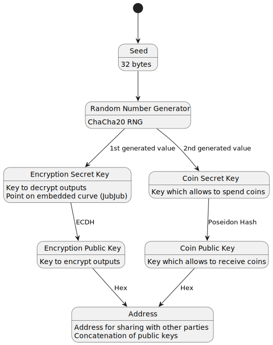
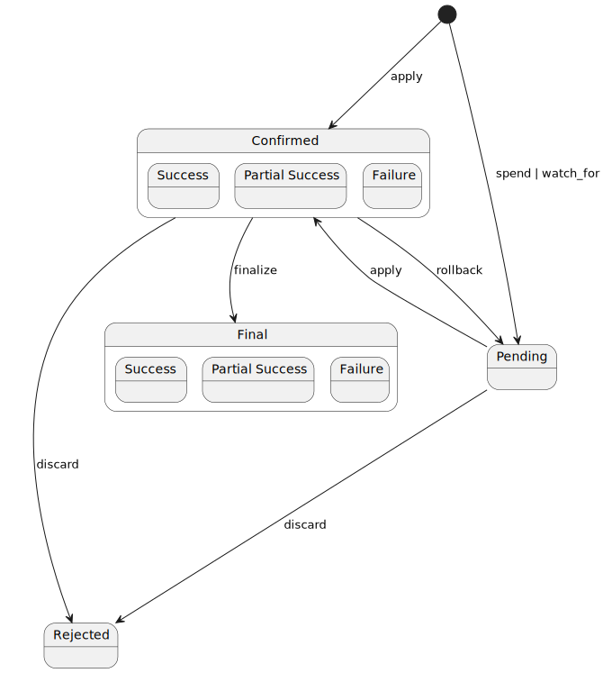
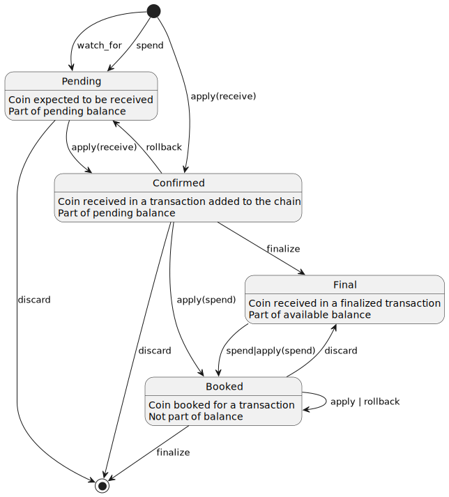

# Midnight Wallet Specification

This document is meant to be a reference for wallet implementors: explaining the differences between other well-known blockchain protocols, providing details on data needed to successfully create and submit transactions, as well as provide practical insights. There are some aspects of cryptography and algorithms used, which are unique to wallet, and thus - are explained in more detail, while others, more ubiquitous across the stack - are meant to be a target of separate documents.  

Midnight features a unique set of features, which influence the way wallet software can operate significantly. In particular, in comparison to many other blockchain protocols:
- transactions are not sealed with signatures
- usage of zero-knowledge technology requires users to generate proofs, which takes relatively a lot of resources: time, CPU and memory
- knowing wallet balance requires iterating over every single transaction present

This document comprises a couple of sections:
1. *[Introduction](#introduction)* - which explains, how addressing goals stated for the protocol leads to differences mentioned above
2. *Key management* - where the details of key structure, address format and relationship with existing standards are provided
3. *Transaction structure* - which explains, what data are present in transactions
4. *State management* - where state needed to build transactions is defined, together with operations necessary to manipulate it
5. *Transaction building* - on the details and steps to be performed to build transaction

<!-- TOC -->
* [Midnight Wallet Specification](#midnight-wallet-specification)
  * [Introduction](#introduction)
    * [Non-interactive zero knowledge proofs of knowledge (NIZK)](#non-interactive-zero-knowledge-proofs-of-knowledge-nizk)
    * [Coin nullifiers and commitments](#coin-nullifiers-and-commitments)
    * [Binding randomness](#binding-randomness)
    * [Output encryption and blockchain scanning](#output-encryption-and-blockchain-scanning)
    * [Summary](#summary)
<!-- TOC -->

## Introduction

Wallet is an important component in a whole network - it stores and protects user's secret keys and allows to use them in order to create or confirm transactions.

It is often the case, that for user's convenience, wallets also collect all the data necessary for issuing simple operations on tokens. Midnight Wallet is no exception in this regard, one could even say, that in case of Midnight, that data management is a particularly important task because the data needed to create transaction is not only sensitive, but also computationally expensive to obtain. This is a common property to many, if not all implementations of protocols based on [Zerocash](http://zerocash-project.org/media/pdf/zerocash-extended-20140518.pdf) and [CryptoNote](https://bytecoin.org/old/whitepaper.pdf) protocols of privacy-preserving tokens, and Midnight shielded tokens protocol belongs to this family, as it is based on [Zswap](https://iohk.io/en/research/library/papers/zswap-zk-snark-based-non-interactive-multi-asset-swaps/), which is related to an evolution of Zerocash protocol.

Zswap, as a protocol for privacy-preserving tokens, has 3 major goals:
1. Maintain privacy of transfers, so that it is impossible to tell:
   - who the input provider (sender) is, unless one is the provider themself
   - who the output recipient is, unless one created that output or is the recipient
   - what amounts were moved, unless one is sender or receiver of particular output
   - what kinds of tokens were moved, unless one is sender or receiver of the token
2. Allow to maintain privacy, while using a non-interactive protocol. That is - to not need interact with the network or other parties after transaction was submitted.
3. Allow to make swap transactions

It appears, these 3 goals combined, motivate usage of specific tools and data structures, that have significant impact on the wallet. Let's see what they are, and how they are used thorough the lifecycle of a coin.

### Non-interactive zero knowledge proofs of knowledge (NIZK)

They provide one, but crucial capability - prove certain computation was performed according to predefined rules, without revealing private data inputs. This means that eventually transaction can contain only the zero-knowledge proof about all the data (including private one) used to build the transaction and some additional data, which has to be public in order to properly evolve the ledger state and allow it to verify future transactions. And that after transaction is submitted - there is no need for additional interaction in order to verify transaction validity.

The predefined rules encoded in the proofs are:
- sender has the right to spend coins provided as inputs
- the transaction contains only specific inputs and outputs
- auxiliary data for preventing unbalanced spends (see [Coin nullifiers and commitments](#coin-nullifiers-and-commitments))

### Coin nullifiers and commitments

Inputs and outputs of a transaction can be thought as exchanging banknotes - each has its (secret) serial number (nonce), currency (type) and value. But the goal is to exchange them while maintaining privacy, so nonce, type, and value should not be publicly available, and at the same time - ledger needs to be assured no tokens are created out of thin air. 

The zero-knowledge proof can assure ledger that no new tokens are created in a transaction - that for each token type the value in inputs covers the value in outputs up to a certain, publicly known imbalance, which is the difference between value from outputs and value from inputs. Having this assertion in place, what is left, is to ensure that:
- no coin is ever used twice (double spend)
- coin was indeed created in an earlier transaction

Preventing double spends is achieved using _nullifiers_ - these are hashes, which take as input: coin (value, type and nonce) and sender secret key. Involvement of sender secret key allows only sender to calculate nullifier that will match the one encoded in a proof, while the whole coin makes each nullifier unique for that coin. Ledger keeps track of nullifiers in a set data structure, so that whenever an input provides a nullifier, which already is known to ledger - it means the transaction should be rejected, because a double spend attempt is taking place.

Ensuring that coin was earlier created as an output is slightly more involved. Firstly, it requires a function to calculate value called coin commitment. This function takes coin as an input, together with receiver address. This allows both sender and receiver to calculate the same value, but no one else (because coin nonce is secret). Each output to the transaction has the commitment publicly readable, and ledger tracks them in a data structure called Merkle tree, which allows to generate a succinct proof that a value is stored in the tree. Such proof needs to be provided when spending a coin. If the proof leads to a tree root, which ledger did not register - it means the coin being spent was not created in a transaction known to the ledger.

### Binding randomness

Many other protocols make use of signature schemes to prevent transaction malleability and prove credentials to issue transaction. To enable atomic swaps, ultimately needed are (at least) 2 parties, which create matching offers, which eventually are combined into a single transaction or executed within a single transaction. The approach Zswap is taking to enable atomic swaps is by allowing controlled malleability - namely merging transactions. But this means known signature schemes can not be used as they prevent malleability completely. It is already not needed to prove credentials to issue transaction - each input and output has relevant zero-knowledge proof attached. 

It is enabled by a construction called _sparse homomorphic commitment_, which is built from 3 functions:
1. for calculating a value commitment for a set consisting of pairs of coin type and value, and additional random element called randomness
2. for combining the value commitments
3. for combining the randomnesses

These functions are carefully selected so that together they provide a really nice properties:
- combining commitments is equal to calculating a commitment for a set being a sum of sets provided to combined commitments and randomnesses combined too
- commitment for a coin when value is equal 0 is equal to a commitment of an empty set

With such scheme in place one can do the following: 
- attach the commitment to each input and output as well as calculate it in its proof (so that proof binds the input or output it is attached to)
- combine randomnesses of all inputs and outputs and attach it to the transaction
- attach to transaction imbalances of each token type

This allows to ensure that transaction was not tampered with, because resulting combination of commitments of all inputs, outputs and imbalances needs to be equal to commitment of an empty set with transaction randomness, if they differ - it means transaction was tampered with. And, because it is known how to combine both commitments and randomnesses, it is possible to merge two transactions into one and still make this check pass. 

### Output encryption and blockchain scanning

With just zero-knowledge proof no additional interaction is needed to verify transaction, but there is no way for the receiver to know, that there exists a transaction, which contains a coin meant for them. Attaching any identifier would end up with not meeting privacy goal, for that reason outputs can have attached coin details, encrypted with receiver's public key. So that in a pursuit in lack of interaction, one can scan a blockchain transaction outputs for ones that decrypt successfully with own private key.

### Summary

Zswap reaches its goals of maintaining privacy using a non-interactive protocol and allowing swaps through a combination of zero-knowledge technology, coin nullifiers and Merkle tree of coin commitments tracked by ledger, sparse homomorphic commitments and output encryption. This indicates high level goals of wallet software for Midnight, which need to be met in order to be able to create a transaction, that will be accepted by Midnight's ledger:
- generate proper zero-knowledge proofs
- track coin lifecycle to prevent double spends
- keep access to an up-to-date view on the Merkle tree of coin commitments, which allows to generate inclusion proofs for coins owned by particular wallet instance
- derive relevant keys
- calculate nullifiers, coin commitments, value commitments as well as combine them accordingly
- encrypt and decrypt outputs
- scan blockchain transactions for own outputs

## Key management

In order to support operations mentioned in the [introduction](#introduction), wallet needs to generate and maintain number of keys. Additionally, there are existing standards related to key management, which wallets tends to follow for maintaining consistent user experience and portability of keys.

The keys used in Midnight are presented below: 



### Seed

A secret 32 bytes, which allow to generate all the other keys. Rest of key generation is performed using a ChaCha20 random number generator.

Since it is 32 bytes, it can be encoded directly as 24 seed phrase following [BIP-0039](https://github.com/bitcoin/bips/blob/master/bip-0039.mediawiki) algorithm.

One can also treat seed as a private key of an account in a BIP-44 (or similar) hierarchy. At this moment no value `coin_type` is selected nor registered in [SLIP-0044](https://github.com/satoshilabs/slips/blob/master/slip-0044.md), but mentioned SLIP mentions that all testnets should use `0x80000001`.

### Output encryption keys

Encryption secret key is a random element of the embedded curve's (JubJub) scalar field, generated as the first value from the RNG initialized with seed.

Although it is a secret key, so it should be treated with a special care, there is one situation, where it can be shared - as a key letting a trusted backend service index wallet transactions - in such context it acts as a viewing key.

Encryption public key is derived using Elliptic Curve Diffie-Hellman scheme (so it is a point on the JubJub curve).

### Coin keys

Coin secret key is 32 random bytes, generated as the second value generated from the RNG. Through coin commitment calculation in a zero-knowledge proof it is a credential to rights to spend particular coin.

Coin public key is 32 bytes calculated as Poseidon hash of width 3 (2 inputs, one output) over the main curve (BLS12-381) with domain separator `midnight:pk-derive` padded to 32 bytes, that is (in a TS pseudocode):

```ts
function coinPublicKey (coinSecretKey: Buffer): Buffer {
  const DOMAIN_SEPARATOR = Buffer.alloc(32).fill("midnight:pk-derive", 0, 18);
  return poseidon(DOMAIN_SEPARATOR, coinSecretKey)
}
```

### Address

Since coin ownership and output encryption are separated and use different keys, address contains both components as a concatenation of a base16-encoded coin public key, pipe sign (`|`) and base16-serialized encryption public key.

Such built address can be sent to other parties, and the sender wallet can easily extract both components by splitting at `|` character.


## Transaction structure and statuses

Midnight transaction includes 3 components:
1. guaranteed Zswap offer
2. (optional) fallible Zswap offer
3. (optional) list of contract calls and deploys

Zswap offer is an atomically applicable, balanced, sorted set of inputs, outputs and transients. It also tracks token imbalances, because finalized offer does not contain information about coins values. The split into guaranteed and fallible offers is related to contracts and paying fees - guaranteed offer is applied first and needs to succeed for transaction to succeed at all, this offer needs to cover transaction fees. Then fallible offer is applied, which may fail, or may succeed, together with contract part. Because Midnight Node might include in a block transaction, which failed execution, there are 3 possible statuses to derive:
- success - in which case all present components of transaction were successfully applied by ledger
- partial success - when only guaranteed offer was successfully applied
- failure - when even the guaranteed offer failed

Offer input represents a coin spent in a transaction. It contains:
- coin nullififer
- value commitment
- root of a coin commitment tree expected to be a result of a merkle proof
- zero-knowledge spend proof
- optionally, contract address, if contract is providing the input.

Offer output represents coin received in a transaction. It contains:
- coin commitment
- value commitment
- zero knowledge creation proof
- optionally, coin ciphertext
- optionally, contract address, if coin is meant to be received by a contract

Transients are an extension needed for contract execution - they are intermediate coins created and spent within a single transaction. They allow contracts to correctly witness coin reception and spend in all situations, especially ones, where contract needs to e.g. merge existing coins with freshly received ones. They also allow to transfer token in the same transaction it was received. For that reason they share many of properties of both inputs and outputs, which are:
- coin nullifier
- coin commitment
- input value commitment
- output value commitment
- optionally, coin ciphertext,
- optionally, contract address, if a contract received the original coin 

## State management

Wallet has a state, which needs accurate maintenance in order to be able to use coins in a transaction. Minimally, it consists of the data needed to spend coins:
- keys
- set of known coins
- coin commitment Merkle tree

Additionally, it is in practice important to track progress of synchronization with chain, pool of pending transactions and transaction history.

There are 7 foundational operations defined, which should be atomic to whole wallet state:
- `apply_transaction(transaction, status, expected_root)` - which updates the state with a transaction observed on chain, this operation allows to learn about incoming transactions
- `finalize_transaction(transaction)` - which marks transaction as final according to consensus rules
- `rollback_last_transaction` - which reverts effects of applying last transaction 
- `discard_transaction(transaction)` - which considers a pending transaction irreversibly failed  
- `spend(coins_to_spend, new_coins)` - which spends coins in a new transaction
- `watch_for(coin)` - which adds a coin to explicitly watch for

With the `apply_transaction`, `finalize_transaction` and `rollback_transaction` possibly be extended to blocks or ranges of blocks. Since shielded tokens are implemented using effectively an UTxO mode, one can find [Cardano Wallet Formal Specification](https://iohk.io/en/research/library/papers/formal-specification-for-a-cardano-wallet/) a relevant read, with many similarities present.

Full transaction lifecycle in relationship to those operations is presented on figure below. Please note, that confirmed and final transactions have statuses related to their execution.




### Balances

A balance of token in a wallet is a sum of values of coins of that token type.

Because consensus finality is not instant, and sometimes wallet knows about coins before they can be spent, there are 3 distinct balances recognized:
- available - derived from final unspent coins, that is - this is the balance, which wallet is safe to spend at the moment, with no risk of transaction being rejected due to coin double spend
- pending - derived from pending coins; this balance represents amount of tokens wallet knows it waits for, but they are not final yet
- total - sum of available and pending balances; it represents total amount of tokens under wallet's control, taking into consideration known pending transactions and coins

Because of need to book coins for ongoing transactions, coin lifecycle differs from transaction lifecycle as presented on the figure below:



### Operations

#### `apply_transaction`

Applies transaction to wallet state. Most importantly - to discover received coins. Depending on provided status of transaction executes for guaranteed offer only or first guaranteed and then fallible offer. Steps that need to be taken for a successful offer are:
1. Update coin commitment tree with commitments of outputs present in the offer
2. Verify coin commitment tree root against provided one, implementation needs to revert updates to coin commitment tree and abort in case of inconsistency
3. Book coins, whose nullifiers match the ones present in offer inputs 
4. Watch for received coins, for each output:
   1. Match commitment with set of pending coins, if it is a match, mark coin as confirmed
   2. If commitment is not a match, try to decrypt output ciphertext, if decryption succeeds - add coin to known set as a confirmed one
   3. If decryption fails - ignore output

If transaction is reported to fail entirely, it is up to implementor to choose how to progress. It is advised to record such event in transaction history and notify user.

If transaction history is tracked, an entry should be added, with confirmed status. Amount of tokens spent can be deducted by comparing coins provided as inputs through nullifiers and discovered outputs. 

#### `finalize_transaction`

Marks transaction as final. Midnight uses Grandpa finalization gadget, which provide definitive information about finalization, thus there is no need to implement probabilistic rules. It is expected wallet state has already applied provided transaction. 
This operation needs to:
1. Mark coin commitment tree state from that transaction as final
2. Update status of known coins to final, so that they become part of available balance
3. Update statuses of transactions in history if tracked

#### `rollback_last_transaction`

Reverts effects of applying last transaction in response to chain reorganization. It needs to:
1. Revert coin commitment tree state to one from before that transaction
2. If transaction is considered own:
   1. Add it to the pool of pending transactions, so it can be submitted to the network again
   2. Move coins received from it to pending state
3. Otherwise discard transaction

#### `discard_transaction`

Frees resources related to tracking a transaction considered not relevant anymore. Following steps need to be taken:
1. Move transaction to transaction history as failed
2. Remove coins received in the transaction
3. Un-book coins spent in the transaction

#### `spend`

Spend coins in a transaction, either by initiating swap, making transfer or balancing other transaction. Only final coins should be provided as inputs to the transaction. 

In certain situations implementation might allow to use confirmed and yet not final coins. Such transaction is bound to fail in case of reorganization because of coin commitment tree root mismatch, so a special care should be put into user experience of managing such transactions.

Following steps need to be taken, from perspective of wallet state:
1. Select coins to use in transaction and book them
2. Prepare change outputs, add them to pending coin pool
3. Prepare transaction, add it to pending transaction pool

#### `watch_for`

Watches for a coin whose details are provided. There are limitations, which require usage of this operation to receive coins from contracts.

It only adds a coin to a pending set, if transaction details are provided too, then such transaction might be added to transaction history as expected.

## Usage of indexer

Literal implementation of a Midnight Wallet, applying transactions one by one, provided by a local node is the best option from security and privacy standpoint, but resources needed to run such implementation and time to have wallet synchronized are quite significant.


