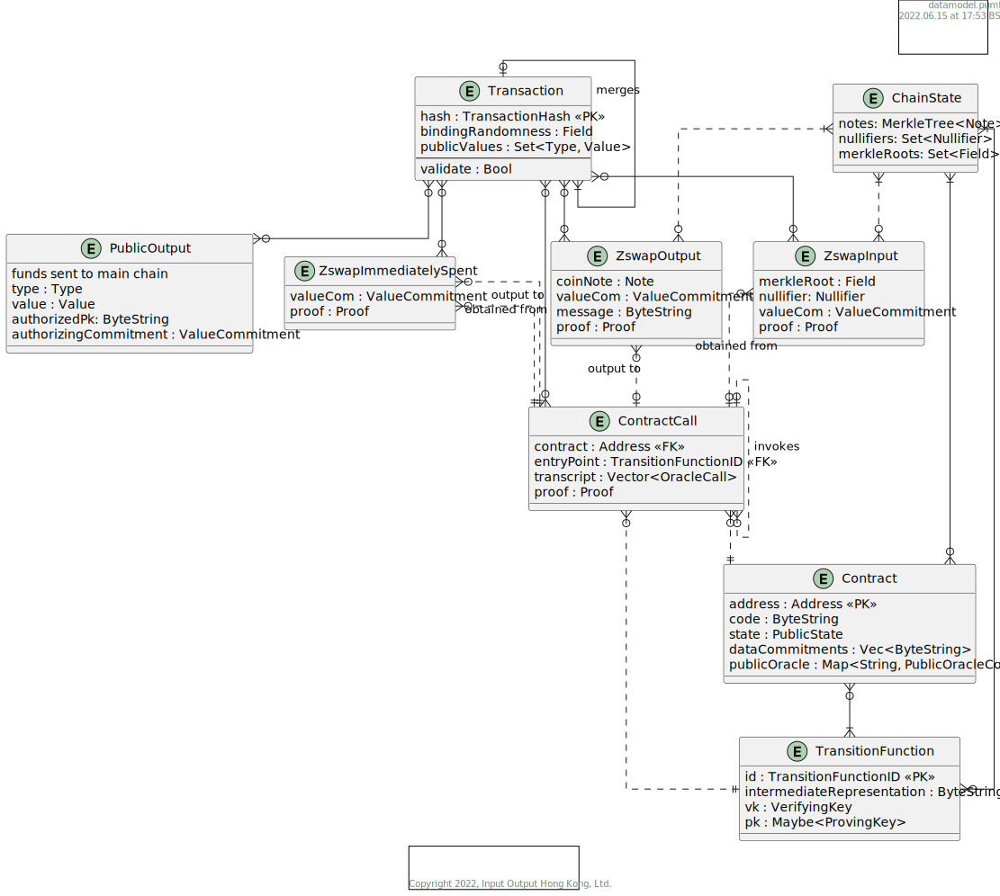

# Transaction Kernel

**This component is a draft.**

[reference implementation](https://github.com/input-output-hk/midnight-kernel-reference/)

The transaction kernel covers the behaviour of Midnight's native currency,
accountability predicates added to this currency, and interactions with smart
contract through [lares](../lares/). This *includes* contract-to-contract
interaction, as this also covers cross-contract transfers.

## Special Considerations

### Proof system capabilities

Parts of the transaction kernel depend on the availability of one-step-recursion in our proof system.

## Neighbors & API Dependencies

Interacts with the *node* for transaction execution, as well as the
*Transaction Constructor* for creating a transaction. Parts of the transaction
kernel will be compiled to *abcird*, and parts to our currently undefined
*public and private oracle languages*, effectively running as an extend to
[Lares](../lares/). Some of its privileged operations will request information
from the *wallet frontend*.

## Operating Environment

The transaction kernel will operate in two independent modes: Transaction
creation and validation. Transaction creation should be runnable is a browser
context in WASM, given trusted external preprocessing. Transaction validation
should run on all systems supported by full nodes, and within transaction
execution budgets.

## Key Library Dependencies

1. Lares for the execution semantics of contract subtransactions.
2. Abcird as the language of kernel circuits.
3. Snarkie for proof creation & proof verification

## Logical Data Model

### Entities

#### Entity 1

#### Entity 2

### Invariants

This MUST include state invariants expressed in terms of the ER model that describe the valid states of the system.

## Responsibilities

### Interface Data Types

What kinds of data are used in the API's, either as inputs or outputs?  Are they versioned?  Does the component have to support multiple versions at once?

### API's
What API's does the component support?  It's not necessary to include the actual code.  Rather, document the nature of the responsibility and any special constraints.

#### API 1

##### Event 1

- Name, input args, return type, kinds of failures
- Computational complexity
- Net effect on memory size or disk usage
- What ER-model structures are used to handle the event?

##### Event 2

## Non-Functional Requirements

### Scalability

- What is the expected complexity bound of each API function?
- For each API function, what is its net effect on memory growth and what mechanisms are included to prevent memory leaks?

### Availability

Is it ok for the component to "just let it fail" when things go wrong, or must this component fight to survive all errors?

### Security

How are the API's protected against unauthorized use?  What is the DDoS defense, for example?  Are there operations that require specific authorization using signatures or authenticated identities?

### Debugability, Serviceability

- What logging levels are supported and can they be dynamically configured?
- How does the component provide debug context on a crash?

## Life Cycle (State Machine)

The component MUST declare whether it has a lifecycle that can be described as a state machine.  This should include any state changes that affect things like the availability of the component or its resources.  A component that performs periodic expensive memory-refactoring, for example, should document this period of unavailability and high resource usage as a distinct state. 

How will the component handle unavailability of required services, both at launch and in steady state?
