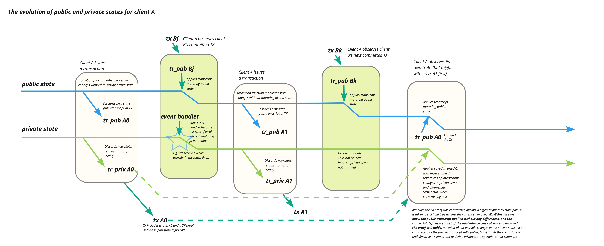

# Private State Management

## Essential Background

* Kachina programs explicitly differentiate the public and private portions of the replicated state machine (RSM) of the contract.  
* It's common to have a single "transition" affect both public and private state.
* Effects on public state are delayed, unreliable, and unordered.  The blockchain makes no guarantees.
* It's common for a contract to *also* update its private state in response to transactions posted by other clients.

## First-Order Implications

* Calling a transition function is a *rehearsal* of a change to the caller's RSM (public and private).  Why rehearse?
	* It is a sanity check.  The rehearsal might fail, in which case no transaction is generated.
	* It produces a private witness that the client can use to prove the validity of the execution agaisnt the then-current RSM.  (*How is this proof still valid against another actual RSM?  Read on.  This is a critical part of the Kachina model.*)
	* It produces transcripts of the sequence of public and private methods invocations and their return values. The public transcript becomes part of the transaction. (*What happens to the private transcript? Read on.*)

* The entire RSM update (public and private) is provisional, but the public/private transcripts have been shown to be coherent with one another.

**Definition** *private query*: a method on the private oracle that may be called inside of a transition function.  Every private-oracle transcript is a sequence of calls to private queries and the return values of those calls.

**Definition** *private event handler*: a method on the private oracle that may be called outside of a transition function.  These methods are named for their primary use case: updating private state in response to an observed "event" such as a verified transaction on chain.

## Illustration: Interleaved State Updates

This figure shows a client's view of a contract over time, with a special focus on the evolution of the client's replicated state machine (the public and private state of the contract).  The figure shows the public state in blue and the private state in red.  The *y* axis is time.  We use the *x* axis to show state changes.  The timeline is divided into two kinds of events processed by the client: transition functions called by the client that generate new transactions, and event handlers executed by the client in response to witnessing transactions (those it generated, and those generated by other clients).

1. The first event shows the client (A) initiating a transaction by calling a transition function.  The transition function takes as inputs the current public and private state; it produces as outputs two transcripts: the public transcript *tr_pub A0* and the private transcript *tr_priv A0*.  The public transcript becomes part of the transaction A proposes to consensus, *tx A0*, while the private transcript is stored locally and indexed by the unique identifier for *tx A0*.  Any state changes produced by executing the transition function are discared or rolled back.
2. Client A next observes a transaction proposed by Client B, $tx Bj$, that is relevant to A's private state.  For example, B might be sending A some committed secret for A to store in its private state for later use in a transaction.  This transaction includes a public transcript from B's transition function that updates the public state of the contract under consensus, so A must apply this state update.  In parallel A can also invoke a private event handler on data from the transaction, updating its private state as a result.  In this case, both the public and private parts of A's contract state are updated by a single transaction.  
3. Next, Client A initiates a new transaction by again calling a transition function.  The transition function takes the now-current public and private states and produces two new transcripts.  Again, it retains the private transcript and publishes the public transcript as part of the new transaction, *tx A1*.
4. Client A next observes another transaction proposed by B, but in this case the transaction is not interesting to A and does not lead to evaluation of any private event handler.  Nevertheless, the transaction does represent a change to the consensus public state, so A must apply the transaction's public transcript to obtain a new public state.
5. Next we see Client A observing one of its own transactions.  The example shows Client A observing transaction *tx A0*, but it could just as easily have observed *tx A1* first because consensus makes no guarantees about ordering of messages.  As with B's transactions, A must apply the public transcript to update the public state; note that although A executed the transition function against an earlier public state, the transcript is now being applied to a public state that has changed twice in the interrim.  Kachina guarantees that the transcript will apply successfully regardless of these intermediate changes, because otherwise the transaction would not be verified and would not appear on chain.  In addition to updating its public state, A must now retrieve its stored private transcript associated with *tx A0* and apply it to the now-current private state.  This is both like and unlike the case of applying the public transcript.  As with the public state, the private state the transcript is modifying at this point is not the same one it modified during the "rehearsal"; it has been changed by the effects of the private event handler that processed *tx Bj$.  Unlike the public state, however, there is no guarantee that applying the private transcript can be applied without errors.  But there is no reasonable recourse for the dApp should the private transcript fail to apply cleanly.

This figure therefore illustrates a crucial requirement Kachina places on the authors of smart contracts: any private transcript generated by the contract must be safe to apply to any well-formed private state.

## Random Notes

* Kachina does not require the client to apply public-oracle transcripts.  If the client has a trusted connection to a Node that has verified the transaction, the client can trust the Node's version of the public state associated with each block.  The choice will come down to performance, if such a trusted relationship exists.  It's easy to imagine a contract state that is large and that contains significant intermal "tail sharing" structure, such as commonly arises in purely functional state updates used to support transactional updates.

* We must clearly distinguish between challenges that arise due to forks/rollbacks from the consensus layer and those that are present even if the client witnesses only finalized transactions.

## Second-Order Implications

* The private oracle must allow arbitrary interleavings of private-oracle transcripts (generated from transition functions) and private event handlers. (*This is not as strong as saying it must allow arbitrary interleavings of all methods.  The transition functions significantly bound the possible interleavings of private queries.  Moreover, a private event handler cannot be called in the middle of a private-oracle transcript.*)

## Alternative Designs

Kachina is a point in the design space.  Some alternatives should be considered before selecting this point for our design.

### Re-Run Transition Functions

Instead of saving the private-oracle transcript, we might save the input parameters to the transition function and simply re-run the whole function when we see the transaction on chain.

