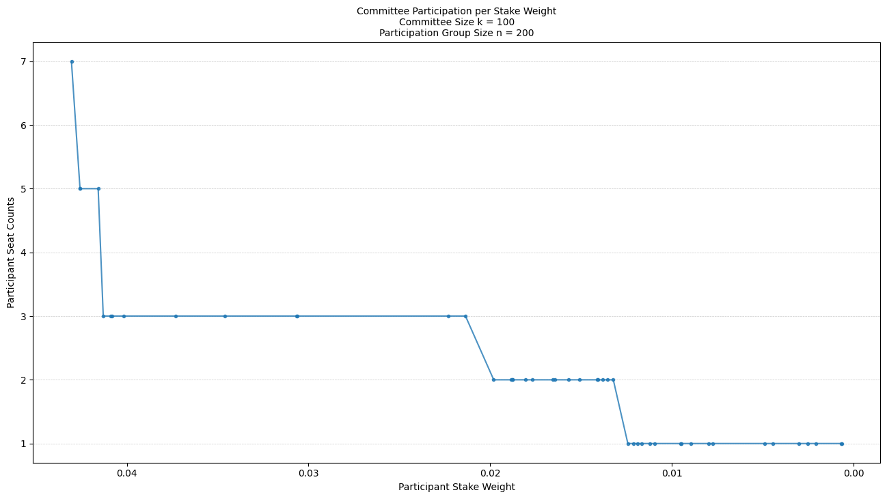
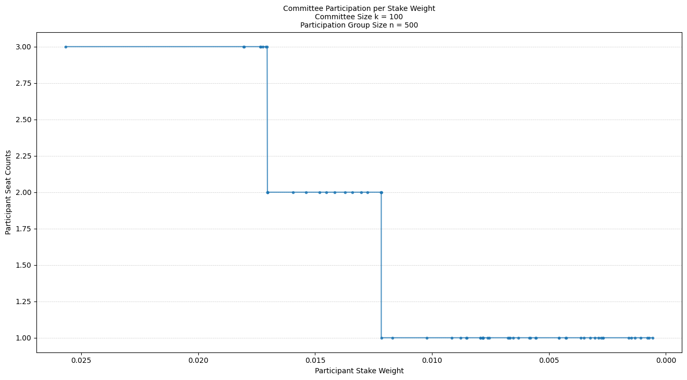
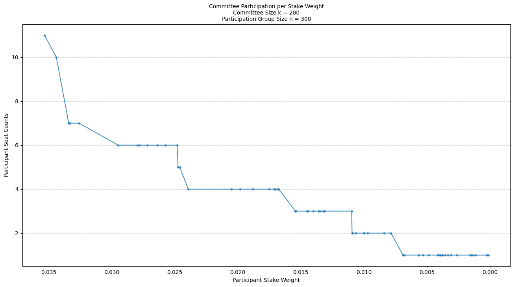
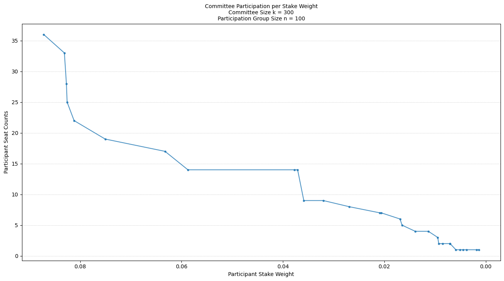
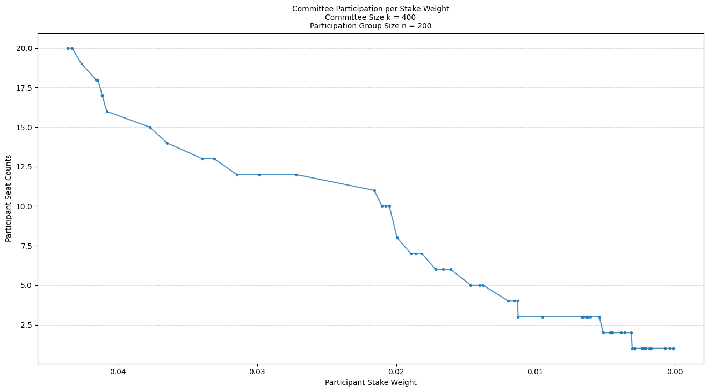
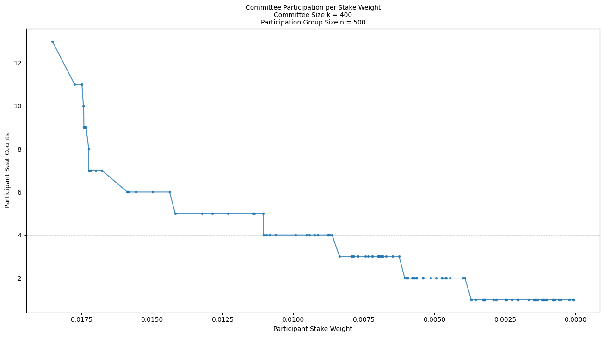
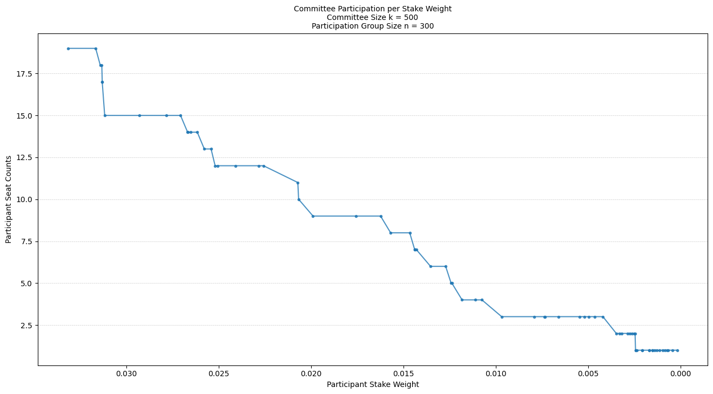

 # Participation Distribution in Committee Selection

 ### Executive Summary

 In the following computer experiments,
 we aim to understand the distribution of selections in a committee
 when varying sizes of the participant pool of SPOs and the committee.
 We show that the "pigeonhole principle" helps us interpret the results
 and understand the finite distribution of the committee seats assigned
 to participants as a function of stake, group, and committee sizes.

 The experiment is designed to:
 - Sample without replacement a group of participants from the population and
 - Calculate the stake weight for each participant, which is the stake normalized
   over the group to sum to 1.
 - Assign a committee of the fixed group size based on the stake weight of each
   using random selection with replacement.
 - Analyze the relationship and distribution of committee selection with group size.

 We conducted the experiments with varying sizes $(100, 200, ..., 500)$
 of groups and committees. The results are visualized through plots of committee
 assignments where we vary the group size to see how the committee selection and
 seat count changes.

 The results show that some group members with smaller stake weights may not (ever?)
 get selected for committee seats.
 With repeated trials where a new committee is selected, called an *epoch*,
 and assuming nonzero stake weight, there is nonzero probability of selecting *any*
 participant in the long run. However, in the short term, there is a significant chance
 that some participants will not ever get selected, almost surely.
 This is a natural outcome of the selection process
 with a discrete and finite number of seats. This is a manifestation of the
 this committee selection process as it currently stands.


```python
# %%

# Load the required libraries

from participation_lib import (
    np,
    pd,
    plt,
    load_data,
    get_stake_distribution,
    assign_commitee,
    plot_group_to_committee_index,
    plot_selection_count_vs_stake,
    plot_committee_selection_counts,
    plot_committee_selection_seat_cutoff,
)
import seaborn as sns
```


```python
# %%

# Load the Data: The population of registered SPOs

population = load_data("../data/pooltool-cleaned.csv")
population.info()
```

    <class 'pandas.core.frame.DataFrame'>
    RangeIndex: 3056 entries, 0 to 3055
    Data columns (total 3 columns):
     #   Column         Non-Null Count  Dtype  
    ---  ------         --------------  -----  
     0   id             3056 non-null   object 
     1   stake          3056 non-null   int64  
     2   stake_percent  3056 non-null   float64
    dtypes: float64(1), int64(1), object(1)
    memory usage: 71.8+ KB


```python
# %%

population.describe()
```


<div>
<style scoped>
    .dataframe tbody tr th:only-of-type {
        vertical-align: middle;
    }

    .dataframe tbody tr th {
        vertical-align: top;
    }

    .dataframe thead th {
        text-align: right;
    }
</style>
<table border="1" class="dataframe">
  <thead>
    <tr style="text-align: right;">
      <th></th>
      <th>stake</th>
      <th>stake_percent</th>
    </tr>
  </thead>
  <tbody>
    <tr>
      <th>count</th>
      <td>3.056000e+03</td>
      <td>3056.000000</td>
    </tr>
    <tr>
      <th>mean</th>
      <td>7.305314e+06</td>
      <td>0.032723</td>
    </tr>
    <tr>
      <th>std</th>
      <td>1.648449e+07</td>
      <td>0.073839</td>
    </tr>
    <tr>
      <th>min</th>
      <td>0.000000e+00</td>
      <td>0.000000</td>
    </tr>
    <tr>
      <th>25%</th>
      <td>5.265000e+02</td>
      <td>0.000002</td>
    </tr>
    <tr>
      <th>50%</th>
      <td>5.692500e+04</td>
      <td>0.000255</td>
    </tr>
    <tr>
      <th>75%</th>
      <td>3.282500e+06</td>
      <td>0.014703</td>
    </tr>
    <tr>
      <th>max</th>
      <td>1.054300e+08</td>
      <td>0.472250</td>
    </tr>
  </tbody>
</table>
</div>


```python
# %%

# Let's now sample a group of participants from the population
# and calculate the stake weight for each participant.

group_size = 100

group_stakes = get_stake_distribution(
    population,
    group_size=group_size,
    num_iter=1000,
    plot_it=True,
)
group_stakes
```


    

    


<div>
<style scoped>
    .dataframe tbody tr th:only-of-type {
        vertical-align: middle;
    }

    .dataframe tbody tr th {
        vertical-align: top;
    }

    .dataframe thead th {
        text-align: right;
    }
</style>
<table border="1" class="dataframe">
  <thead>
    <tr style="text-align: right;">
      <th></th>
      <th>stake</th>
      <th>stake_weight</th>
    </tr>
  </thead>
  <tbody>
    <tr>
      <th>0</th>
      <td>7.219340e+07</td>
      <td>9.222604e-02</td>
    </tr>
    <tr>
      <th>1</th>
      <td>6.818016e+07</td>
      <td>8.709918e-02</td>
    </tr>
    <tr>
      <th>2</th>
      <td>6.408177e+07</td>
      <td>8.186355e-02</td>
    </tr>
    <tr>
      <th>3</th>
      <td>5.903673e+07</td>
      <td>7.541858e-02</td>
    </tr>
    <tr>
      <th>4</th>
      <td>5.363961e+07</td>
      <td>6.852384e-02</td>
    </tr>
    <tr>
      <th>...</th>
      <td>...</td>
      <td>...</td>
    </tr>
    <tr>
      <th>95</th>
      <td>1.878100e+01</td>
      <td>2.399246e-08</td>
    </tr>
    <tr>
      <th>96</th>
      <td>1.138000e+01</td>
      <td>1.453779e-08</td>
    </tr>
    <tr>
      <th>97</th>
      <td>6.772000e+00</td>
      <td>8.651134e-09</td>
    </tr>
    <tr>
      <th>98</th>
      <td>3.466000e+00</td>
      <td>4.427766e-09</td>
    </tr>
    <tr>
      <th>99</th>
      <td>1.666000e+00</td>
      <td>2.128291e-09</td>
    </tr>
  </tbody>
</table>
<p>100 rows × 2 columns</p>
</div>


```python
# %%

group_stakes.describe()
```


<div>
<style scoped>
    .dataframe tbody tr th:only-of-type {
        vertical-align: middle;
    }

    .dataframe tbody tr th {
        vertical-align: top;
    }

    .dataframe thead th {
        text-align: right;
    }
</style>
<table border="1" class="dataframe">
  <thead>
    <tr style="text-align: right;">
      <th></th>
      <th>stake</th>
      <th>stake_weight</th>
    </tr>
  </thead>
  <tbody>
    <tr>
      <th>count</th>
      <td>1.000000e+02</td>
      <td>1.000000e+02</td>
    </tr>
    <tr>
      <th>mean</th>
      <td>7.827876e+06</td>
      <td>1.000000e-02</td>
    </tr>
    <tr>
      <th>std</th>
      <td>1.646826e+07</td>
      <td>2.103797e-02</td>
    </tr>
    <tr>
      <th>min</th>
      <td>1.666000e+00</td>
      <td>2.128291e-09</td>
    </tr>
    <tr>
      <th>25%</th>
      <td>1.884457e+03</td>
      <td>2.407368e-06</td>
    </tr>
    <tr>
      <th>50%</th>
      <td>1.574305e+05</td>
      <td>2.011152e-04</td>
    </tr>
    <tr>
      <th>75%</th>
      <td>4.812535e+06</td>
      <td>6.147944e-03</td>
    </tr>
    <tr>
      <th>max</th>
      <td>7.219340e+07</td>
      <td>9.222604e-02</td>
    </tr>
  </tbody>
</table>
</div>


```python
# %%

# Let's now assign a committee of the fixed group_size
# based on the stake weight of each

committee, seat_counts, first_zero_index = assign_commitee(
    group_stakes,
    committee_size=group_size,
    num_iter=1000,
)
```


    

    


```python
# %%

print("Committee")  # Participants selected for the committee
print(committee)
print("\nSeat Counts")  # Number of times each participant is selected
print(seat_counts)
print("\nFirst Zero Index")  # Index where the seat count first goes to zero
print(first_zero_index)
```

    Committee
              stake  stake_weight
    12  24475930.00      0.031268
    4   53639610.00      0.068524
    0   72193400.00      0.092226
    0   72193400.00      0.092226
    7   39632300.00      0.050630
    ..          ...           ...
    2   64081770.00      0.081864
    17  13636220.00      0.017420
    0   72193400.00      0.092226
    23   6091469.99      0.007782
    7   39632300.00      0.050630
    
    [100 rows x 2 columns]
    
    Seat Counts
    0     0.09200
    1     0.08670
    2     0.08142
    3     0.07587
    4     0.06969
           ...   
    66    0.00000
    65    0.00000
    64    0.00000
    62    0.00000
    99    0.00000
    Name: relative frequency, Length: 100, dtype: float64
    
    First Zero Index
    68


```python
# %%

# Let's now create a plots of committee assignments where we vary
# the group size over {100, 200, 300, 400, 500} and see how the
# committee selection and seat count changes.

# Initialize Parameters:
comm_sizes = [100, 200, 300, 400, 500]  # vary over committee size, k
group_sizes = [100, 200, 300, 400, 500]  # vary over group size, n
num_iter = 1000  # Number of iterations for Monte Carlo simulation
# Note that the number of iterations here can be interpreted as the number
# of selection rounds for the committee, which we call an epoch.
# If we have a new epoch per day, then 1000 iterations is about 3 years.

num_reps = 30  # is the number of repetitions for each group size
# used to average the number of distinct voters over the iterations

# Collect the selection count values
# for each group size, keyed by committee size
committee_seats = {}
distinct_voters = {}

# Initialize an array to store the first zero index
# for each committee size (row) and group size (columns)
first_zero_indices = np.zeros(
    (
        len(comm_sizes),
        len(group_sizes),
    )
)
```


```python
# %%

# Loop over the committee sizes
for i, committee_size in enumerate(comm_sizes):
    # Loop over the group sizes
    selection_counts = {}
    distinct_voters_avg = {}
    distinct_voters_std = {}
    distinct_voters_lst = []  # for the given committee size

    for j, group_size in enumerate(group_sizes):

        group_label = f"Group Size = {group_size}"
        comm_label = f"Committee Size = {committee_size}"

        print(f"{group_label} participants")
        print(f"{comm_label} seats")

        distinct_voters_list = []

        # Average the number of distinct voters over the iterations
        for _ in range(num_reps):
            group_stakes = get_stake_distribution(
                population,
                group_size,
                num_iter=1,
                plot_it=False,
            )
            committee, seat_counts, first_zero_index = assign_commitee(
                group_stakes,
                committee_size=committee_size,
                num_iter=num_iter,
                plot_it=False,
            )

            # Store the last seat counts for each group size
            selection_counts[group_label] = seat_counts

            # Count the number of distinct voters
            distinct_voters_lst.append(len(committee.index.unique()))

        # Average the number of distinct voters over the iterations
        distinct_voters_avg[group_label] = np.mean(distinct_voters_lst)

        # Standard deviation of the number of distinct voters
        distinct_voters_std[group_label] = np.std(distinct_voters_lst)

        plot_selection_count_vs_stake(
            group_stakes,
            committee,
            first_zero_index,
        )

        # Store the last first zero index
        first_zero_indices[i][j] = first_zero_index

    # Collect the selection frequencies in a DataFrame
    committee_seats[comm_label] = pd.DataFrame(selection_counts)
    distinct_voters[comm_label] = pd.DataFrame(
        [distinct_voters_avg, distinct_voters_std],
        index=["Mean", "Std Dev"],
    )
```

    Group Size = 100 participants
    Committee Size = 100 seats


    

    


    Group Size = 200 participants
    Committee Size = 100 seats


    

    


    Group Size = 300 participants
    Committee Size = 100 seats


    

    


    Group Size = 400 participants
    Committee Size = 100 seats


    

    


    Group Size = 500 participants
    Committee Size = 100 seats


    

    


    Group Size = 100 participants
    Committee Size = 200 seats


    

    


    Group Size = 200 participants
    Committee Size = 200 seats


    

    


    Group Size = 300 participants
    Committee Size = 200 seats


    

    


    Group Size = 400 participants
    Committee Size = 200 seats


    

    


    Group Size = 500 participants
    Committee Size = 200 seats


    

    


    Group Size = 100 participants
    Committee Size = 300 seats


    

    


    Group Size = 200 participants
    Committee Size = 300 seats


    

    


    Group Size = 300 participants
    Committee Size = 300 seats


    

    


    Group Size = 400 participants
    Committee Size = 300 seats


    

    


    Group Size = 500 participants
    Committee Size = 300 seats


    

    


    Group Size = 100 participants
    Committee Size = 400 seats


    

    


    Group Size = 200 participants
    Committee Size = 400 seats


    

    


    Group Size = 300 participants
    Committee Size = 400 seats


    

    


    Group Size = 400 participants
    Committee Size = 400 seats


    

    


    Group Size = 500 participants
    Committee Size = 400 seats


    

    


    Group Size = 100 participants
    Committee Size = 500 seats


    

    


    Group Size = 200 participants
    Committee Size = 500 seats


    

    


    Group Size = 300 participants
    Committee Size = 500 seats


    

    


    Group Size = 400 participants
    Committee Size = 500 seats


    

    


    Group Size = 500 participants
    Committee Size = 500 seats


    

    


```python
# %%

# Combine the selection counts for each committee size
# into a single DataFrame for easier analysis and plotting.

distinct_voters_df = pd.concat(distinct_voters, axis=1)
committee_seats_df = pd.concat(
    committee_seats,
    axis=1,
)
sim_results_df = pd.concat(
    [distinct_voters_df, committee_seats_df],
    keys=["Distinct Voters", "Committee Seats"],
)
sim_results_df
```


<div>
<style scoped>
    .dataframe tbody tr th:only-of-type {
        vertical-align: middle;
    }

    .dataframe tbody tr th {
        vertical-align: top;
    }

    .dataframe thead tr th {
        text-align: left;
    }
</style>
<table border="1" class="dataframe">
  <thead>
    <tr>
      <th></th>
      <th></th>
      <th colspan="5" halign="left">Committee Size = 100</th>
      <th colspan="5" halign="left">Committee Size = 200</th>
      <th>...</th>
      <th colspan="5" halign="left">Committee Size = 400</th>
      <th colspan="5" halign="left">Committee Size = 500</th>
    </tr>
    <tr>
      <th></th>
      <th></th>
      <th>Group Size = 100</th>
      <th>Group Size = 200</th>
      <th>Group Size = 300</th>
      <th>Group Size = 400</th>
      <th>Group Size = 500</th>
      <th>Group Size = 100</th>
      <th>Group Size = 200</th>
      <th>Group Size = 300</th>
      <th>Group Size = 400</th>
      <th>Group Size = 500</th>
      <th>...</th>
      <th>Group Size = 100</th>
      <th>Group Size = 200</th>
      <th>Group Size = 300</th>
      <th>Group Size = 400</th>
      <th>Group Size = 500</th>
      <th>Group Size = 100</th>
      <th>Group Size = 200</th>
      <th>Group Size = 300</th>
      <th>Group Size = 400</th>
      <th>Group Size = 500</th>
    </tr>
  </thead>
  <tbody>
    <tr>
      <th rowspan="2" valign="top">Distinct Voters</th>
      <th>Mean</th>
      <td>25.633333</td>
      <td>32.216667</td>
      <td>38.200000</td>
      <td>42.916667</td>
      <td>46.886667</td>
      <td>30.300000</td>
      <td>40.250000</td>
      <td>48.677778</td>
      <td>56.100000</td>
      <td>62.860000</td>
      <td>...</td>
      <td>33.700000</td>
      <td>46.950000</td>
      <td>57.833333</td>
      <td>68.483333</td>
      <td>78.053333</td>
      <td>37.500000</td>
      <td>51.133333</td>
      <td>63.133333</td>
      <td>73.908333</td>
      <td>83.580000</td>
    </tr>
    <tr>
      <th>Std Dev</th>
      <td>2.869185</td>
      <td>7.257391</td>
      <td>10.544298</td>
      <td>12.360275</td>
      <td>13.814262</td>
      <td>3.513308</td>
      <td>10.654616</td>
      <td>15.017640</td>
      <td>18.442885</td>
      <td>21.496676</td>
      <td>...</td>
      <td>3.959377</td>
      <td>14.017162</td>
      <td>19.430360</td>
      <td>25.089501</td>
      <td>29.608509</td>
      <td>4.500000</td>
      <td>14.363689</td>
      <td>21.020202</td>
      <td>26.238329</td>
      <td>30.536813</td>
    </tr>
    <tr>
      <th rowspan="9" valign="top">Committee Seats</th>
      <th>0</th>
      <td>0.076510</td>
      <td>0.043100</td>
      <td>0.032520</td>
      <td>0.025630</td>
      <td>0.025490</td>
      <td>0.120355</td>
      <td>0.061430</td>
      <td>0.035735</td>
      <td>0.029845</td>
      <td>0.021400</td>
      <td>...</td>
      <td>0.099630</td>
      <td>0.043748</td>
      <td>0.047280</td>
      <td>0.025315</td>
      <td>0.018470</td>
      <td>0.130774</td>
      <td>0.046484</td>
      <td>0.033184</td>
      <td>0.023440</td>
      <td>0.020428</td>
    </tr>
    <tr>
      <th>1</th>
      <td>0.075400</td>
      <td>0.043100</td>
      <td>0.031940</td>
      <td>0.024580</td>
      <td>0.018280</td>
      <td>0.098020</td>
      <td>0.040460</td>
      <td>0.034345</td>
      <td>0.028405</td>
      <td>0.020680</td>
      <td>...</td>
      <td>0.099620</td>
      <td>0.043335</td>
      <td>0.033315</td>
      <td>0.025255</td>
      <td>0.018040</td>
      <td>0.086848</td>
      <td>0.046318</td>
      <td>0.031954</td>
      <td>0.023868</td>
      <td>0.019656</td>
    </tr>
    <tr>
      <th>2</th>
      <td>0.063120</td>
      <td>0.042700</td>
      <td>0.033270</td>
      <td>0.025240</td>
      <td>0.018160</td>
      <td>0.096635</td>
      <td>0.040160</td>
      <td>0.032580</td>
      <td>0.027835</td>
      <td>0.020670</td>
      <td>...</td>
      <td>0.090940</td>
      <td>0.042373</td>
      <td>0.032405</td>
      <td>0.024020</td>
      <td>0.017330</td>
      <td>0.084954</td>
      <td>0.046094</td>
      <td>0.031112</td>
      <td>0.023124</td>
      <td>0.019302</td>
    </tr>
    <tr>
      <th>...</th>
      <td>...</td>
      <td>...</td>
      <td>...</td>
      <td>...</td>
      <td>...</td>
      <td>...</td>
      <td>...</td>
      <td>...</td>
      <td>...</td>
      <td>...</td>
      <td>...</td>
      <td>...</td>
      <td>...</td>
      <td>...</td>
      <td>...</td>
      <td>...</td>
      <td>...</td>
      <td>...</td>
      <td>...</td>
      <td>...</td>
      <td>...</td>
    </tr>
    <tr>
      <th>495</th>
      <td>NaN</td>
      <td>NaN</td>
      <td>NaN</td>
      <td>NaN</td>
      <td>0.000000</td>
      <td>NaN</td>
      <td>NaN</td>
      <td>NaN</td>
      <td>NaN</td>
      <td>0.000000</td>
      <td>...</td>
      <td>NaN</td>
      <td>NaN</td>
      <td>NaN</td>
      <td>NaN</td>
      <td>0.000000</td>
      <td>NaN</td>
      <td>NaN</td>
      <td>NaN</td>
      <td>NaN</td>
      <td>0.000000</td>
    </tr>
    <tr>
      <th>496</th>
      <td>NaN</td>
      <td>NaN</td>
      <td>NaN</td>
      <td>NaN</td>
      <td>0.000000</td>
      <td>NaN</td>
      <td>NaN</td>
      <td>NaN</td>
      <td>NaN</td>
      <td>0.000000</td>
      <td>...</td>
      <td>NaN</td>
      <td>NaN</td>
      <td>NaN</td>
      <td>NaN</td>
      <td>0.000000</td>
      <td>NaN</td>
      <td>NaN</td>
      <td>NaN</td>
      <td>NaN</td>
      <td>0.000000</td>
    </tr>
    <tr>
      <th>497</th>
      <td>NaN</td>
      <td>NaN</td>
      <td>NaN</td>
      <td>NaN</td>
      <td>0.000000</td>
      <td>NaN</td>
      <td>NaN</td>
      <td>NaN</td>
      <td>NaN</td>
      <td>0.000000</td>
      <td>...</td>
      <td>NaN</td>
      <td>NaN</td>
      <td>NaN</td>
      <td>NaN</td>
      <td>0.000000</td>
      <td>NaN</td>
      <td>NaN</td>
      <td>NaN</td>
      <td>NaN</td>
      <td>0.000000</td>
    </tr>
    <tr>
      <th>498</th>
      <td>NaN</td>
      <td>NaN</td>
      <td>NaN</td>
      <td>NaN</td>
      <td>0.000000</td>
      <td>NaN</td>
      <td>NaN</td>
      <td>NaN</td>
      <td>NaN</td>
      <td>0.000000</td>
      <td>...</td>
      <td>NaN</td>
      <td>NaN</td>
      <td>NaN</td>
      <td>NaN</td>
      <td>0.000000</td>
      <td>NaN</td>
      <td>NaN</td>
      <td>NaN</td>
      <td>NaN</td>
      <td>0.000000</td>
    </tr>
    <tr>
      <th>499</th>
      <td>NaN</td>
      <td>NaN</td>
      <td>NaN</td>
      <td>NaN</td>
      <td>0.000000</td>
      <td>NaN</td>
      <td>NaN</td>
      <td>NaN</td>
      <td>NaN</td>
      <td>0.000000</td>
      <td>...</td>
      <td>NaN</td>
      <td>NaN</td>
      <td>NaN</td>
      <td>NaN</td>
      <td>0.000000</td>
      <td>NaN</td>
      <td>NaN</td>
      <td>NaN</td>
      <td>NaN</td>
      <td>0.000000</td>
    </tr>
  </tbody>
</table>
<p>502 rows × 25 columns</p>
</div>


```python
# %%

# Plot the selection counts for each group size
plot_committee_selection_seat_cutoff(
    comm_sizes,
    committee_seats_df,
    first_zero_indices,
)

# The cutoff stake value is the stake weight of the participant where the
# committee seat count first goes to zero. This is the point where the
# pigeonhole principle applies, showing that some participants with smaller
# stake weights may not get selected for committee seats.
#
# This is expected due to the variation in
# stake weights. The pigeonhole principle helps us understand this
# uneven distribution of selections based on stake weights.
```


    <Figure size 1600x800 with 0 Axes>


    

    


    <Figure size 1600x800 with 0 Axes>


    

    


    <Figure size 1600x800 with 0 Axes>


    

    


    <Figure size 1600x800 with 0 Axes>


    

    


    <Figure size 1600x800 with 0 Axes>


    

    


```python
# %%

# Plot the selection counts for each group size with log scale
plot_committee_selection_seat_cutoff(
    comm_sizes,
    committee_seats_df,
    first_zero_indices,
    log_scale=True,
)
# With the log scale you can see that the distribution of committee seats
# is uneven, with some participants getting selected multiple times while
# others are not selected at all.
#
```


    <Figure size 1600x800 with 0 Axes>


    

    


    <Figure size 1600x800 with 0 Axes>


    

    


    <Figure size 1600x800 with 0 Axes>


    

    


    <Figure size 1600x800 with 0 Axes>


    

    


    <Figure size 1600x800 with 0 Axes>


    

    


```python
# %%

# Extract the data for plotting
committee_size = 300

df = distinct_voters_df[f"Committee Size = {committee_size}"]
group_sizes = [int(col.split("=")[1].strip()) for col in df.columns]
mean_values = df.loc["Mean"].values
std_dev_values = df.loc["Std Dev"].values

# Calculate the percentage of participants not selected for committee seats
not_selected_percentages = 100 * (1 - mean_values / group_sizes)

# Create a DataFrame for easier plotting with seaborn
plot_data = pd.DataFrame(
    {
        "Group Size": group_sizes,
        "Percentage Excluded": not_selected_percentages,
        "Std Dev": std_dev_values,
    }
)
print(
    "Percentage of Group Participants Not Selected"
    f" for Committee Seats, k = {committee_size}:"
)

plot_data
```

    Percentage of Group Participants Not Selected for Committee Seats, k = 300:


<div>
<style scoped>
    .dataframe tbody tr th:only-of-type {
        vertical-align: middle;
    }

    .dataframe tbody tr th {
        vertical-align: top;
    }

    .dataframe thead th {
        text-align: right;
    }
</style>
<table border="1" class="dataframe">
  <thead>
    <tr style="text-align: right;">
      <th></th>
      <th>Group Size</th>
      <th>Percentage Excluded</th>
      <th>Std Dev</th>
    </tr>
  </thead>
  <tbody>
    <tr>
      <th>0</th>
      <td>100</td>
      <td>66.533333</td>
      <td>4.271872</td>
    </tr>
    <tr>
      <th>1</th>
      <td>200</td>
      <td>77.616667</td>
      <td>12.442356</td>
    </tr>
    <tr>
      <th>2</th>
      <td>300</td>
      <td>81.755556</td>
      <td>17.624352</td>
    </tr>
    <tr>
      <th>3</th>
      <td>400</td>
      <td>84.025000</td>
      <td>22.219511</td>
    </tr>
    <tr>
      <th>4</th>
      <td>500</td>
      <td>85.605333</td>
      <td>25.829685</td>
    </tr>
  </tbody>
</table>
</div>


```python
# %%

# Create upper and lower bounds for the error bands

def std_error(data, **kwargs):
    """Function that returns lower and upper error bounds"""
    return (
        data["Percentage Excluded"] - data["Std Dev"],
        data["Percentage Excluded"] + data["Std Dev"],
    )
```


```python
# %%

# Plot the data with seaborn
plt.figure(figsize=(12, 8))
sns.set(style="whitegrid")

# Plot the main line without error bars
sns.lineplot(
    x="Group Size",
    y="Percentage Excluded",
    data=plot_data,
    errorbar=std_error,
    err_style="band",
    marker="o",
    color="b",
    label="Percentage Excluded",
)
# Add error bands using plt.errorbar
plt.errorbar(
    plot_data["Group Size"],
    plot_data["Percentage Excluded"],
    yerr=plot_data["Std Dev"],
    fmt="none",  # No connecting line
    ecolor="r",
    capsize=5,
    alpha=0.6,
    label="Error (±1 std dev)"
)
plt.xlabel("Group Size")
plt.ylabel("Percentage Excluded")
plt.title("Percentage of Group Participants Not Selected for Committee Seats"
          f"\n(Committee Seats k = {committee_size})")
plt.legend()
plt.grid(True)
plt.show()
```


    

    

