 # Participation Distribution in Committee Selection

 ### Executive Summary

 In the following computer experiments, we aim to understand the
 distribution of selections in a committee when varying sizes of the
 participant pool of SPOs and the committee. We show that the
 "pigeonhole principle" helps us interpret the results and understand
 the finite distribution of the committee seats assigned to participants
 as a function of stake, group, and committee sizes.

 The experiment is designed to:
 - Sample without replacement a group of participants from the population
   and
 - Calculate the stake weight for each participant, which is the stake
   normalized over the group to sum to 1.
 - Assign a committee of the fixed group size based on the stake weight
   of each using random selection with replacement.
 - Analyze the relationship and distribution of committee selection with
   group size.

 We conducted the experiments with varying sizes (100, 200, ..., 500) of
 groups and committees. The results are visualized through plots of
 committee assignments where we vary the group size to see how the
 committee selection and seat count changes.

 The results show that some group members with smaller stake weights may
 not (ever?) get selected for committee seats. With repeated trials where
 a new committee is selected, called an *epoch*, and assuming nonzero
 stake weight, there is nonzero probability of selecting *any* participant
 in the long run. However, in the short term, there is a significant chance
 that some participants will not ever get selected, almost surely. This is
 a natural outcome of the selection process with a discrete and finite
 number of seats. This is a manifestation of this committee selection
 process as it currently stands.


```python
# %%

# Load the required libraries

from participation_lib import (
    np,
    pd,
    plt,
    sns,
    load_data,
    get_stake_distribution,
    assign_commitee_plus,
    simulate,
    std_error,
    plot_group_to_committee_index,
    plot_selection_count_vs_stake,
    plot_committee_selection_counts,
    plot_committee_selection_seat_cutoff,
)
```


```python
# %%

# Load the Data: The population of registered SPOs

population = load_data("../data/pooltool-cleaned.csv")

print(population.info())
```

    <class 'pandas.core.frame.DataFrame'>
    RangeIndex: 3056 entries, 0 to 3055
    Data columns (total 3 columns):
     #   Column         Non-Null Count  Dtype  
    ---  ------         --------------  -----  
     0   id             3056 non-null   object 
     1   stake          3056 non-null   int64  
     2   stake_percent  3056 non-null   float64
    dtypes: float64(1), int64(1), object(1)
    memory usage: 71.8+ KB
    None


```python
# %%

population.describe()
```


<div>
<style scoped>
    .dataframe tbody tr th:only-of-type {
        vertical-align: middle;
    }

    .dataframe tbody tr th {
        vertical-align: top;
    }

    .dataframe thead th {
        text-align: right;
    }
</style>
<table border="1" class="dataframe">
  <thead>
    <tr style="text-align: right;">
      <th></th>
      <th>stake</th>
      <th>stake_percent</th>
    </tr>
  </thead>
  <tbody>
    <tr>
      <th>count</th>
      <td>3.056000e+03</td>
      <td>3056.000000</td>
    </tr>
    <tr>
      <th>mean</th>
      <td>7.305314e+06</td>
      <td>0.032723</td>
    </tr>
    <tr>
      <th>std</th>
      <td>1.648449e+07</td>
      <td>0.073839</td>
    </tr>
    <tr>
      <th>min</th>
      <td>0.000000e+00</td>
      <td>0.000000</td>
    </tr>
    <tr>
      <th>25%</th>
      <td>5.265000e+02</td>
      <td>0.000002</td>
    </tr>
    <tr>
      <th>50%</th>
      <td>5.692500e+04</td>
      <td>0.000255</td>
    </tr>
    <tr>
      <th>75%</th>
      <td>3.282500e+06</td>
      <td>0.014703</td>
    </tr>
    <tr>
      <th>max</th>
      <td>1.054300e+08</td>
      <td>0.472250</td>
    </tr>
  </tbody>
</table>
</div>


```python
# %%

# Let's now sample a group of participants from the population
# and calculate the stake weight for each participant.

group_size = 100

group_stakes = get_stake_distribution(
    population,
    group_size=group_size,
    num_iter=1000,
    plot_it=True,
)
print(group_stakes)
```


    

    


               stake  stake_weight
    0   7.283987e+07  9.217518e-02
    1   6.846427e+07  8.663808e-02
    2   6.461900e+07  8.177208e-02
    3   5.964222e+07  7.547422e-02
    4   5.455957e+07  6.904238e-02
    ..           ...           ...
    95  1.986700e+01  2.514069e-08
    96  1.168200e+01  1.478298e-08
    97  6.484000e+00  8.205175e-09
    98  3.224000e+00  4.079809e-09
    99  1.600000e+00  2.024719e-09
    
    [100 rows x 2 columns]


```python
# %%

print(group_stakes.describe())
```

                  stake  stake_weight
    count  1.000000e+02  1.000000e+02
    mean   7.902330e+06  1.000000e-02
    std    1.665953e+07  2.108180e-02
    min    1.600000e+00  2.024719e-09
    25%    1.837206e+03  2.324892e-06
    50%    1.513475e+05  1.915227e-04
    75%    4.831149e+06  6.113575e-03
    max    7.283987e+07  9.217518e-02


```python
# %%

# Let's now assign a committee of the fixed group_size
# based on the stake weight of each

results = assign_commitee_plus(
    group_stakes,
    committee_size=group_size,
    num_iter=1000,
)
```


```python
# %%

# Let's now create a plots of committee assignments where we vary
# the group size over {100, 200, 300, 400, 500} and see how the
# committee selection and seat count changes.

# Initialize Parameters:
# comm_sizes = [100]  # vary over committee size, k
# group_sizes = [100]  # vary over group size, n
comm_sizes = [100, 200, 300, 400, 500]  # vary over committee size, k
group_sizes = [100, 200, 300, 400, 500]  # vary over group size, n
num_iter = 1  # Number of iterations for Monte Carlo simulation

# Note that the number of iterations here can be interpreted as the number
# of selection rounds for the committee, which we call an epoch.
# If we have a new epoch per day, then 1000 iterations is about 3 years.
```


```python
# %%

# Call the function
sim_results_df = simulate(
    population,
    comm_sizes,
    group_sizes,
    num_iter,
    plot_it=True,
)
```

    
    Committee Size = 100
    Group Size = 100


    

    


    Group Size = 200


    
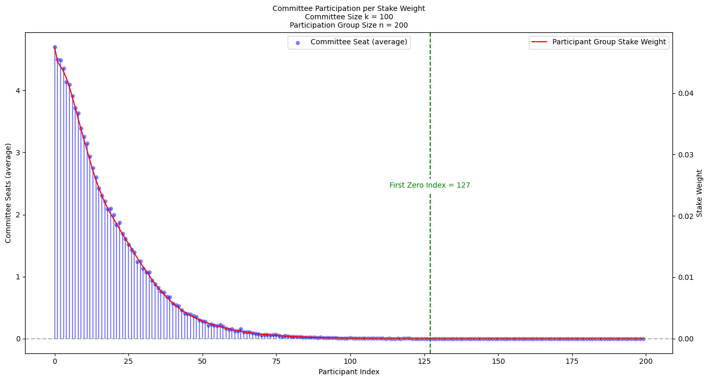
    


    Group Size = 300


    
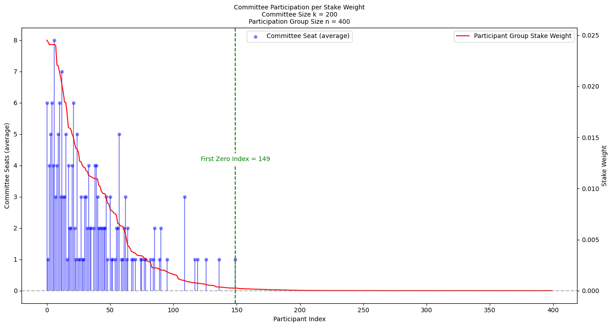
    


    Group Size = 400


    

    


    Group Size = 500


    
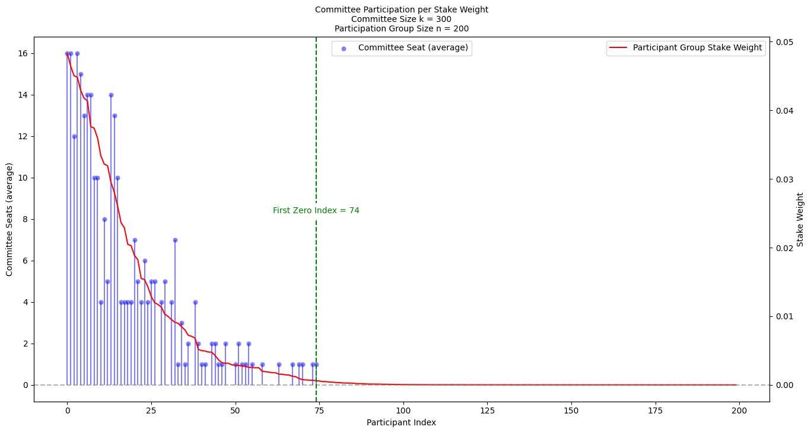
    


    
    Committee Size = 200
    Group Size = 100


    
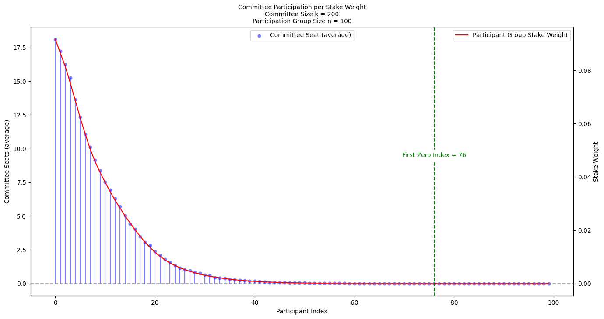
    


    Group Size = 200


    
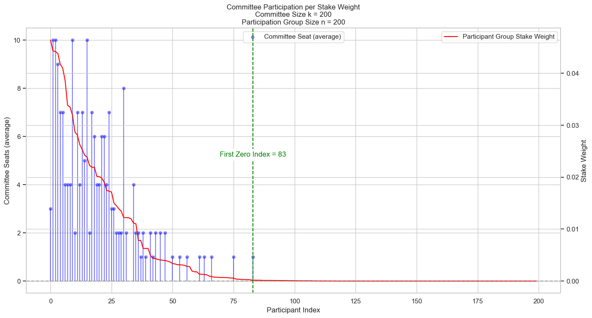
    


    Group Size = 300


    

    


    Group Size = 400


    

    


    Group Size = 500


    

    


    
    Committee Size = 300
    Group Size = 100


    

    


    Group Size = 200


    
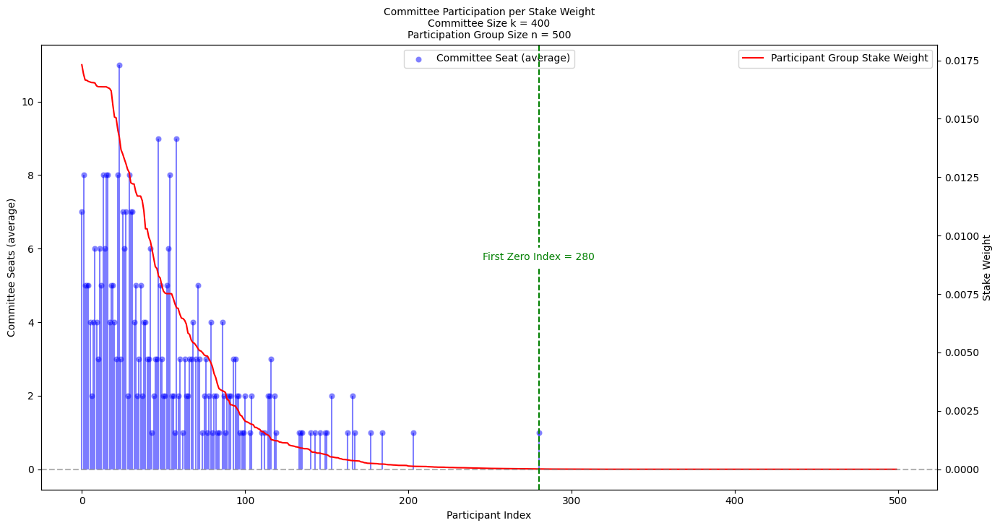
    


    Group Size = 300


    
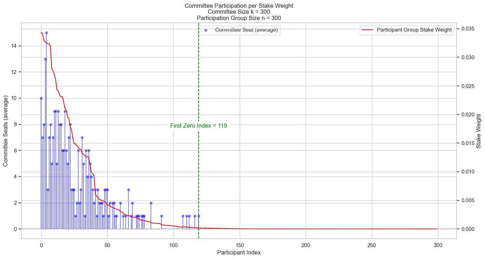
    


    Group Size = 400


    
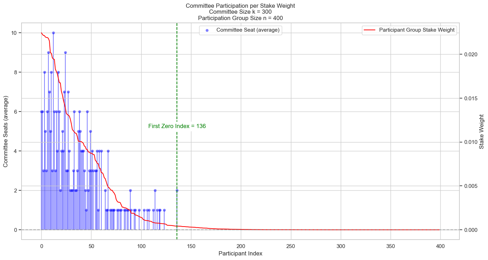
    


    Group Size = 500


    
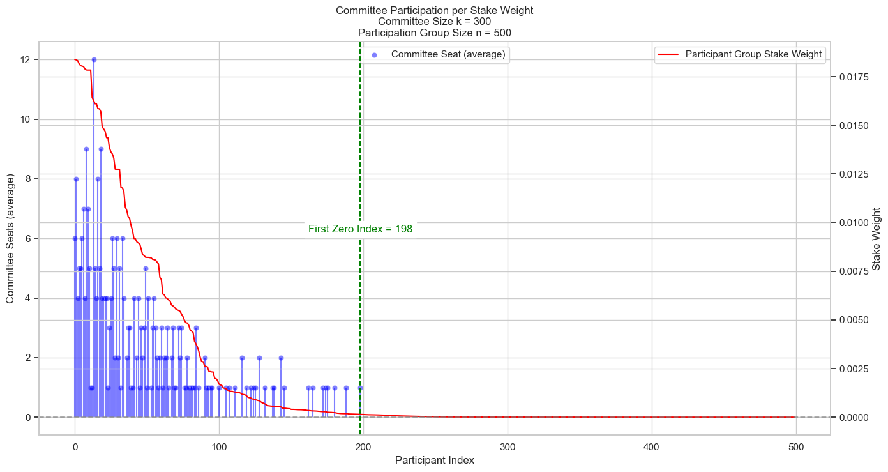
    


    
    Committee Size = 400
    Group Size = 100


    

    


    Group Size = 200


    
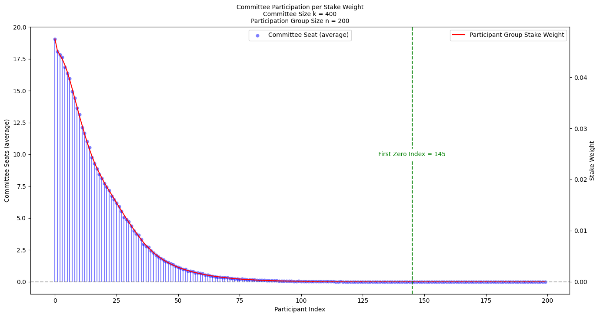
    


    Group Size = 300


    
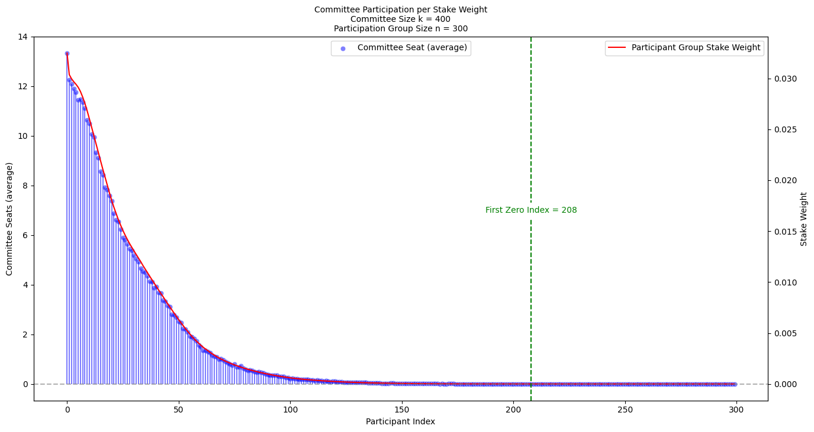
    


    Group Size = 400


    

    


    Group Size = 500


    
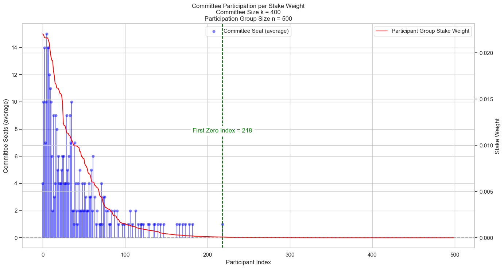
    


    
    Committee Size = 500
    Group Size = 100


    
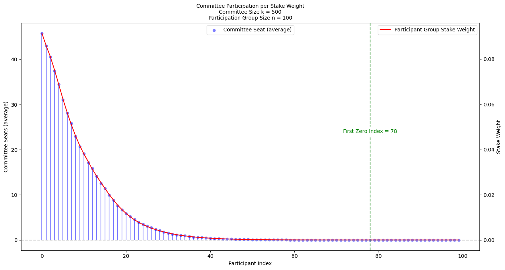
    


    Group Size = 200


    
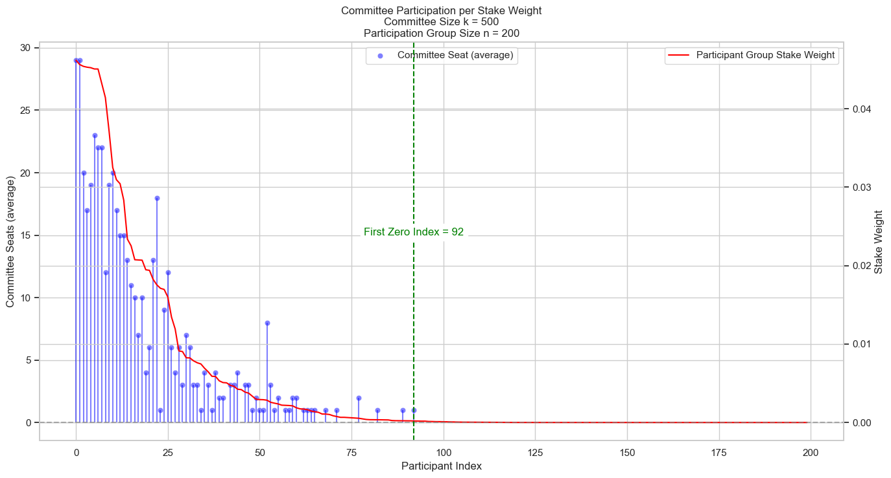
    


    Group Size = 300


    
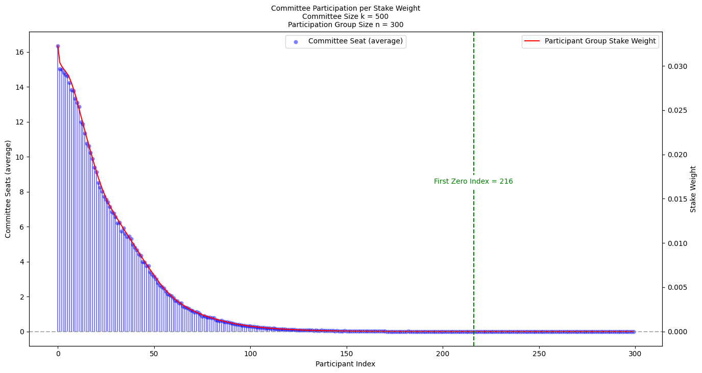
    


    Group Size = 400


    
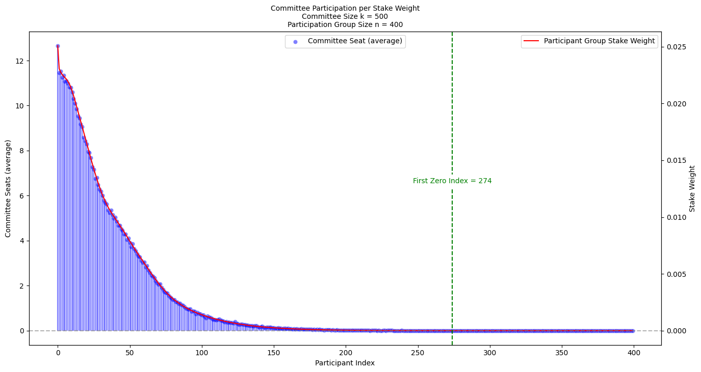
    


    Group Size = 500


    
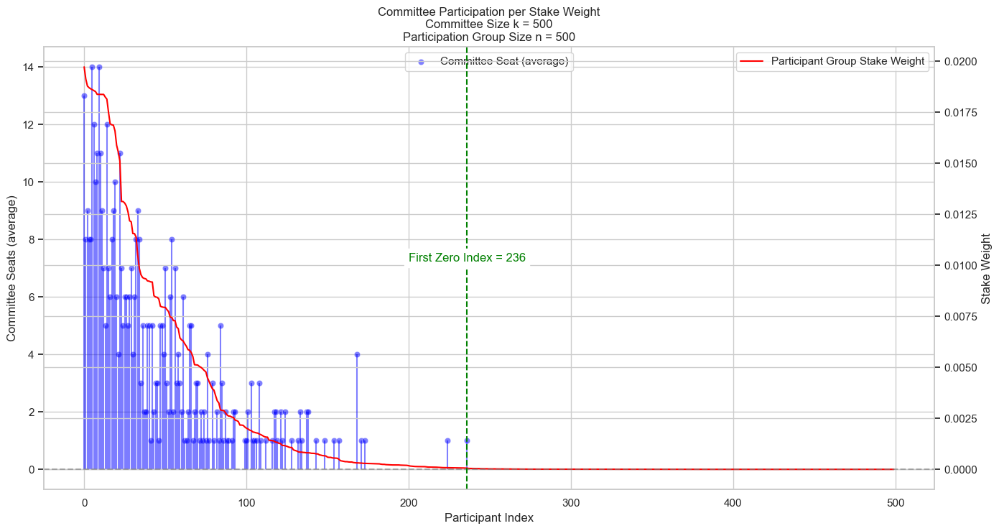
    


```python
# %%

# committee_seats_df = committee_seats_df.swaplevel(axis=1).sort_index(axis=1)
```


```python
# %%

# Extract the data for plotting

col_index = sim_results_df.columns
commitee_sizes = [
    int(col.split("=")[1].strip()) for col in col_index.get_level_values(0).unique()
]
group_sizes = [
    int(col.split("=")[1].strip()) for col in col_index.get_level_values(1).unique()
]
```


```python
# %%

# Plot the percentage of group participants excluded from a committee
# of a given size vs. different group sizes

fig, ax = plt.subplots(figsize=(12, 8))

sns.set(style="whitegrid")

for committee_size in commitee_sizes:
    committee_label = f"Committee Size = {committee_size}"
    committee_voters = sim_results_df.loc["Distinct Voters", committee_label]

    mean_values = committee_voters.loc["mean"]
    std_dev_values = committee_voters.loc["sd"]

    # Calculate the percentage of participants not selected for committee seats
    not_selected_percentages = (1.0 - mean_values / group_sizes) * 100
    not_selected_percentages.name = "Excluded (%)"

    # Create a DataFrame for easier plotting with seaborn
    plot_data = pd.DataFrame(
        {
            "Group Size": group_sizes,
            "Percentage Excluded": not_selected_percentages,
            "Std Dev": std_dev_values,
        }
    )

    # Plot the main line without error bars
    sns.lineplot(
        x="Group Size",
        y="Percentage Excluded",
        data=plot_data,
        marker="o",
        label=committee_label,
        ax=ax,
    )

ax.set_ylabel("Percentage Excluded")
ax.set_xlabel("Group Size")
ax.legend(title="Committee Size")
plt.title("Percentage of Group Participants Not Selected for Committee Seats")
plt.grid(True)
plt.show()
```


    

    


```python
# %%

sim_results_df.loc["Distinct Voters", :]
```


<div>
<style scoped>
    .dataframe tbody tr th:only-of-type {
        vertical-align: middle;
    }

    .dataframe tbody tr th {
        vertical-align: top;
    }

    .dataframe thead tr th {
        text-align: left;
    }
</style>
<table border="1" class="dataframe">
  <thead>
    <tr>
      <th>Committee Size</th>
      <th colspan="5" halign="left">Committee Size = 100</th>
      <th colspan="5" halign="left">Committee Size = 200</th>
      <th>...</th>
      <th colspan="5" halign="left">Committee Size = 400</th>
      <th colspan="5" halign="left">Committee Size = 500</th>
    </tr>
    <tr>
      <th>Group Size</th>
      <th>Group Size = 100</th>
      <th>Group Size = 200</th>
      <th>Group Size = 300</th>
      <th>Group Size = 400</th>
      <th>Group Size = 500</th>
      <th>Group Size = 100</th>
      <th>Group Size = 200</th>
      <th>Group Size = 300</th>
      <th>Group Size = 400</th>
      <th>Group Size = 500</th>
      <th>...</th>
      <th>Group Size = 100</th>
      <th>Group Size = 200</th>
      <th>Group Size = 300</th>
      <th>Group Size = 400</th>
      <th>Group Size = 500</th>
      <th>Group Size = 100</th>
      <th>Group Size = 200</th>
      <th>Group Size = 300</th>
      <th>Group Size = 400</th>
      <th>Group Size = 500</th>
    </tr>
  </thead>
  <tbody>
    <tr>
      <th>mean</th>
      <td>25.0</td>
      <td>37.0</td>
      <td>50.0</td>
      <td>52.0</td>
      <td>58.0</td>
      <td>31.0</td>
      <td>51.0</td>
      <td>71.0</td>
      <td>81.0</td>
      <td>91.0</td>
      <td>...</td>
      <td>35.0</td>
      <td>66.0</td>
      <td>85.0</td>
      <td>95.0</td>
      <td>103.0</td>
      <td>39.0</td>
      <td>68.0</td>
      <td>76.0</td>
      <td>121.0</td>
      <td>123.0</td>
    </tr>
    <tr>
      <th>sd</th>
      <td>0.0</td>
      <td>0.0</td>
      <td>0.0</td>
      <td>0.0</td>
      <td>0.0</td>
      <td>0.0</td>
      <td>0.0</td>
      <td>0.0</td>
      <td>0.0</td>
      <td>0.0</td>
      <td>...</td>
      <td>0.0</td>
      <td>0.0</td>
      <td>0.0</td>
      <td>0.0</td>
      <td>0.0</td>
      <td>0.0</td>
      <td>0.0</td>
      <td>0.0</td>
      <td>0.0</td>
      <td>0.0</td>
    </tr>
  </tbody>
</table>
<p>2 rows × 25 columns</p>
</div>


```python
# %%

# Plot the committee selection counts distribution
fig = plt.figure(figsize=(12, 8))

plot_data = sim_results_df.loc["Committee Seats"].loc["mean"]

for c, g in plot_data.index:

    y = plot_data.loc[(c, g)]
    x = y.index

    n_c = int(c.split("=")[1].strip())
    n_g = int(g.split("=")[1].strip())

    colors = sns.color_palette("tab20", len(plot_data.index))
    color_idx = list(plot_data.index).index((c, g))
    plt.bar(x, y, alpha=0.7, color=colors[color_idx], label=f"{n_c}, {n_g}")

plt.xlabel("Participant Index")
plt.ylabel("Committee Seat Count (average)")
plt.title("Committee Seat Count for Participants")
plt.legend(title="Committee Size, Group Size")
plt.xlim(0, 200)
plt.show()
```


    
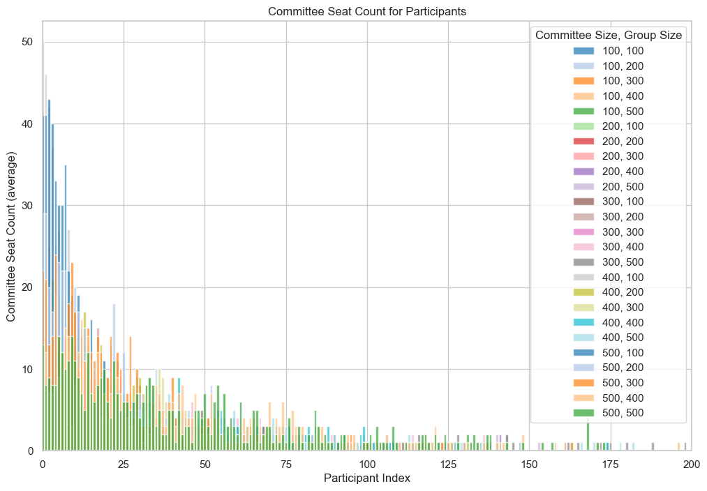
    


```python
# %%

# Distinct Voters
committee_voters = sim_results_df.loc["Distinct Voters"]

# Create a DataFrame row from the computed percentages
mean_values = committee_voters.loc["mean"]
std_dev_values = committee_voters.loc["sd"]

# Calculate the percentage of participants not selected for committee seats
print("Percentage of Group Participants Not Selected for Committee Seats:")
committee_participation = pd.concat([mean_values, std_dev_values], axis=1)
# committee_participation.columns = ["Mean", "Std Dev"]

print(committee_participation)
```

    Percentage of Group Participants Not Selected for Committee Seats:
                                            mean   sd
    Committee Size       Group Size                  
    Committee Size = 100 Group Size = 100   25.0  0.0
                         Group Size = 200   37.0  0.0
                         Group Size = 300   50.0  0.0
                         Group Size = 400   52.0  0.0
                         Group Size = 500   58.0  0.0
    Committee Size = 200 Group Size = 100   31.0  0.0
                         Group Size = 200   51.0  0.0
                         Group Size = 300   71.0  0.0
                         Group Size = 400   81.0  0.0
                         Group Size = 500   91.0  0.0
    Committee Size = 300 Group Size = 100   40.0  0.0
                         Group Size = 200   45.0  0.0
                         Group Size = 300   76.0  0.0
                         Group Size = 400   91.0  0.0
                         Group Size = 500  109.0  0.0
    Committee Size = 400 Group Size = 100   35.0  0.0
                         Group Size = 200   66.0  0.0
                         Group Size = 300   85.0  0.0
                         Group Size = 400   95.0  0.0
                         Group Size = 500  103.0  0.0
    Committee Size = 500 Group Size = 100   39.0  0.0
                         Group Size = 200   68.0  0.0
                         Group Size = 300   76.0  0.0
                         Group Size = 400  121.0  0.0
                         Group Size = 500  123.0  0.0


```python
# %%

# Prepare the DataFrame for concatenation with the other simulation results
committee_participation = committee_participation.T
committee_participation.index = pd.MultiIndex.from_tuples(
    [("Committee Participation %", "mean"), ("Committee Participation %", "sd")]
)

# Concatenate this new row to the simulation results DataFrame
sim_results_df = pd.concat([sim_results_df, committee_participation], axis=0)

sim_results_df
```


<div>
<style scoped>
    .dataframe tbody tr th:only-of-type {
        vertical-align: middle;
    }

    .dataframe tbody tr th {
        vertical-align: top;
    }

    .dataframe thead tr th {
        text-align: left;
    }
</style>
<table border="1" class="dataframe">
  <thead>
    <tr>
      <th></th>
      <th>Committee Size</th>
      <th colspan="5" halign="left">Committee Size = 100</th>
      <th colspan="5" halign="left">Committee Size = 200</th>
      <th>...</th>
      <th colspan="5" halign="left">Committee Size = 400</th>
      <th colspan="5" halign="left">Committee Size = 500</th>
    </tr>
    <tr>
      <th></th>
      <th>Group Size</th>
      <th>Group Size = 100</th>
      <th>Group Size = 200</th>
      <th>Group Size = 300</th>
      <th>Group Size = 400</th>
      <th>Group Size = 500</th>
      <th>Group Size = 100</th>
      <th>Group Size = 200</th>
      <th>Group Size = 300</th>
      <th>Group Size = 400</th>
      <th>Group Size = 500</th>
      <th>...</th>
      <th>Group Size = 100</th>
      <th>Group Size = 200</th>
      <th>Group Size = 300</th>
      <th>Group Size = 400</th>
      <th>Group Size = 500</th>
      <th>Group Size = 100</th>
      <th>Group Size = 200</th>
      <th>Group Size = 300</th>
      <th>Group Size = 400</th>
      <th>Group Size = 500</th>
    </tr>
  </thead>
  <tbody>
    <tr>
      <th rowspan="2" valign="top">Distinct Voters</th>
      <th>mean</th>
      <td>25.0</td>
      <td>37.0</td>
      <td>50.0</td>
      <td>52.0</td>
      <td>58.0</td>
      <td>31.0</td>
      <td>51.0</td>
      <td>71.0</td>
      <td>81.0</td>
      <td>91.0</td>
      <td>...</td>
      <td>35.0</td>
      <td>66.0</td>
      <td>85.0</td>
      <td>95.0</td>
      <td>103.0</td>
      <td>39.0</td>
      <td>68.0</td>
      <td>76.0</td>
      <td>121.0</td>
      <td>123.0</td>
    </tr>
    <tr>
      <th>sd</th>
      <td>0.0</td>
      <td>0.0</td>
      <td>0.0</td>
      <td>0.0</td>
      <td>0.0</td>
      <td>0.0</td>
      <td>0.0</td>
      <td>0.0</td>
      <td>0.0</td>
      <td>0.0</td>
      <td>...</td>
      <td>0.0</td>
      <td>0.0</td>
      <td>0.0</td>
      <td>0.0</td>
      <td>0.0</td>
      <td>0.0</td>
      <td>0.0</td>
      <td>0.0</td>
      <td>0.0</td>
      <td>0.0</td>
    </tr>
    <tr>
      <th>Committee Seats</th>
      <th>mean</th>
      <td>0      7.0
1      6.0
2     15.0
3      5.0
4 ...</td>
      <td>0      5.0
1      3.0
2      5.0
3      5.0
4 ...</td>
      <td>0      4.0
1      1.0
2      3.0
3      3.0
4 ...</td>
      <td>0      5.0
1      2.0
2      3.0
3      3.0
4 ...</td>
      <td>0      7.0
1      0.0
2      1.0
3      2.0
4 ...</td>
      <td>0     19.0
1     18.0
2     16.0
3     21.0
4 ...</td>
      <td>0       3.0
1      10.0
2      10.0
3       9....</td>
      <td>0       5.0
1       8.0
2       7.0
3      13....</td>
      <td>0      5.0
1      4.0
2      4.0
3      4.0
4 ...</td>
      <td>0      4.0
1      3.0
2      6.0
3      3.0
4 ...</td>
      <td>...</td>
      <td>0     50.0
1     46.0
2     42.0
3     37.0
4 ...</td>
      <td>0      12.0
1      20.0
2      17.0
3      21....</td>
      <td>0      16.0
1       8.0
2      11.0
3       9....</td>
      <td>0       8.0
1      12.0
2      13.0
3      13....</td>
      <td>0       4.0
1      10.0
2      14.0
3       7....</td>
      <td>0     41.0
1     41.0
2     43.0
3     40.0
4 ...</td>
      <td>0      29.0
1      29.0
2      20.0
3      17....</td>
      <td>0      22.0
1      21.0
2      13.0
3      14....</td>
      <td>0      11.0
1      12.0
2       7.0
3       7....</td>
      <td>0      13.0
1       8.0
2       9.0
3       8....</td>
    </tr>
    <tr>
      <th rowspan="2" valign="top">Committee Participation %</th>
      <th>mean</th>
      <td>25.0</td>
      <td>37.0</td>
      <td>50.0</td>
      <td>52.0</td>
      <td>58.0</td>
      <td>31.0</td>
      <td>51.0</td>
      <td>71.0</td>
      <td>81.0</td>
      <td>91.0</td>
      <td>...</td>
      <td>35.0</td>
      <td>66.0</td>
      <td>85.0</td>
      <td>95.0</td>
      <td>103.0</td>
      <td>39.0</td>
      <td>68.0</td>
      <td>76.0</td>
      <td>121.0</td>
      <td>123.0</td>
    </tr>
    <tr>
      <th>sd</th>
      <td>0.0</td>
      <td>0.0</td>
      <td>0.0</td>
      <td>0.0</td>
      <td>0.0</td>
      <td>0.0</td>
      <td>0.0</td>
      <td>0.0</td>
      <td>0.0</td>
      <td>0.0</td>
      <td>...</td>
      <td>0.0</td>
      <td>0.0</td>
      <td>0.0</td>
      <td>0.0</td>
      <td>0.0</td>
      <td>0.0</td>
      <td>0.0</td>
      <td>0.0</td>
      <td>0.0</td>
      <td>0.0</td>
    </tr>
  </tbody>
</table>
<p>5 rows × 25 columns</p>
</div>


```python
# %%

# Let's now create a plots of committee assignments where we vary
# the group size over {100, 200, 300, 400, 500} and see how the
# committee selection and seat count changes.

# Initialize Parameters:
# comm_sizes = [100]  # vary over committee size, k
# group_sizes = [100]  # vary over group size, n
comm_sizes = [100, 200, 300, 400, 500]  # vary over committee size, k
group_sizes = [100, 200, 300, 400, 500]  # vary over group size, n
num_iter = 30  # Number of iterations for Monte Carlo simulation

# Note that the number of iterations here can be interpreted as the number
# of selection rounds for the committee, which we call an epoch.
# If we have a new epoch per day, then 1000 iterations is about 3 years.
```


```python
# %%

# Call the function
sim_results_df = simulate(
    population,
    comm_sizes,
    group_sizes,
    num_iter,
    plot_it=True,
)
```

    
    Committee Size = 100
    Group Size = 100


    

    


    Group Size = 200


    

    


    Group Size = 300


    

    


    Group Size = 400


    

    


    Group Size = 500


    

    


    
    Committee Size = 200
    Group Size = 100


    

    


    Group Size = 200


    

    


    Group Size = 300


    

    


    Group Size = 400


    

    


    Group Size = 500


    

    


    
    Committee Size = 300
    Group Size = 100


    

    


    Group Size = 200


    

    


    Group Size = 300


    

    


    Group Size = 400


    

    


    Group Size = 500


    

    


    
    Committee Size = 400
    Group Size = 100


    

    


    Group Size = 200


    

    


    Group Size = 300


    

    


    Group Size = 400


    

    


    Group Size = 500


    

    


    
    Committee Size = 500
    Group Size = 100


    

    


    Group Size = 200


    

    


    Group Size = 300


    

    


    Group Size = 400


    

    


    Group Size = 500


    

    


```python
# %%

# committee_seats_df = committee_seats_df.swaplevel(axis=1).sort_index(axis=1)
```


```python
# %%

# Extract the data for plotting

col_index = sim_results_df.columns
commitee_sizes = [
    int(col.split("=")[1].strip()) for col in col_index.get_level_values(0).unique()
]
group_sizes = [
    int(col.split("=")[1].strip()) for col in col_index.get_level_values(1).unique()
]
```


```python
# %%

# Plot the percentage of group participants excluded from a committee
# of a given size vs. different group sizes

fig, ax = plt.subplots(figsize=(12, 8))

sns.set(style="whitegrid")

for committee_size in commitee_sizes:
    committee_label = f"Committee Size = {committee_size}"
    committee_voters = sim_results_df.loc["Distinct Voters", committee_label]

    mean_values = committee_voters.loc["mean"]
    std_dev_values = committee_voters.loc["sd"]

    # Calculate the percentage of participants not selected for committee seats
    not_selected_percentages = (1.0 - mean_values / group_sizes) * 100
    not_selected_percentages.name = "Excluded (%)"

    # Create a DataFrame for easier plotting with seaborn
    plot_data = pd.DataFrame(
        {
            "Group Size": group_sizes,
            "Percentage Excluded": not_selected_percentages,
            "Std Dev": std_dev_values,
        }
    )

    # Plot the main line without error bars
    sns.lineplot(
        x="Group Size",
        y="Percentage Excluded",
        data=plot_data,
        marker="o",
        label=committee_label,
        ax=ax,
    )

ax.set_ylabel("Percentage Excluded")
ax.set_xlabel("Group Size")
ax.legend(title="Committee Size")
plt.title("Percentage of Group Participants Not Selected for Committee Seats")
plt.grid(True)
plt.show()
```


    
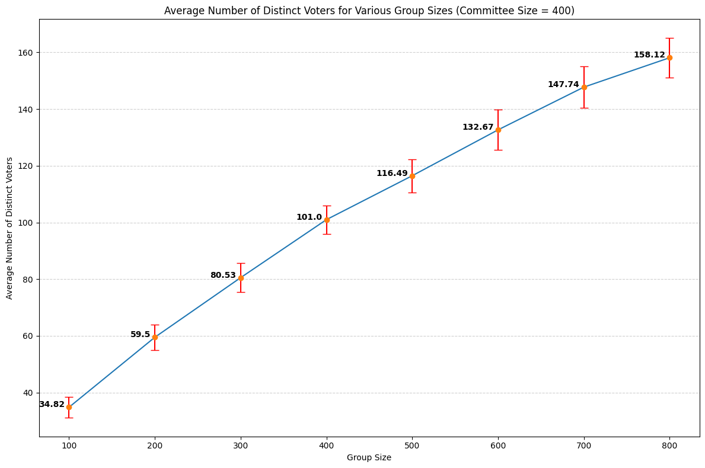
    


```python
# %%

sim_results_df.loc["Distinct Voters", :]
```


<div>
<style scoped>
    .dataframe tbody tr th:only-of-type {
        vertical-align: middle;
    }

    .dataframe tbody tr th {
        vertical-align: top;
    }

    .dataframe thead tr th {
        text-align: left;
    }
</style>
<table border="1" class="dataframe">
  <thead>
    <tr>
      <th>Committee Size</th>
      <th colspan="5" halign="left">Committee Size = 100</th>
      <th colspan="5" halign="left">Committee Size = 200</th>
      <th>...</th>
      <th colspan="5" halign="left">Committee Size = 400</th>
      <th colspan="5" halign="left">Committee Size = 500</th>
    </tr>
    <tr>
      <th>Group Size</th>
      <th>Group Size = 100</th>
      <th>Group Size = 200</th>
      <th>Group Size = 300</th>
      <th>Group Size = 400</th>
      <th>Group Size = 500</th>
      <th>Group Size = 100</th>
      <th>Group Size = 200</th>
      <th>Group Size = 300</th>
      <th>Group Size = 400</th>
      <th>Group Size = 500</th>
      <th>...</th>
      <th>Group Size = 100</th>
      <th>Group Size = 200</th>
      <th>Group Size = 300</th>
      <th>Group Size = 400</th>
      <th>Group Size = 500</th>
      <th>Group Size = 100</th>
      <th>Group Size = 200</th>
      <th>Group Size = 300</th>
      <th>Group Size = 400</th>
      <th>Group Size = 500</th>
    </tr>
  </thead>
  <tbody>
    <tr>
      <th>mean</th>
      <td>25.466667</td>
      <td>40.6</td>
      <td>50.5</td>
      <td>57.2</td>
      <td>63.733333</td>
      <td>31.366667</td>
      <td>50.9</td>
      <td>66.966667</td>
      <td>79.133333</td>
      <td>91.133333</td>
      <td>...</td>
      <td>37.2</td>
      <td>61.566667</td>
      <td>81.166667</td>
      <td>99.766667</td>
      <td>118.466667</td>
      <td>37.8</td>
      <td>62.766667</td>
      <td>86.466667</td>
      <td>108.366667</td>
      <td>125.966667</td>
    </tr>
    <tr>
      <th>sd</th>
      <td>2.692376</td>
      <td>2.332381</td>
      <td>2.459675</td>
      <td>3.673327</td>
      <td>3.604935</td>
      <td>2.316367</td>
      <td>2.785079</td>
      <td>3.25047</td>
      <td>4.514667</td>
      <td>4.709801</td>
      <td>...</td>
      <td>1.83303</td>
      <td>3.58407</td>
      <td>3.387067</td>
      <td>4.038839</td>
      <td>4.68852</td>
      <td>2.181742</td>
      <td>3.018646</td>
      <td>2.629744</td>
      <td>4.370228</td>
      <td>5.552677</td>
    </tr>
  </tbody>
</table>
<p>2 rows × 25 columns</p>
</div>


```python
# %%

# Plot the committee selection counts distribution
fig = plt.figure(figsize=(12, 8))

plot_data = sim_results_df.loc["Committee Seats"].loc["mean"]

for c, g in plot_data.index:

    y = plot_data.loc[(c, g)]
    x = y.index

    n_c = int(c.split("=")[1].strip())
    n_g = int(g.split("=")[1].strip())

    colors = sns.color_palette("tab20", len(plot_data.index))
    color_idx = list(plot_data.index).index((c, g))
    plt.bar(x, y, alpha=0.7, color=colors[color_idx], label=f"{n_c}, {n_g}")

plt.xlabel("Participant Index")
plt.ylabel("Committee Seat Count (average)")
plt.title("Committee Seat Count for Participants")
plt.legend(title="Committee Size, Group Size")
plt.xlim(0, 200)
plt.show()
```


    

    


```python
# %%

# Distinct Voters
committee_voters = sim_results_df.loc["Distinct Voters"]

# Create a DataFrame row from the computed percentages
mean_values = committee_voters.loc["mean"]
std_dev_values = committee_voters.loc["sd"]

# Calculate the percentage of participants not selected for committee seats
print("Percentage of Group Participants Not Selected for Committee Seats:")
committee_participation = pd.concat([mean_values, std_dev_values], axis=1)
# committee_participation.columns = ["Mean", "Std Dev"]

print(committee_participation)
```

    Percentage of Group Participants Not Selected for Committee Seats:
                                                 mean        sd
    Committee Size       Group Size                            
    Committee Size = 100 Group Size = 100   25.466667  2.692376
                         Group Size = 200        40.6  2.332381
                         Group Size = 300        50.5  2.459675
                         Group Size = 400        57.2  3.673327
                         Group Size = 500   63.733333  3.604935
    Committee Size = 200 Group Size = 100   31.366667  2.316367
                         Group Size = 200        50.9  2.785079
                         Group Size = 300   66.966667   3.25047
                         Group Size = 400   79.133333  4.514667
                         Group Size = 500   91.133333  4.709801
    Committee Size = 300 Group Size = 100        33.2  2.181742
                         Group Size = 200   57.033333   3.25047
                         Group Size = 300        75.5  3.442383
                         Group Size = 400   90.666667  3.486482
                         Group Size = 500       108.1  5.127377
    Committee Size = 400 Group Size = 100        37.2   1.83303
                         Group Size = 200   61.566667   3.58407
                         Group Size = 300   81.166667  3.387067
                         Group Size = 400   99.766667  4.038839
                         Group Size = 500  118.466667   4.68852
    Committee Size = 500 Group Size = 100        37.8  2.181742
                         Group Size = 200   62.766667  3.018646
                         Group Size = 300   86.466667  2.629744
                         Group Size = 400  108.366667  4.370228
                         Group Size = 500  125.966667  5.552677


```python
# %%

# Prepare the DataFrame for concatenation with the other simulation results
committee_participation = committee_participation.T
committee_participation.index = pd.MultiIndex.from_tuples(
    [("Committee Participation %", "mean"), ("Committee Participation %", "sd")]
)

# Concatenate this new row to the simulation results DataFrame
sim_results_df = pd.concat([sim_results_df, committee_participation], axis=0)

sim_results_df
```


<div>
<style scoped>
    .dataframe tbody tr th:only-of-type {
        vertical-align: middle;
    }

    .dataframe tbody tr th {
        vertical-align: top;
    }

    .dataframe thead tr th {
        text-align: left;
    }
</style>
<table border="1" class="dataframe">
  <thead>
    <tr>
      <th></th>
      <th>Committee Size</th>
      <th colspan="5" halign="left">Committee Size = 100</th>
      <th colspan="5" halign="left">Committee Size = 200</th>
      <th>...</th>
      <th colspan="5" halign="left">Committee Size = 400</th>
      <th colspan="5" halign="left">Committee Size = 500</th>
    </tr>
    <tr>
      <th></th>
      <th>Group Size</th>
      <th>Group Size = 100</th>
      <th>Group Size = 200</th>
      <th>Group Size = 300</th>
      <th>Group Size = 400</th>
      <th>Group Size = 500</th>
      <th>Group Size = 100</th>
      <th>Group Size = 200</th>
      <th>Group Size = 300</th>
      <th>Group Size = 400</th>
      <th>Group Size = 500</th>
      <th>...</th>
      <th>Group Size = 100</th>
      <th>Group Size = 200</th>
      <th>Group Size = 300</th>
      <th>Group Size = 400</th>
      <th>Group Size = 500</th>
      <th>Group Size = 100</th>
      <th>Group Size = 200</th>
      <th>Group Size = 300</th>
      <th>Group Size = 400</th>
      <th>Group Size = 500</th>
    </tr>
  </thead>
  <tbody>
    <tr>
      <th rowspan="2" valign="top">Distinct Voters</th>
      <th>mean</th>
      <td>25.466667</td>
      <td>40.6</td>
      <td>50.5</td>
      <td>57.2</td>
      <td>63.733333</td>
      <td>31.366667</td>
      <td>50.9</td>
      <td>66.966667</td>
      <td>79.133333</td>
      <td>91.133333</td>
      <td>...</td>
      <td>37.2</td>
      <td>61.566667</td>
      <td>81.166667</td>
      <td>99.766667</td>
      <td>118.466667</td>
      <td>37.8</td>
      <td>62.766667</td>
      <td>86.466667</td>
      <td>108.366667</td>
      <td>125.966667</td>
    </tr>
    <tr>
      <th>sd</th>
      <td>2.692376</td>
      <td>2.332381</td>
      <td>2.459675</td>
      <td>3.673327</td>
      <td>3.604935</td>
      <td>2.316367</td>
      <td>2.785079</td>
      <td>3.25047</td>
      <td>4.514667</td>
      <td>4.709801</td>
      <td>...</td>
      <td>1.83303</td>
      <td>3.58407</td>
      <td>3.387067</td>
      <td>4.038839</td>
      <td>4.68852</td>
      <td>2.181742</td>
      <td>3.018646</td>
      <td>2.629744</td>
      <td>4.370228</td>
      <td>5.552677</td>
    </tr>
    <tr>
      <th>Committee Seats</th>
      <th>mean</th>
      <td>0     8.600000
1     9.900000
2     8.900000
3...</td>
      <td>0      4.666667
1      4.266667
2      4.33333...</td>
      <td>0      3.000000
1      2.800000
2      2.96666...</td>
      <td>0      2.866667
1      2.333333
2      1.90000...</td>
      <td>0      2.166667
1      1.700000
2      2.10000...</td>
      <td>0     16.433333
1     15.400000
2     15.86666...</td>
      <td>0      9.233333
1      9.266667
2      8.30000...</td>
      <td>0      6.433333
1      6.466667
2      7.03333...</td>
      <td>0      4.933333
1      4.033333
2      4.23333...</td>
      <td>0      4.766667
1      3.966667
2      3.86666...</td>
      <td>...</td>
      <td>0     40.033333
1     37.800000
2     33.30000...</td>
      <td>0      19.433333
1      17.933333
2      19.00...</td>
      <td>0      14.200000
1      11.833333
2      13.03...</td>
      <td>0      11.300000
1       8.266667
2       9.26...</td>
      <td>0      7.833333
1      7.966667
2      7.23333...</td>
      <td>0     47.366667
1     43.133333
2     41.26666...</td>
      <td>0      24.500000
1      23.533333
2      21.13...</td>
      <td>0      17.533333
1      15.033333
2      16.13...</td>
      <td>0      12.066667
1      11.800000
2      11.53...</td>
      <td>0       9.800000
1      10.366667
2       8.80...</td>
    </tr>
    <tr>
      <th rowspan="2" valign="top">Committee Participation %</th>
      <th>mean</th>
      <td>25.466667</td>
      <td>40.6</td>
      <td>50.5</td>
      <td>57.2</td>
      <td>63.733333</td>
      <td>31.366667</td>
      <td>50.9</td>
      <td>66.966667</td>
      <td>79.133333</td>
      <td>91.133333</td>
      <td>...</td>
      <td>37.2</td>
      <td>61.566667</td>
      <td>81.166667</td>
      <td>99.766667</td>
      <td>118.466667</td>
      <td>37.8</td>
      <td>62.766667</td>
      <td>86.466667</td>
      <td>108.366667</td>
      <td>125.966667</td>
    </tr>
    <tr>
      <th>sd</th>
      <td>2.692376</td>
      <td>2.332381</td>
      <td>2.459675</td>
      <td>3.673327</td>
      <td>3.604935</td>
      <td>2.316367</td>
      <td>2.785079</td>
      <td>3.25047</td>
      <td>4.514667</td>
      <td>4.709801</td>
      <td>...</td>
      <td>1.83303</td>
      <td>3.58407</td>
      <td>3.387067</td>
      <td>4.038839</td>
      <td>4.68852</td>
      <td>2.181742</td>
      <td>3.018646</td>
      <td>2.629744</td>
      <td>4.370228</td>
      <td>5.552677</td>
    </tr>
  </tbody>
</table>
<p>5 rows × 25 columns</p>
</div>


```python
# %%

# Save the results to an Excel file
output_file = "../data/participation_run_results.xlsx"
sim_results_df.to_excel(output_file)
print(f"Results saved to {output_file}")
```

    Results saved to ../data/participation_run_results.xlsx

