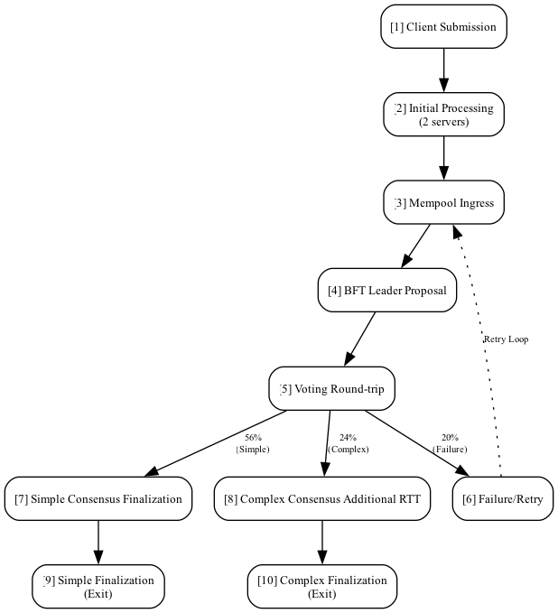

# Blockchain Queuing Network Report

Rob Jones | robert.jones@shield.io | 28 April 2025


## 1. Overview

This simulation model was developed to analyze and predict performance characteristics of the Midnight blockchain's transaction processing system. By representing the system as a queuing network, Fig. 1, we can identify bottlenecks, estimate throughput capabilities, and evaluate how different components interact under various load conditions.

The primary objective is to provide quantitative insights into:
- Transaction processing times across different pathways
- System capacity limits and scaling properties
- Consensus bottlenecks and retry behaviors
- Queue depth patterns at critical processing stages


<small>Fig. 1: Detailed queuing network model of the Midnight blockchain transaction processing system, showing transaction flow paths through submission, verification, mempool, consensus stages, and retry loops.</small>

Unlike simplified analytical models, this simulation captures the complex, interdependent nature of blockchain systems where processing time variances, probabilistic routing, and feedback loops significantly impact overall performance.

The model uses the [Ciw Python package](https://github.com/CiwPython/Ciw) to simulate a queuing network that mimics a complex blockchain transaction processing system. It abstracts the many specialized nodes seen in the original diagram and introduces multiple processing stages that capture the nuances of consensus, including branching for simple and complex transactions, multi-phase consensus rounds, and a feedback/retry loop for failed transactions.

## 2. Queuing Network Model

The queuing network model presented in Fig. 2 represents our abstraction of the Midnight blockchain's transaction processing pipeline. This model transforms the complex interactions between blockchain components into a series of interconnected service centers with defined processing characteristics. Each node in the network represents a distinct processing stage that transactions must navigate, from initial submission through verification, consensus, and finalization. By simplifying the architecture while preserving critical pathways and bottlenecks, this model enables quantitative analysis of throughput, queue depths, and processing times under various load conditions. The simulation captures essential blockchain behaviors including transaction branching based on complexity, probabilistic routing, feedback loops for failed transactions, and the inherent serialization points in consensus mechanisms.


<small>Fig. 2: Queuing network model diagram showing the service centers; the queues are not visulaized for simplicity in drawing with the `dot` digraph. </small>

###  2.1. Explanation
- **Modular Node Structure:**  
  The model is built using a series of nodes, each representing a distinct phase of transaction processing. For example:  
  - **Node 1 (Client Submission):** Receives external transactions.  
  - **Node 2 (Initial Processing):** Simulates early verification (Trusted Service Host, Proof Server, Passive Node) using parallel servers.  
  - **Node 3 (Mempool Ingress):** Acts as the queuing point for pending transactions.  
  - **Node 4 (BFT Leader Processing):** Central stage where transactions are queued for consensus, intentionally set with longer service times to simulate a bottleneck.  
  - **Branching Post Node 4:**  
    - **Failure Branch (Node 5):** Represents consensus failures (e.g., outdated committee) with a fixed probability; routes transactions back to the mempool.  
    - **Simple Consensus Path (Nodes 6 → 7):** Processes relatively straightforward transactions.  
    - **Complex Consensus Path (Nodes 8 → 9):** Models transactions requiring extra network round-trip delays and extra verification.  

- **Extended Consensus Phases:**  
  A further refinement splits consensus into multiple sub-phases (for instance, a proposal phase followed by a voting round trip) before applying branching logic. This mimics the multiple rounds observed in the full diagram.

- **Feedback/Retry Loop:**  
  Transactions that fail during consensus (set at a 20% probability) are directed to a retry node, introducing a delay before they rejoin the mempool. This captures the “reprocessing” seen when a committee is out-of-date or when consensus stalls.

- **Routing Probabilities:**  
  The routing matrix is used to enforce deterministic flow between stages (for example, 100% routing from one stage to the next) and probabilistic branching (e.g., 20% to failure, 56% to simple, 24% to complex).

### 2.2. Code
The following code implements our queuing network model using the Ciw Python library for discrete event simulation. This implementation represents the 10-node network modeling the complete transaction lifecycle through a blockchain system. The model captures key processing stages including client submission, initial verification, mempool queuing, consensus phases (proposal and voting), and differentiated paths for transaction completion. Notably, it implements probabilistic branching after consensus and includes a retry mechanism for failed transactions. Service times are modeled using exponential distributions with parameters tuned to represent the relative processing demands of each stage, with intentional bottlenecks at the BFT leader node. The simulation tracks waiting times, service times, and overall throughput to provide quantitative insights into system performance under load.

```python
#!/usr/bin/env python3
# -*- coding: utf-8 -*-
# 
import numpy as np
from ciw import Simulation, create_network, seed
from ciw.dists import Exponential
#!/usr/bin/env python3
# -*- coding: utf-8 -*-
"""
Blockchain Consensus Queueing Network Simulator

This module implements a 10-node queueing network simulation to model the flow
of transactions through a blockchain consensus system using the Ciw library.

Network Structure:
- Node 1: Client Submission (external arrivals)
- Node 2: Initial Processing (Trusted Service Host / Proof Server) - 2 servers
- Node 3: Mempool Ingress
- Node 4: BFT Leader Proposal (Proposal Phase)
- Node 5: Voting Round-trip (Voting Phase)
- Node 6: Failure/Retry Processing (failed transactions; retries go back to Node 3)
- Node 7: Simple Consensus Finalization (successful simple branch)
- Node 8: Complex Consensus Additional RTT (pre-finalization for complex transactions)
- Node 9: Simple Finalization (exit for simple transactions)
- Node 10: Complex Finalization (exit for complex transactions)

The simulation includes probabilistic branching after the consensus phases with:
- 20% failure rate (transactions routed to failure/retry processing)
- 56% simple transaction rate (faster finalization path)
- 24% complex transaction rate (requiring additional round-trip time)

This model can be used to analyze throughput, waiting times, and bottlenecks
in blockchain consensus systems under various parameter configurations.

Dependencies:
- ciw: https://github.com/CiwPython/Ciw
- numpy: https://numpy.org/
"""
# Branching probabilities after the two-phase consensus:
p_failure = 0.2  # 20% chance of failure after voting phase.
p_simple = 0.56  # 56% chance to continue to a simple finalization.
p_complex = 0.24  # 24% chance to continue to a complex finalization.

assert p_failure + p_simple + p_complex == 1.0, "Branching probabilities must sum to 1.0."

# Routing matrix:
routing = [
    # Node 1 -> Node 2.
    [0.0, 1.0, 0.0, 0.0, 0.0, 0.0, 0.0, 0.0, 0.0, 0.0],
    # Node 2 -> Node 3.
    [0.0, 0.0, 1.0, 0.0, 0.0, 0.0, 0.0, 0.0, 0.0, 0.0],
    # Node 3 -> Node 4 (BFT Leader Proposal)
    [0.0, 0.0, 0.0, 1.0, 0.0, 0.0, 0.0, 0.0, 0.0, 0.0],
    # Node 4 -> Node 5 (Voting Round-trip)
    [0.0, 0.0, 0.0, 0.0, 1.0, 0.0, 0.0, 0.0, 0.0, 0.0],
    # Node 5 -> Branching: Failure, Simple, Complex.
    # 20% to Node 6 (Failure), 56% to Node 7 (Simple path), 24% to Node 8 (Complex path)
    [0.0, 0.0, 0.0, 0.0, 0.0, p_failure, p_simple, p_complex, 0.0, 0.0],
    # Node 6 (Failure/Retry) routes back to Node 3 (retry loop).
    [0.0, 0.0, 1.0, 0.0, 0.0, 0.0, 0.0, 0.0, 0.0, 0.0],
    # Node 7 -> Node 9 (Simple Finalization exit)
    [0.0, 0.0, 0.0, 0.0, 0.0, 0.0, 0.0, 0.0, 1.0, 0.0],
    # Node 8 -> Node 10 (Complex Finalization exit)
    [0.0, 0.0, 0.0, 0.0, 0.0, 0.0, 0.0, 0.0, 0.0, 1.0],
    # Node 9 is an exit node.
    [0.0, 0.0, 0.0, 0.0, 0.0, 0.0, 0.0, 0.0, 0.0, 0.0],
    # Node 10 is an exit node.
    [0.0, 0.0, 0.0, 0.0, 0.0, 0.0, 0.0, 0.0, 0.0, 0.0],
    ]

network = create_network(
    arrival_distributions=[
        Exponential(5.0),  # Node 1: Client Submission
        None,  # Node 2
        None,  # Node 3
        None,  # Node 4
        None,  # Node 5
        None,  # Node 6
        None,  # Node 7
        None,  # Node 8
        None,  # Node 9
        None,  # Node 10
        ],
    service_distributions=[
        Exponential(1.0),  # Node 1: Client Submission
        Exponential(1.5),  # Node 2: Initial Processing (2 servers)
        Exponential(2.0),  # Node 3: Mempool Ingress
        Exponential(3.5),  # Node 4: BFT Leader Proposal
        Exponential(2.0),  # Node 5: Voting Round-trip
        Exponential(3.0),  # Node 6: Failure/Retry Processing
        Exponential(3.0),  # Node 7: Simple Consensus Finalization (pre-exit)
        Exponential(4.0),  # Node 8: Complex Consensus Additional RTT
        Exponential(2.5),  # Node 9: Simple Finalization (exit)
        Exponential(2.5),  # Node 10: Complex Finalization (exit)
        ],
    number_of_servers=[1, 2, 1, 1, 1, 1, 1, 1, 1, 1],
    routing=routing,
    )
# %%
assert network, "Network construction failed."
num_nodes = network.number_of_nodes
# %%
# Simulate one realization (trial)
sim = Simulation(network)
assert sim, "Simulation construction failed."

# %%
# Simulate until max time.
seed(42)  # Set the seed for reproducibility.
sim.simulate_until_max_time(1000)

# %%
# Get all simulation records
records = sim.get_all_records()

# Report detailed statistics.
print("\nExtended Consensus Model Statistics:")
for node in range(1, num_nodes + 1):
    node_records = [r for r in records if r.node == node]
    if node_records:
        avg_wait = np.mean([r.waiting_time for r in node_records])
        avg_service = np.mean([r.service_time for r in node_records])
        print(f"  Node {node}: Average Waiting = {avg_wait:.3f} s, Average Service = {avg_service:.3f} s")
    else:
        print(f"  Node {node}: No transactions recorded.")

# Overall throughput from the two exit nodes (Node 9 and Node 10).
exit_departures = [r.exit_date for r in records if r.node in [9, 10]]
if exit_departures:
    overall_tps = len(exit_departures) / max(exit_departures)
    print(f"\nOverall Throughput: {overall_tps:.3f} transactions per second")
else:
    print("No transactions completed through the system.")

# Optionally, further analysis can be performed:
retry_records = [r for r in records if r.node == 6]
if retry_records:
    print(f"\nTotal Failure/Retry events (Node 6): {len(retry_records)}")
    avg_retry_wait = np.mean([r.waiting_time for r in retry_records])
    print(f"Average wait time in Retry Node: {avg_retry_wait:.3f} s")


```
### 2.2. Performance Bottlenecks

- The BFT Leader Processing (Node 4) is assigned a higher mean service time to capture the inherent bottleneck of leader processing. Any delays here have a cascading effect on the overall transaction throughput.

- The retry loop (Node 5 back to Node 3) introduces additional delay, especially if many transactions hit the failure branch. This can cause a buildup in the mempool and longer overall processing times.

- Splitting consensus into sub-phases (proposal and voting) can reveal further delays during round-trip communications, highlighting potential network-induced latencies.

### 2.3. Salient Points

- The BFT Leader Proposal (Node 4) and the Voting Round-trip (Node 5) are critical to performance bottlenecks because delays here have a cascading impact on downstream processing.

- The Failure/Retry loop (Node 6 back to Node 3) is crucial because high failure rates could congest the mempool and degrade overall throughput.

- The branching paths for Simple vs. Complex Consensus Finalization allow the model to reflect that not every transaction follows the same route—with complex transactions having additional delay overhead.

- This diagram is an abstraction designed to capture the multi-phase consensus mechanism of a blockchain system with realistic feedback (retry) handling.

## 3. Areas of Improvement

### 3.1. Service Time Distribution Considerations

The model currently uses exponential distributions for all service times, which is a common but simplistic assumption in queuing theory. These distributions are mathematical placeholders that need refinement based on real-world measurements. In actual blockchain systems, service times may follow more complex distributions depending on transaction characteristics, network conditions, and processing requirements. For example, signature verification might follow a bimodal distribution based on transaction complexity, while consensus round trips could exhibit log-normal patterns due to network latency variations. Future model improvements should incorporate empirical data collected from the production network to derive more accurate service time distributions for each processing stage. This refinement would significantly enhance the predictive accuracy of the simulation, particularly for tail latencies and overall throughput estimations under varying load conditions.

### 3.2. Finite Queue Capacities

Currently, nodes (like the mempool) are modeled with infinite capacity. Real systems have finite buffers. Limiting node (queue) capacity can lead to more realistic congestion phenomena—such as blocking or drop events.

### 3.3. Dynamic Routing and Prioritization

The current model uses static routing probabilities. A more nuanced approach might simulate dynamic routing decisions based on current queue lengths, transaction complexity, or priority classes (e.g., urgent vs. best-effort transactions).

### 3.4. Service Time Distributions

While exponential distributions are convenient, real-world delays might follow different patterns. Incorporating alternative distributions or empirical data (reflecting circuit sizes, signature verification times, gas costs, etc.) could improve fidelity.

### 3.5. Detailed Logging and Data Analytics
  
Tracking individual transaction journeys, counting the number of retries per transaction, and recording performance percentiles (such as 90th and 95th percentile wait times) would offer deeper insights into bottlenecks and variability.

## 4. Next Steps & Further Refinement

- **Implement Queue Capacity Limits:**  
  Explore whether Ciw or another simulation framework allows for capacity restrictions at critical nodes (e.g., the mempool) and simulate failure modes like transaction drops or backpressure-induced slowdowns.

- **Incorporate Dynamic Behavior:**  
  - Modify routing probabilities based on current system state.  
  - Introduce priority queues where high-priority transactions might bypass or get expedited processing.
  
- **Refine Consensus Phases:**  
  Further decompose consensus operations. For instance, add nodes for individual signature verifications, differential delays for vote aggregation, and additional round trips for finalized consensus.

- **Enhanced Statistical Reporting:**  
  - Use libraries like Pandas and Matplotlib to visualize distributions of waiting and service times.  
  - Compute confidence intervals for overall throughput and per-path performance metrics.
  
- **Hybrid Simulation Models:**  
  Consider integrating discrete-event simulation with agent-based modeling if you need to capture interactions that change dynamically based on network conditions or validator behavior.

## 5. Conclusion

This simulation model attempts to capture the complex behavior outlined in the original diagram. It models key stages, introduces branching for consensus outcomes, and factors in retry mechanisms—all of which are pivotal to understanding system performance. However, further refinements—such as dynamic routing, finite capacities, and enhanced statistical analysis—will help bridge the gap between abstraction and the real-world behavior of blockchain networks.

This report should serve as a roadmap for future iterations, guiding adjustments to improve performance analysis and to uncover potential vulnerabilities in the network. If additional details or further explorations are desired, we can delve into any of these refinement areas to further enhance the simulation’s fidelity.
