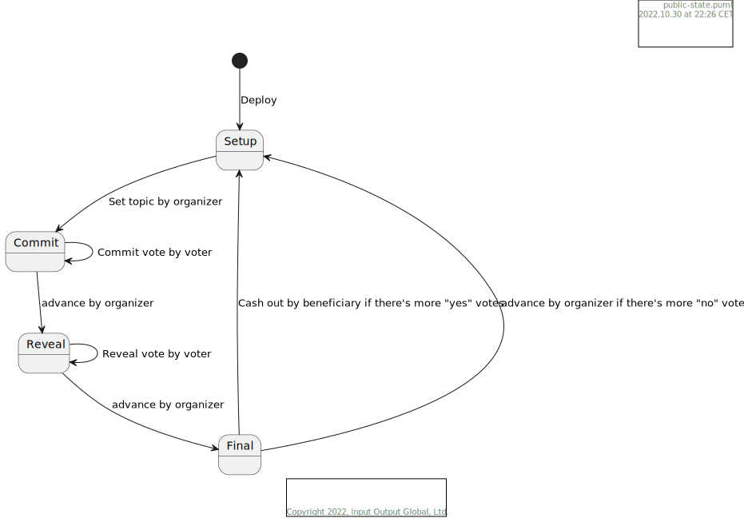
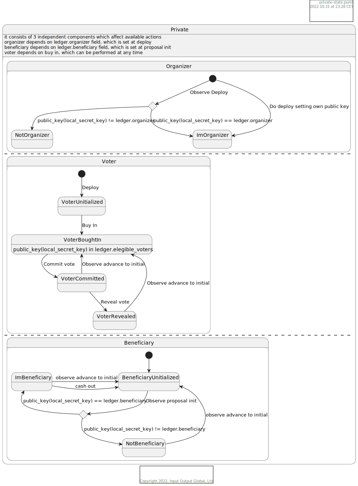
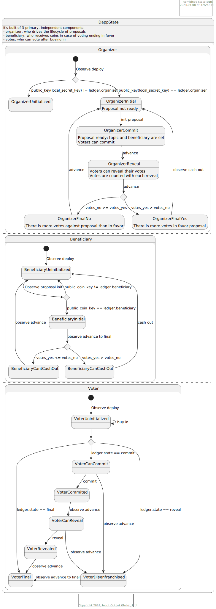
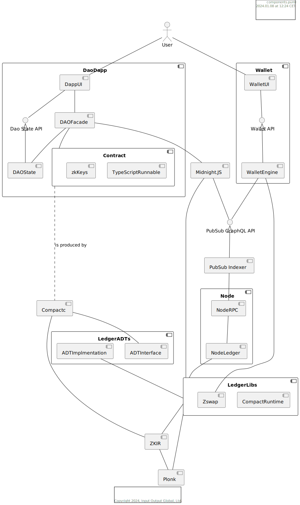
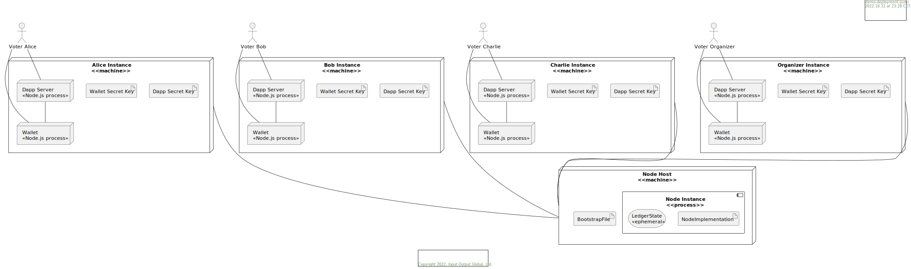
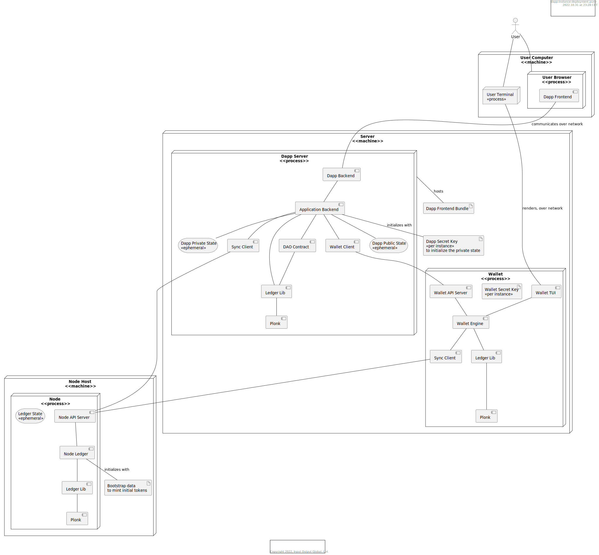

# DAO Dapp

This document defines the target architecture of the DAO example Dapp. It takes into account actual state and capabilities of various components of Midnight as of time of writing and thus - some details will need to updated as Midnight development progresses.

## Purpose of the Dapp

DAO is a natural extension to the e-voting use-case. Not only it still requires the separation between private and public state of a contract to maintain privacy, but also it requires support of native tokens from a contract in order to offer functionality of funding a proposal. 

## State, roles, actions and phases

There are 3 roles defined in the dapp:
  - organizer, who can initialize proposal and advance voting to next stage
  - beneficiary, who can collect tokens in case of voting result being in favor of a proposal 
  - voter

When contract is deployed, deploying party sets organizer's public key in the public state of a contract.
Organizer initializes a proposal by setting its topic and beneficiary address. After proposal initialization it is automatically advanced to "commit" phase - that is one, where eligible voters can commit to their votes (without revealing them). Then, at organizer's will, proposal advances to a "reveal" phase - votes are being revealed (by each voter separately) and counted at the same time. When organizer decides advances contract to "final" phase - voting result is known, if it is in favor of a proposal, beneficiary can withdraw tokens, causing contract to move to initial stage, where no proposal is active, otherwise organizer can do the same, keeping tokens in the contract's treasury.

A Midnight user can become a voter at any time by buing into the DAO. Though voter can only vote in the first observed "commit" phase of a proposal.

### State diagrams

What is described above, in more detail is presented in diagrams below

#### Public (ledger) state

Public (on-chain, ledger) state of the contract constists of data that is used for synchronization purposes, as well as to limit certain actions only to parties, which can prove that are eligible to execute them (e.g. only organizer can advance state)

#### Private state 

Private state (is present only on user's machine) consists of 3 independent components, each of them enables certain set of actions.

#### Combined (dApp) state

When combined, from Dapp instance perspective (where both private and public state are accessible), we get following state machine. Please note that:
  - the combined state is closer in its structure to private state
  - each of combined states can be derived from public and private state deterministically

## Components

Component diagram of the dapp and its neighbours needed to run it. 
Supporting components, like Wallet, Application Backend, etc. are present on this diagram mostly for completeness, and some details are ommited to keep the diagram readable.

### DAO State and its API

It implements the combined state machine as presented above basing on data from contract instance. 

The Dao State API exists to offer flexibility during development and make it easier to migrate into a target architecture, which does not require a dapp-specific server to be run.

### Wallet

Even though it is meant to offer only a Terminal UI for upcoming demo, it follows the architecture for [Wallet Browser Extension](../../components/WalletBorwserExtension) in most parts. 

Same goes for the integration between Wallet and Dapp - Application Backend expects any wallet, which implements the right API.

### Ledger Lib

According to [ADR 0004 - workshops without browser support](../../adrs/0004-workshops-without-browser-support.md) this is the component that implements the ledger logic and related counterparts, which need to be following the same rules:
  - wallet (for being able to create transaction that ledger accepts)
  - Application Backend (for being able to generate contract call metadata and proofs that ledger accepts)

  Ledger Lib is being implemented in Rust language, but exposes a TypeScript interface that can be used in Node.js through NAPI.

## Deployment

Demo deployment, from a high-level perspective, consists of 4 dapp instance deployments and a single (mocked) node deployment. Before running the node and dapps, a setup step is required, which:
  - generates and configures wallet secret keys for users
  - generates and configures dapp secret keys for users
  - generates bootstrap file, which includes transaction(s) to mint initial tokens for users
  - configures the node to use generated bootstrap file
  - deploys the contract, which can be part of bootstrap file generation running ad-hoc application backend

Diagram below shows in more detail, from a single dapp instance perspective, where different components are being actually run:

## Important decisions made / shortcuts taken

### No accessible wallet private keys, voter scans chain looking for deployment

Jira ticket - [PM-5284](https://input-output.atlassian.net/browse/PM-5284)

In the demo setup we know there's only one instance of the contract deployed, we are 
safe to assume then that the first deployment transaction observed is the wanted one. 

In this way we can simplify deployment, as well as the UI/configuration code in the 
interest of time. Eventually though this should change.

There is also a wallet initial state case - it is serialized as a 
whole, which reduced effort related to some bits like learning about minted coins or 
format of the private key.

### How to learn if specific instance is an organizer

Jira ticket - [PM-5283](https://input-output.atlassian.net/browse/PM-5283)

Currently, the only reliable way of knowing this is by making the deployment and 
storing a flag. There is a follow-up ticket created for enabling it generally after 
join - [PM-5532](https://input-output.atlassian.net/browse/PM-5532).

### Who and when calls zkir to generate prover and verifier keys?

It's abcird compiler, prover and verifier keys are part of compiler output.

### Minting start tokens

There's a flag in ledger code which allows non-balanced transactions to be accepted. 

This allows to create a script which creates: 
  - wallets (whole state as mentioned in [state initialization](#no-accessible-wallet-private-keys-voter-scans-chain-looking-for-deployment))
  - mint transactions
  - dapp secret keys

### Evolving state in dapp backend

Dapp backend uses the same synchronization mechanism as wallet and evolves the state 
using ledger code, which allows to track state only of specified contracts.

