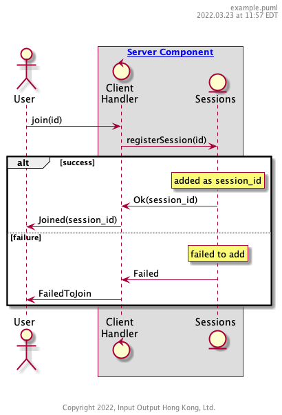

# Example Flowlet

This is an example flowlet showing a user registration to an imaginary service.  Proper documentation here should provide a reference link to "Component A", and should define the data types and other details of the messages being passed and the values returned.

