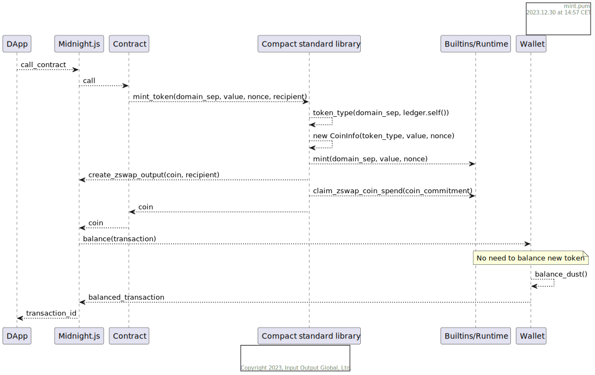

# Native tokens

Zswap supports native tokens using colored coins approach - every coin/shielded utxo has assigned type, where DUST is just a very specific, well-known type.

Following basic operations need to be covered across whole stack, some of them are variations in usage of the same API/mechanics: 
  - minting new tokens (not possible for DUST)
  - receiving tokens from contract
  - providing tokens to contract / balancing transaction with tokens for submission
  - sending tokens from wallet
  - sending tokens from contract
  - displaying tokens balance
  - swapping tokens

Together, these operations contribute to possibility of leveraging tokens in DApps, an example of such approach can be seen in [the DAO example](../../example-dapps/dao).

## Minting new tokens

Allows contracts, and contracts only to mint brand new tokens. The process is as follows:

The crucial points/facts about it are:
  - contracts can only mint tokens of types produced by the `token_type` function, which takes into account arbitrary domain separator and contract address
  - because of domain separator being input to `token_type` - contracts can issue tokens of many types
  - `token_type` is exposed both as a Compact standard library function, and a runtime function, so that it can be used in many contexts
  - `mint` call is the crucial one in whole process - it registers the mint with the transaction, so that ledger will allow this single token type to be not balanced up to defined amount

At the end of the process, the transaction, that is produced:
  - has an output created for specified recipient, which contains the newly created token
  - newly created token may not be present in imbalances, because of registered mint

## Receiving tokens from contract

After a mint performed directly for the user or a withdrawal of tokens from a pool held by contract, wallet needs to receive the tokens, there are 2 possible cases for transaction shape:
1. There is prepared output for the wallet. In this case receiving the coin does not differ from receiving a DUST coin. 
2. There is no prepared output, transaction has a positive balance of certain token type. In this situation wallet is free to create a new output coin for itself. In case of custom tokens the value is expected to be equal to the token imbalance, in case of DUST - it needs to be deducted by necessary fees. 

In both cases, Wallet's UI should allow the end user to set a human&ndash;readable description of the token type. Preferably as soon as receiving the transaction from a DApp.

## Providing tokens to contract / balancing tokens

The basic rule for balancing tokens is that wallet, upon receiving an unbalanced transaction, should add inputs and outputs necessary to reduce imbalances to zero. In case of DUST &mdash; this means the inputs need to cover all outputs and all fees. In case of other tokens &mdash; the inputs need to cover outputs in 1:1 ratio.

This approach allows providing tokens to contract interactions by letting contract execute with necessary outputs created, then submitting such imbalanced transaction to wallet, which, depending on its balance and user decision, can either balance and submit the transaction, or reject it.

There exists another (actually, it is the original) idea for managing this process, which is - DApp, before calling contract, would ask wallet to create an imbalanced transaction with necessary outputs to use in the contract, then contract would be executed, finally letting wallet balance whole transaction.

## Sending tokens from wallet

Wallet, in order to send tokens to another wallet, should first create an unbalanced transaction with desired outputs. And then follow the process of balancing. In some simple cases it is possible for wallet to prepare all inputs and outputs in a single step, though in the interest of reducing complexity it is preferred to make the approach involving balancing the default one.    

Sending tokens to contracts is only possible if contract claims the tokens, which means an explicit contract interaction needs to be involved.

## Sending tokens from contract

Contract, in order to send tokens, preferably calls a standard library circuit `send`. It takes input coin, recipient, value to be sent and returns and output coin and, optionally a change. 

It ensures necessary ledger/runtime functions are being called to let contract spend a coin as well as it might create proper outputs. 

At the end of the process, the transaction, that is produced:
- has an output created for specified recipient, which contains the newly created token
- newly created token may not be present in imbalances, because of registered mint

## Displaying tokens balance

Coins have assigned types, which are hashes for custom tokens or `0x00000000000000000000000000000000` for DUST. While hashes are very friendly for various ways of computing, they are not friendly for humans. For that reason wallet UI implementations are advised to let users add/adjust displayed name of a token so that in various circumstances user can identify what tokens are part of balance and what tokens would be involved in a transaction.

## Swapping tokens

TBD.

Basic mechanic is that 2 users prepare 2 imbalanced transactions which, upon merging, produce a balanced transaction. In order to be able to merge the transaction though, an exchange infrastructure of a sort is needed, which is out of scope for the time being.   
