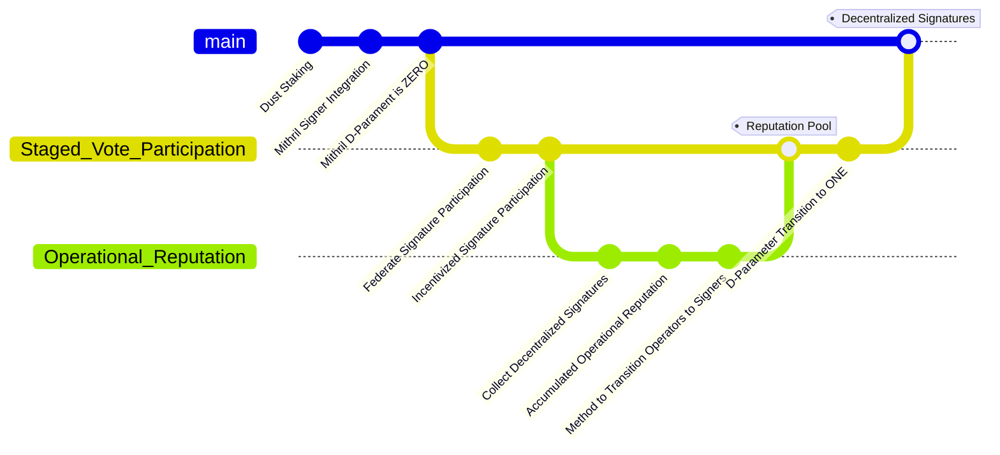

# Proposal 0009: Application of Mithril for Midnight state verification on a mainchain

# Problem Statement

<!-- Please start by clearly stating the problem your proposal is trying to solve. Describe the context and why this proposal is important.
-->

**The risk**:
A compromised sidechain committee can forge a certificate they post to mainchain.
A forged certificate could be used to liquidate value from a sidechain if undetected.

# Proposed Changes

<!-- Describe your proposal in detail. -->

Remove the committee from the direct process of generating a certificate of bridge transactions.

Apply Mithril technology to the periodic agreement of state on Midnight's chain.
Use this agreement as evidence of faithful execution of updates to the Midnight chain and a commitment to that agreement on mainchain.
Specifically witnessing the set of bridge transactions over a time window, and posting an aggregate signature certificate.

# Desired Result

<!-- Finally, describe what you hope to achieve and how you can evaluate that you
have achieved it. -->

- Enable the detection of a forged certificate.
- Require a higher level of participation in the activity that is separate from the consensus process.

## Proposed Plan

## Dependencies:

[Mithril](https://mithril.network/doc/)

- needs distribution to calculate voting power

⚠️ Dust Staking or Deligation
