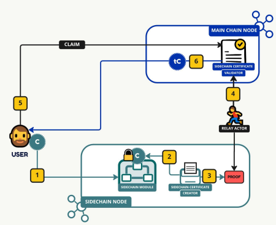
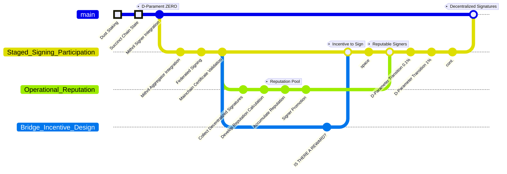

# Proposal 0009: Application of Mithril for Midnight state verification on a mainchain

⚠️ _Prerequisite_: Dust Staking or Delegation

# Problem Statement

<!-- Please start by clearly stating the problem your proposal is trying to solve. Describe the context and why this proposal is important.
-->

**The risk**:
A compromised sidechain committee can forge a certificate they post to mainchain.
A forged certificate could be used to liquidate value from a sidechain if undetected.

# Proposed Changes

<!-- Describe your proposal in detail. -->

Remove the sidechain committee, used for consensus, from the process of generating a certificate of bridge transactions.

As an alternative, apply Mithril technology to the periodic agreement of state on Midnight's chain.
Use this agreement as evidence of faithful execution of updates to the Midnight chain and commit "proof" of this evidence on mainchain.
Specifically witnessing the set of bridge transactions over a time window, and posting an aggregate signature certificate.

The Sidechain Specification details the token transfer process from a sidechain to a mainchain.
The image below is from the specification and illustrates the process of transferring tokens.
Additionally, the steps shown in the image are described below.

1. The user initiates the flow by invoking on-sidechain mechanisms to lock some C tokens.
2. At the end of the sidechain epoch, the Sidechain Certificate Creator starts the process of
   creating the proof of sidechain to main chain transactions (user issued lock transactions).
   As a result, each committee member persists its own signature to the ledger over the
   discovered user-initiated lock actions.
3. After some time, there are enough signatures posted on the sidechain for the ‘n out of m’
   condition (related to ATMS) to be met and the relay actor can craft a certificate out of these
   signatures. This step can require sidechain data finalization as a prerequisite for the relay
   actor to take action.
4. The relay actor invokes the Sidechain Certificate Validator’s on-chain script with the
   certificate of the user-initiated lock actions. The Validator checks the posted certificate,
   and, if successful, persists it on the main chain.
5. At this point, a user calls a claim script against the persisted certificate providing proof of
   ownership of a particular sidechain transaction.
6. If successful, the user will be issued a native token tC representing the C tokens locked on
   the sidechain.

❗ This proposal is focusing on modifying steps 2-4 to use Mithril.

# Desired Result

<!-- Finally, describe what you hope to achieve and how you can evaluate that you
have achieved it. -->

- Enable the detection of a forged certificate.
- Require a higher level of participation in the activity that is separate from the consensus process.
- Minimize risk at launch through federated signing.
- Use a known adaptation pathway to transition from federated to decentralized signing.

## Proposed Plan

## Dependencies:

[Mithril](https://mithril.network/doc/) needs distribution to calculate voting power.

⚠️ Dust Staking or Delegation

## References:

- [Mithril Documentation](https://mithril.network/doc/)
- [Mithril Blog Post](https://iohk.io/en/blog/posts/2021/10/29/mithril-a-stronger-and-lighter-blockchain-for-better-efficiency/)
- [Mithril Research Paper](https://iohk.io/en/research/library/papers/mithril-stake-based-threshold-multisignatures/)
- [Example EVM Sidechain technical specification 1.0](https://github.com/input-output-hk/sidechains-tooling/releases/download/technical_spec_1.0/Example.EVM.sidechain.technical.specification.ver.1.0.20230111.pdf)
