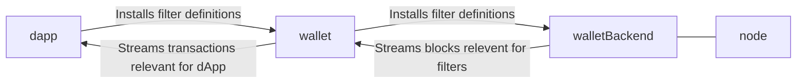

# Delivering relevant transactions to dApps

## Context

So far this topic was explicitly put on hold, assuming that wallet can do just fine in delivering transactions to 
dApps in order to evolve public and private oracles state.

## Alternatives

### #1 - Multi-purpose wallet backend account, wallet delivers transactions to dApp

[Wallet Backend](../components/WalletBackend) has multiple filters attached to a single account

Wallet keeps track all transactions related to potentially any dApp used by the user, with additional mapping 
between dApp, its filters, and the relevant transactions.

dApp, through dApp connector, receives a stream with all the relevant transactions for it, so it can evolve states

### #2 - Single-purpose Wallet backend account, wallet delivers transactions to dApp

### #3 - Single-purpose Wallet backend account, dApp obtains transactions on its own

## Author's preference
