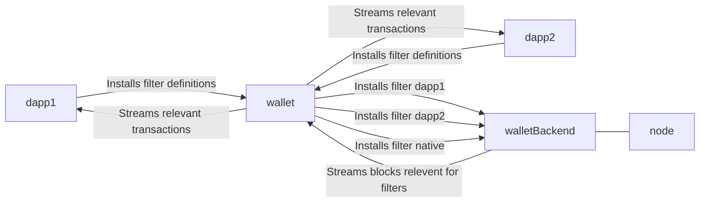
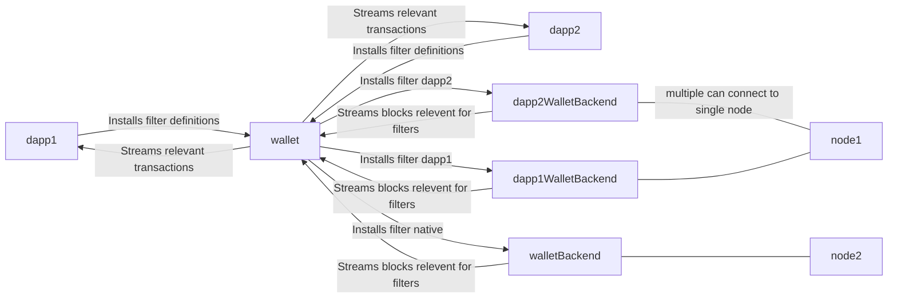
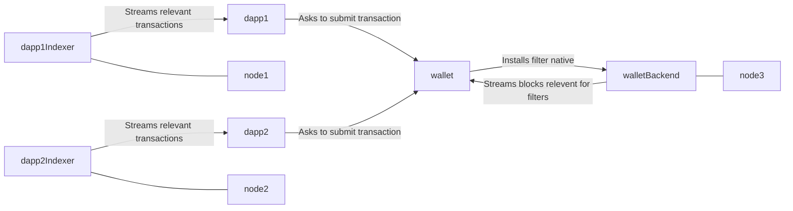

# Delivering relevant transactions to dApps

## Context

So far this topic was explicitly put on hold, assuming that wallet can do just fine in delivering transactions to 
dApps in order to evolve public and private oracles state.

Given there are couple (sometimes conflicting) traits to meet: performance, security, privacy, decentralization and 
developer experience, choice of specific approach becomes particularly hard as there is no obvious winner.

## Alternatives

### #1 - Multi-purpose wallet backend account, wallet delivers transactions to dApp

[Wallet Backend](../components/WalletBackend) has multiple filters attached to a single account

Wallet keeps track all transactions related to potentially any dApp used by the user, with additional mapping 
between dApp, its filters, and the relevant transactions.

dApp, through dApp connector, receives a stream with all the relevant transactions for it, so it can evolve states

#### Performance

Without additional measures it may make Wallet Backend particularly costly: a lot of data redundantly tracked by 
many Wallet Backend accounts, possibly a lot of data to be synchronized between Wallet Backend account and Wallet.
The above also increases amount of data Wallet has to process in order to learn about exact relevant transactions, 
sort them by filter (native token vs dapp), etc.

There is a potential improvement for dApps - in most cases we might expect relevant transactions to be already 
delivered to the Wallet, so dApp loading time is reduced.

#### Security

The biggest security-related concern is related to the amount of data tracked by Wallet Backend and its complexity 
when choosing this approach.  

This approach also raises an opportunity for a DoS-style attack, where dApp installs many filters related to 
transaction-heavy contracts, which in effect put high pressure on Wallet Backend and Wallet installations.

Another, possible concern is possibility of a malicious web extension: 
  - learning that user X is interested in a smart contract Y (or using it). 
  - injecting unrelated/unverified transactions to deceive the dApp about the state, such attempts should result 
    though in a transaction not passing consensus validation, where the biggest possible risk is lost resources on 
    computation; possible protection would include, for example, creating merkle tree of tracked transactions, 
    sending each transaction with an inclusion proof that dApp can verify  

#### Privacy

Given Wallet Backend is meant to work on basis of whole blocks - in most cases it is expected to be(very) hard to tell, 
whether particular transaction is relevant to wallet or not, and in what extent (native token, smart contract for 
interacting, smart contract for reading data). Adding additional, random, unrelated blocks to the stream should 
make it even harder to identify the relevant transactions.

#### Decentralization

It seems to make Wallet Backend more heavyweight component, because of processing more data for user. This may lead 
to bigger reliance on remote Wallet Backend installations because of resource constraints needed to run it.
A situation, where Wallet Backend account goes down for any reason, makes user unable to interact with its wallet or
any dApp.

At the same time this alternative seems to improve decentralization on the side of dApps, because they have a way to 
go fully decentralized, as in - not require by-design any server-side component to work other than providing a 
mean to host the dApp website/web-app.

#### Developer experience

Midnight (Wallet) developers need to meet higher performance expectations, which, in general, affects 
implementation structure and perceived maintanability of code.

### #2 - Single-purpose Wallet backend account, wallet delivers transactions to dApp

[Wallet Backend](../components/WalletBackend) has single filter attached to a single account. It either is a filter 
for a native tokens or a filter for a smart contract.

Wallet keeps track of all transactions given wallet user may be interested in. The mapping between dApps and 
transactions also has to be maintained. 

dApp, through dApp connector, receives a stream with all the relevant transactions for it, so it can evolve states

#### Performance
Within single Wallet Backend deployment - there is no redundancy in data tracked. Single account tracks only 
transactions related to it, be it native-tokens-related or smart-contract-related. Single smart-contract account can 
be possibly queried by many different Wallets. The only connection of a native-token filter to smart contracts could
be detection of calls made by an account owner.

Wallet itself can also see performance improvement because of having a clear way for selectively syncing blocks on a 
per-filter basis. In a multi-purpose accounts proposal, while possible, it would require adjusting the syncing API, 
here - it is just a decision to be made on Wallet side.

dApps, depending on other factors - may see either increased or decreased loading time due to possible need to 
transfer transactions on-demand from dApp Wallet Backend account through Wallet to dApp itself.

#### Security

Overall complexity of implementations is lower (separate one for native tokens, separate for smart contracts), less 
amount of critical data processed by Wallet Backend. 

The DoS-style attack, where dApp installs many filters related to transaction-heavy contracts seems to be easier to 
protect against though overall robustness of Wallet Backend installation wrt tracking transaction-heavy smart 
contracts remains a concern.

Risks related to malicious web extension remains.

#### Privacy

To some extent it relies on answer of question "is someone's interest in smart contract X a privacy breach"?

Native-token tracking Wallet Backend accounts will process way less data, so countermeasures as interleaving 
relevant data with irrelevant may be more important.

#### Decentralization

Raises similar concerns as multi-purpose accounts. With one change though - it is easier to spread load and rely on 
more Wallet Backend deployments, which overall make whole solution more resilient, without completely breaking 
usability for Wallet users when Wallet Backend account goes down. 

This approach opens a way to a range of implementations, where different data comes from different Wallet Backend 
deployments and Wallet (or its user) decides which ones to trust.

#### Developer experience

dApp developer still has a quite nice experience in terms of not having to be concerned about delivering 
transactions and lack of requirement for a backend application. Alternatively, there might be a mechanism allowing 
dApp developer to hint Wallet to use specific indexer/backend instance, leaving it to Wallet (User) whether it will 
be used or not 

Midnight developers&ops have 2 separate modules to maintain and manage, which may increase maintenance effort, but 
also makes it easier to develop native tokens and smart contracts indexing functionalities. 

### #3 - Single-purpose Wallet backend account, dApp obtains transactions on its own

This approach changes one thing - it makes dApp developer responsible to maintain and deploy all components 
needed for dApp to function.

#### Performance

Depends solely on dApp implementation.

Wallet Backend installation can be way smaller because of not having to care about smart contracts at all (besides 
possible smart contract calls made by user).

#### Security

Compared to alternatives above - malicious web extensions are smaller problem because their possible impact on dApp 
is smaller. 

More depends on specific dApp implementation.

#### Privacy

It is better in some areas (wallet knows less about user actions).

On the other hand, possible surface for violating user's privacy in dApp is bigger.

#### Decentralization

On the one hand - less depends on wallet infrastructure, which makes whole solution more decentralized. On the other 
hand - it poses bigger risk of dApp developers reaching for effectively centralized solutions for implementing their 
backends (like it happens with Infura for Ethereum, for example).

#### Developer experience

For Midnight developers - implementing the indexer as a framework is probably a way bigger cost than a relatively 
opaque binary, thus, it might be almost identical experience to #2 or a significantly harder one in case of 
implementing framework for indexer/backend-side. Documentation and tooling around either binary or framework add 
additional work that needs to be done with a great care about details to make a good DX for dApp developers.

For dApp developers - the biggest change is need to run own infrastructure (or use some provider of it). It raises 
an opportunity though - need to run the indexer (which can be a library as well) allows dApp developer to 
arbitrarily include or discard transactions sent to dApp front-end. In case of transaction-heavy use-cases like DEX 
it might be a big change.

## Author's preference

#3. Implementing a good ecosystem of focused tools that together work out of the box seems to provide many of wins 
of #2 while having a good amount of flexibility. It also allows community to be more involved and potentially 
discover some unpredicted patterns that can be later embodied as libraries either from Midnight team or third parties.

Potential drawbacks related to dApp developers having bigger control over users privacy may be addressed with 
education and making privacy the easier and well-documented way. 
