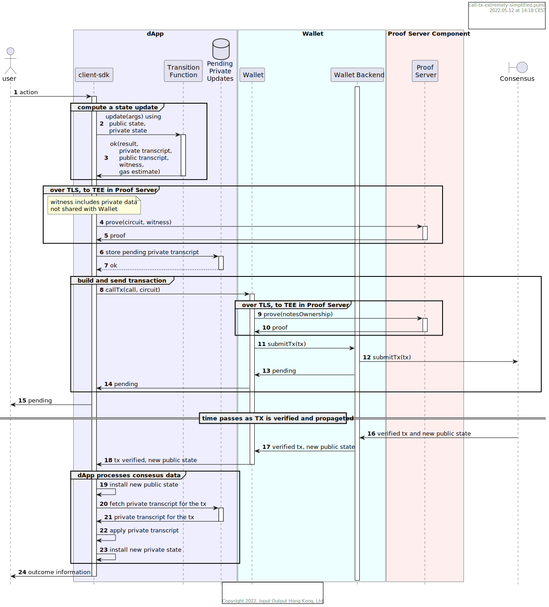

# Flow: _dApp User_ Generating a Transaction

Midnight dApps present a user interface through which dApp users interact.  Their inputs to this interface trigger business logic in the dApp backend, which runs in their client context with full access to their private data.  Some user inputs will cause the dApp to issue transactions with the intent to modify the public state of the dApp.  A dApp may consist of multiple contracts with multiple on-chain addresses, and a single user input may update multiple contracts; it is therefore important that Midnight should support atomic transactions against multiple contracts, similar to how a single *spend* transaction can consume multiple inputs and produce multiple outputs.

Midnight uses ZK SNARKs to prove that each transaction conforms to a valid execution of the contract.  If the execution of the contract depends on private data, as it often does, the details of the private data will be used in the proof but not revealed by the proof.

## Object-Oriented Intuitions

Without committing to an object-oriented implementation of the Midnight programming model, some OO concepts can make it easier to undetstand the flows in a Midnight dApp.

It's useful to think of a dApp as containing one or more *contracts*, each of which is an implementation of the abstract `ContractBase`.  Each of these contracts has two helper classes, one to manage the private state and one to manage the public state.  These are referred to as the public and private *oracles*.  Each *transition function* in the contract accesses public and private state exclusively through the methods on these helper classes.  

### Transition Function Execution

Each execution of a transition function operates in the context of a current public state and current private state, as accessed through the oracles.  The Midnight runtime captures the transcript of the transition function's calls to these helpers, recording the function that was called, its parameters, and the return value.  On completion of the transition function, *all updates to public and private state are rolled back* and only the transcripts and final return value are retained.  This is easily explained by the fact that state updates are speculative and are contingent on consensus verification of the transaction.  

Two other outputs of executing a transition function are important to understand:

1. **Gas Estimate**  The public oracle, executed off-chain during the transition function's execution, is also executed on-chain during verification.  If possible, Midnight will bound this execution by limiting the expressive power of the language so that gas fees are not required to offset on-chain execution.  If not, Midnight will capture gas usage data that it observes in the public oracle during the off-chain execution of the transition function and will use that as a predictor of the gas usage on chain.

2. **Witness**  The transition function is defined using a limited language that compiles into Zero-Knowledge curcuits.  These are the circuits used to prove and verify soundness of computations for consensus.  To complete the proof, the prover needs to know the circuit and a *witness* that it can inspect to justify the proof.  The witness in Midnight will typically contain private data returned from the private oracle, so it must not leave the trusted environment of the client.  It is shared only with the SNARK prover and then discarded, leaving only the proof behind.  Midnight arranges to extract the witness required by the prover as another output of the transition function's execution.

### Transcript Application

Public and private state are actually updated only in response to verified transactions.  Verification of a transaction inlcudes the successful application of the public-oracle transcript, which Midnight includes in the transaction along with the ZK proof.  This allows the transaction to operate on a public state thay may have advanced since the point when the client ran its transition function to generate the proof.  After the verifier checks the ZK proof, final verification and state update are interleaved through the application of the public-oracle transcript.  The verifier iterates over the transcript and calls the given methods with the given parameters on the now-current public state.  As long as each update succeeds and returns the same result as the one captured in the transcript, the application succeeds.  At the end of the loop, if each transcript item was successfully verified, the transaction is considered verified and the resulting state is committed as the new state of the contract; otherwise the transaction is failed and the state updates are rolled back.

The private transcript contains sensitive information and cannot be shared outside the client's trusted environment.  Instead, Midnight retains the transcript locally in a data store indexed by the transaction ID of the corresponding public-state transaction.  If and when the client context observes that transaction's verification, it retrieves the private-state transcript and applies it to the now-current private state, which may differ from the private state that was current when the transcript was captured.  Unlike the public transcript, however, the private transcript has no recourse should the transcript fail to apply correctly; the client cannot "reject" a transaction that is already verified on chain, and the dApp user cannot be expected to recover from a failure at this level of the dApp.  Is is therefore critical that the Midnight programming model provide assurances that no intervening updates to private state can invalidate the application of a saved private-oracle transcript.

## The Proof Server

Midnight is designed to support the benefits of privacy with the ease-of-use of a light wallet.  An important piece of the solution is the way Midnight allows clients to safely offload the heavy computation of ZK proofs to untrusted servers.  Our solution, in brief, is that IOHK and other interested parties will host *Proof Servers* that compute the necessary proofs within a Trusted Execution Environment, or TEE.  Each client's private witness data is protected in transit by a TLS connection that is terminated within the TEE hardware enclave to prevent snooping by the Proof Server host.  The service provided by the Proof Server could be monetized to offset costs, or could be run without fees by interested parties otherwise incented to make Midnight succeed.

## Extremely Simplified Flow

The following figure illustrates an extremely high-level simplification of the flow that enables a user to push a transaction through the blockchain and witness its result.  A step-by-step discussion follows the figure.

1. The user performs some UI action triggering dApp backend logic.
2. The dApp calls a transition function on one of the contracts.
3. The contract executes the transition function, capturing transcripts of the function's interactions with the public and private oracles.
4. The dApp uses a secure connection to a Proof Server to request a ZK proof, using the transition function's corresponding circuit and the witness extracted in previous step.
5. The Proof Server provides the necessary ZK proof.
6. The dApp stores the private-oracle transcript, indexed by the TX id of the new transaction.
7. Stored successfully
8. The dApp calls wallet frontend to prepare and submit transaction with performed call details
9. The wallet uses a secure connection to a Proof Server to request a spend ZK proof
10. The Proof Server provides the necessary ZK proof.
11. The wallet frontend submits transaction to its backend. The transaction includes the contract's ID, the ZK proof, and everything needed to complete any required spends of Midnight's base currency, such as gas or other fees, or movement of funds between the contract and other parties.
12. Midnight submits the transaction to consensus.  
13. Wallet backend responds to frontend that transaction is pending.
14. Wallet frontend responds with pending status to the dApp.
15. The dApp advises the user that the request is pending. At this point the user may safely go offline and await a result, or stay connected to monitor updates.
16. Once the TX is verified on chain, wallet backend will eventually witness the verified TX and the new public state.
17. Then wallet frontend will learn them from wallet backend.
18. Then the dApp learn them from wallet frontend.
19. The dApp installs the observed public state (or, equivalently, computes the public state from the public-oracle transcript -- the choice comes down to performance).
20. The dApp looks up the corresponding saved private-oracle transcript.
21. Successfully retrieved.
22. The dApp applies the private-oracle transcript, executing each query or command in sequence.
23. After successful application of private state, the dApp installs the resulting private state as the current private state of the given contract.
24. The dApp advises the user that of the public and private effects of the verified transaction.

## Conclusion

This is, as previously stated, an extreme oversimplifiction of the flow, but it illustrates the key points where Midnight smart contracts are implemented across the Midnight stack.  

* dApps call transition functions to generate transactions
* state updates of transition functions are delayed and separated into corresponding public and private transcripts
* proof servers offload the heavy computation of ZK proofs
* verifiers use both the ZK proof and the public oracle to verify transactions, and the act of verification also performs the public-state updates
* dApps re-combine the private part of the computation with its public part by applying the saved private transcript after the TX is verified
* application of private transcripts MUST succeed; this demands that Midnight provide a means of writing private-state oracles that ensures safe application in the presence of intervening private-state updates.

### A Brief Note On Latency

This overview flow gives us some initial insights into the latencies a user will face.  Ignoring the (likely trivial) latency of the actual dApp logic, the key points of latency are the Proof Server and consensus.  The Proof Server introduces two forms of latency: the time it takes to perform the proof, and the queueing latency inherent in a shared service.  The proving latency can be considered a speed-of-light limitation among competing ZK-based smart-contract platforms, since all must execute proofs using the best available proving technology.  (And this speaks to the need for Midnight to support upgrades to the proving system!) The queueing latency is an artifact of Midnight's exclusive use of light wallets, and can be mitigated only by providing a sufficient Proof Server pool and load distribution scheme.

